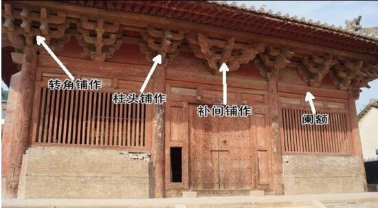

# 簡介

斗栱，又稱斗拱、枓栱、斗科、鋪作（宋《營造法式》），是在屋頂和梁枋之間的木構件，用於支撐挑出的屋檐。

圖：山西善化寺大雄寶殿斗栱（實地拍攝）

<!--more-->

斗栱以朵為單位，大概是比擬成一朵花吧。兩朵斗栱之間的部分叫栱眼壁，如下圖所示：

圖：山西太原不二寺的栱眼壁<a href="https://www.bilibili.com/video/BV1Tx4y1q7Uz?t=47.6">（來源）</a>

# 分類

斗拱按位置可分為：

1. 柱頭科，又稱柱頭鋪作（宋《營造法式》），位於柱頭。
2. 平身科，又稱補間鋪作（宋《營造法式》），位於柱間。
3. 角科，又稱轉角鋪作（宋《營造法式》），位於屋角柱頭。

圖：三類斗栱<a href="https://bp.ntu.edu.tw/001/Upload/1352/ckfile/3ccbb243-e25f-4e82-8aa5-45360c23ffb8.pdf">（來源）</a>

圖：鋪作與闌額 共七鋪作<a href="http://www.99gujian.com/baike/jiegou/810.html">（來源）</a>

# 部件

斗拱主要包含栱、翹、昂、斗、升等部件。

圖：斗栱的主要分件

圖：斗栱主要構件名稱（來源：中國數字科技館）

圖：斗拱部件名稱（來源：梁思成《中國建築史》）

## 栱

栱，又寫作拱，弓形短木（「弓」、「栱」發音相近），用於托住屋檐下的枋子和椽子。按尺寸從小到大可分為：瓜栱、萬栱、廂栱；按位置從裏到外又可分為：裏拽栱、正心栱、外拽栱；於是，按尺寸和位置有以下組合：

1. 正心瓜栱，又稱泥道栱（宋《營造法式》），嵌入壁中，鋪以泥胚。
2. 外拽瓜栱，又稱瓜子栱（宋《營造法式》）
3. 裏拽瓜栱，又稱瓜子栱（宋《營造法式》）
4. 正心萬栱，又稱足材慢栱（宋《營造法式》）
5. 外拽萬栱，又稱單材慢栱（宋《營造法式》）
6. 裏拽萬栱，又稱單材慢栱（宋《營造法式》）
7. 外拽廂栱，又稱令栱（宋《營造法式》）
8. 裏拽廂栱，又稱令栱（宋《營造法式》）

圖：清式五跴平身斗科<a href="https://upload.wikimedia.org/wikipedia/commons/f/f5/SSID-13220679_%E5%BB%BA%E7%AF%89%E8%A8%AD%E8%A8%88%E5%8F%83%E8%80%83%E5%9C%96%E9%9B%86_%E7%AC%AC5%E9%9B%86_%E6%96%97%E6%A0%B1.pdf">（來源）</a>（注：跴同「跳」）

## 翹

翹，又稱華栱、抄（宋《營造法式》），弓形木，與栱垂直，形式和功能跟栱一樣。自下往上，翹伸出逐漸增多。

圖：天津獨樂寺觀音閣斗栱<a href="https://www.bilibili.com/video/BV1Yv4y1G7V2?t=161.1">（來源）</a>

## 昂

昂，斜置構件，常留有尖角，其槓桿作用，支撐挑出的檐部。按斜置方向可分為：上昂、下昂。按尖角的形狀可分為：批竹昂、凹面昂、琴面昂、象鼻昂等。角科上的昂又叫角昂。

圖：山西佛宮寺釋迦塔（應縣木塔）斗栱 三下昂 批竹昂<a href="https://zh.wikipedia.org/wiki/File:Fogongsi_ang.JPG">（來源）</a>

## 斗

斗，又寫作枓，斗狀方形木塊，十字卯口，用於層層疊栱。

1. 坐斗，又稱櫨斗、櫨枓（宋《營造法式》），位於梁之上。
2. 十八斗，又稱交互斗（宋《營造法式》），形狀跟坐斗一樣，但體積較小，位於翹或昂之上。

圖：坐斗（來源：網絡）

圖：山西華嚴寺大雄寶殿斗栱<a href="https://www.bilibili.com/video/BV1iB4y1L72r?t=67.4">（來源）</a>

## 升

升，斗狀方形木塊，一字卯口，在栱之上承托上一層的栱或枋。

1. 槽升子，又稱齊心斗（宋《營造法式》），位於栱的中間。
2. 三才升，又稱散斗（宋《營造法式》），位於栱的兩端。

圖：三才升（來源：網絡）

圖：蘇州玄妙觀三清殿斗栱<a href="https://zh.wikipedia.org/wiki/%E7%8E%84%E5%A6%99%E8%A7%82_(%E8%8B%8F%E5%B7%9E%E5%B8%82)#/media/File:Suzhou_Xuanmiao_Guan_2015.04.23_17-57-33.jpg">（來源）</a>

# 出跳與鋪作計數

出跳，又寫作出跴，清代又叫出踩。「跳」、「挑」發音相近。

宋《營造法式》上寫道：「**凡鋪作自柱頭上櫨枓口內出一栱或一昂皆謂之一跳，傳至五跳上。出一跳謂之四鋪作**〈或用華頭子，上出一昂〉，**出兩跳謂之五鋪作**〈下出一卷頭，上施一昂〉。」

簡單來說，從櫨枓上逐級上壘一栱或一昂就算是一跳，櫨枓出第一跳華栱就是四鋪作，以後每多出一跳鋪作數就加一。

圖：山西芮城廣仁王廟正殿斗栱<a href="https://www.tinzi.net/adycms/news/2016-1-15/449.html">（來源）</a>

圖：山西佛光寺東大殿雙抄雙下昂七鋪作斗栱<a href="https://www.bilibili.com/video/BV1AWxkeUE1h?t=112.5">（來源）</a>

# 偷心造與計心造

宋《營造法式》上寫道：「**凡鋪作逐跳上**〈下昂之上亦同〉**安栱謂之計心，若逐跳上不安栱而再出跳或出昂者謂之偷心**」。

簡單來說，就是華栱或昂之上有橫栱就是計心造，沒有橫栱而是連續安華栱或昂，也就是連續出跳，那就是偷心造。

圖：山西平遙鎮國寺萬佛殿雙抄雙下昂七鋪作斗栱<a href="https://www.tinzi.net/adycms/news/2016-1-15/449.html">（來源）</a>

圖：四抄七鋪作斗栱<a href="https://www.tinzi.net/adycms/news/2016-1-15/449.html">（來源）</a>

# 演變

到了清代，由於工程規範的變化（見《工程做法則例》），斗栱較先前纖細，顯得柱大斗栱小，並且裝飾性越來越強。

圖：故宮太和殿斗栱：纖細、密集、裝飾<a href="https://zh.m.wikipedia.org/wiki/File:%E5%A4%AA%E5%92%8C%E6%AE%BF%E6%96%97%E6%8B%B1.JPG">（來源）</a>

# 附：宋清斗栱用詞對照表

| **清《工程做法則例》** | **宋《營造法式》** |
| --- | --- |
| 柱頭科 | 柱頭鋪作 |
| 平身科 | 補間鋪作 |
| 角科 | 轉角鋪作 |
| 正心瓜栱 | 泥道栱 |
| 外拽瓜栱 | 瓜子栱 |
| 裏拽瓜栱 | 瓜子栱 |
| 正心萬栱 | 足材慢栱 / 泥道慢栱 |
| 外拽萬栱 | 單材慢栱 / 慢栱 |
| 裏拽萬栱 | 單材慢栱 / 慢栱 |
| 外拽廂栱 | 令栱 |
| 裏拽廂栱 | 令栱 |
| 翹 | 華栱 / 抄（一說是「杪」） |
| 坐斗 | 櫨斗 |
| 十八斗 | 交互斗 |
| 槽升子 | 齊心斗 |
| 三才升 | 散斗 |
| 螞蚱頭 | 耍頭 |

# 參考

1. 梁思成《中國建築史》
2. [宋·李誡《營造法式》](https://zh.wikisource.org/wiki/%E7%87%9F%E9%80%A0%E6%B3%95%E5%BC%8F)
3. [斗栱-維基百科](https://zh.wikipedia.org/zh-tw/%E6%96%97%E6%A0%B1)
4. 樓慶西《中國古建築二十講》
5. [中國建築入門三部曲——台基、屋身、屋頂](https://chiculture.org.hk/tc/china-five-thousand-years/1118)
6. [图释中国古建结构常识](http://www.sanyamuseum.com/a/3/2022/0606/965.html)
7. [古建筑结构图解 构件对照（一）](https://www.tinzi.net/adycms/news/2016-1-15/449.html)
8. [中國營造學社《建築設計參考圖集第五集：斗栱》](https://upload.wikimedia.org/wikipedia/commons/f/f5/SSID-13220679_%E5%BB%BA%E7%AF%89%E8%A8%AD%E8%A8%88%E5%8F%83%E8%80%83%E5%9C%96%E9%9B%86_%E7%AC%AC5%E9%9B%86_%E6%96%97%E6%A0%B1.pdf)
