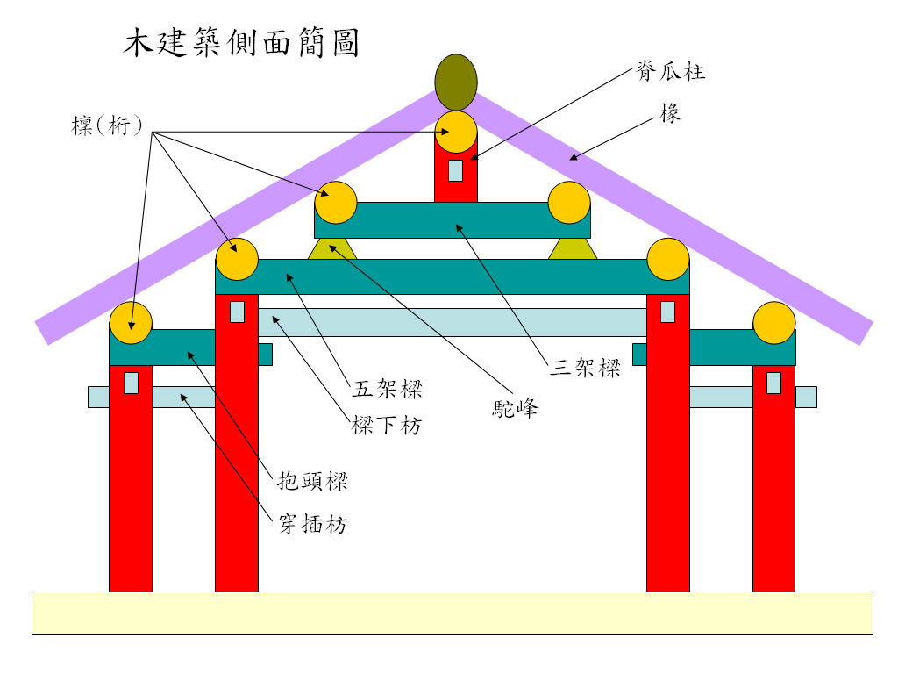
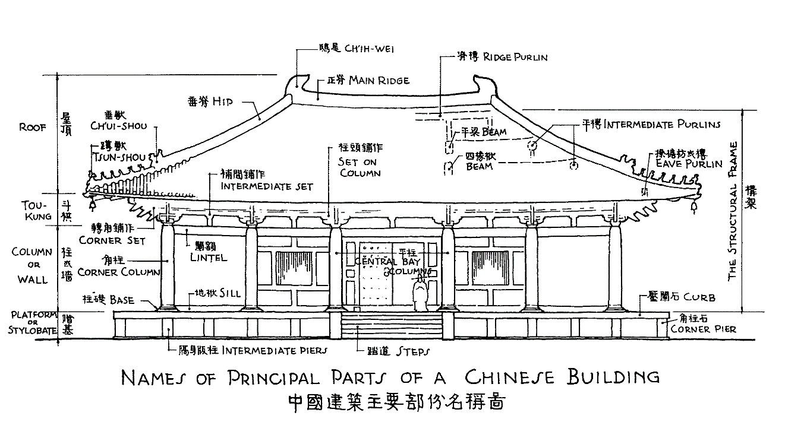
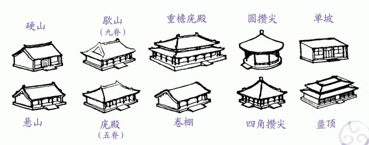

# 主要特徵

梁思成先生在《中國建築史》中概述了中國古代建築的主要特徵：

1. 結構取法方面：
    1. 以木料為主要構材。
    2. 歷用構架制之結構原則，即「梁柱式建築」之「構架制」，牆倒屋不塌。
    3. 以斗拱為結構之關鍵，並為度量單位。
    4. 外部輪廓之特異，包括：翼展之屋頂、崇厚之階基、玲瓏木質之屋身、院落之組織、彩色之施用。
2. 環境思想方面：
    1. 不求原物長存之觀念。
    2. 建築活動受道德觀念之制裁。
    3. 著重部署之規制。
    4. 建築之術，師徒傳授，不重書籍。唯有官修的兩部書籍流傳至今，即宋李誡《營造法式》和清工部《工程做法則例》。

<!--more-->

# 構架制

中國古代建築以木構為主流，結構上有：

1. 抬梁式
2. 穿斗式

其中以抬梁式為主流，其結構如下：

> 立柱四根，上施梁枋，牽制而成為一「間」（前後橫木為枋，左右為梁）。梁可數層重疊稱「梁架」。每層縮短如梯級，逐級增高稱「舉折」，左右兩梁端，每級上承長槫，直至最上為脊槫，故可有五槫，七槫至十一槫不等，視梁架之層數而定。每兩槫之間，密佈櫛篦並列之椽，構成斜坡屋頂之骨幹；上加望板，始覆以瓦葺。四柱間之位置稱「間」。通常一座建築物均由若干「間」組成。 — 梁思成《中國建築史》
（按：tuán，宋時說法，清時則稱為「檩 lǐn」，又稱「桁 héng」，指屋頂或梁上承托椽子的橫木。）
> 

大意就是：立四根柱子，上面施放梁和枋，牽制形成的空間稱之為「一間」。梁可以重疊多層，形成「梁架」。每一層梁縮短，像梯級一般，逐級增高，稱之為「舉折」。左右兩根梁的兩端，逐級上架長桁，直到最上面的為脊桁，因此桁的數量有五、七到十一不等，看梁架的層數來定。每兩根桁之間，密佈著椽，構成斜坡屋頂的骨幹；上面再加上望板，然後蓋上瓦。通常一座建築物均是由若干「間」組成的。

圖：木建築側面簡圖<a href="https://zh.wikipedia.org/wiki/File:Wood_structure.png">（來源）</a>

圖：大同善化寺三圣殿的金代抬梁式梁架<a href="https://zh.wikipedia.org/wiki/File:Datong_Shanhua_Si_2013.08.29_12-33-06.jpg">（來源）</a>

穿斗式多見於南方民居，無梁結構，柱子直接承重，柱子間使用「穿枋（斗枋）」串連，桁直接架在柱頭上。

圖：穿斗式<a href="https://tcmb.culture.tw/zh-tw/detail?indexCode=Culture_Place&id=649009">（來源）</a>

圖：潮州开元寺天王殿<a href="https://zh.wikipedia.org/wiki/File:%E6%BD%AE%E5%B7%9E%E5%BC%80%E5%85%83%E5%AF%BA%E5%A4%A9%E7%8E%8B%E6%AE%BF%E6%96%97%E6%8B%B1%EF%BC%88%E6%B8%85%E4%BB%A3%EF%BC%89.JPG">（來源）</a>

# 三段式

中國古代屋子整體上可分為三個部分，分別是：

1. 屋頂
2. 屋身
3. 台基（或稱階基）

圖：三分（來源：網絡）

圖：中國建築主要部分名稱（來源：梁思成《中國建築史》P6）

# 屋頂

## 屋頂形式

中國古代屋頂形式有多種分類方式：

1. 按是否有坡分：坡頂、平頂。
2. 坡頂又按數量分：單坡頂、兩坡頂、四坡頂等。
3. 兩坡頂按屋頂與山牆的關係分：硬山、懸山兩種。
4. 四坡頂分四坡五脊的廡殿頂、四坡九脊的歇山頂。
5. 坡頂有尖的叫攢尖頂，分：三角攢尖，四角攢尖，六角攢尖，八角攢尖，圓攢尖等。
6. 按是否重檐分：重檐頂、單檐頂。重檐頂等級高於單檐頂。
7. 此外還有盔頂、盝頂、十字脊頂。 

主要的屋頂形式，按等級由高到低分：

1. 廡殿頂（宋稱四阿頂）：四坡屋頂，多用於殿堂式建築。
2. 歇山頂（宋稱九脊殿）：由上半部硬山或懸山，下半部廡殿所組成，基本上只准官署使用。
3. 攢尖頂（宋稱撮尖）：包括圓攢尖，四角攢尖，三角攢尖及八角攢尖等
4. 懸山頂（挑山頂）：屋頂兩側突出於山牆。
5. 硬山頂：屋頂兩側不突出於山牆。
6. 卷棚頂：沒有中脊之屋頂。

其中，重檐廡殿頂等級最高，其次是重檐歇山頂，接著是單檐廡殿頂，然後是單檐歇山頂等等。

圖：屋頂（來源：網絡）

圖：北京故宮太和殿——重檐廡殿頂<a href="https://zh.wikipedia.org/wiki/File:Hall_of_Supreme_Harmony.JPG">（來源）</a>

圖：大同善化寺大殿——單檐廡殿頂<a href="https://zh.wikipedia.org/wiki/File:Shanhua_Temple_1.jpg">（來源）</a>

圖：太原晉祠聖母殿——重檐歇山頂<a href="https://zh.wikipedia.org/wiki/File:Goddess_Temple_Jinsi.JPG">（來源）</a>

圖：福州華林寺大殿——單檐歇山頂<a href="https://zh.wikipedia.org/wiki/File:Fuzhou_Hualin_Si_20120304-01.jpg">（來源）</a>

圖：廣東從化廣裕祠——懸山頂<a href="https://zh.wikipedia.org/wiki/File:%E4%BB%8E%E5%8C%96%E5%B9%BF%E8%A3%95%E7%A5%A0.JPG">（來源）</a>

圖：瀋陽故宮崇政殿——硬山頂<a href="https://zh.wikipedia.org/wiki/File:Mukden_palace_Chongzheng_Hall_04.jpg">（來源）</a>

圖：北京頤和園蘇州街建築——懸山式卷棚頂<a href="https://zh.wikipedia.org/wiki/File:Juanpeng_and_xuanshan_roofs_in_Suzhou_Street_Summer_Palace.jpg">（來源）</a>

圖：北京故宮中和殿——四角攢尖頂<a href="https://zh.wikipedia.org/wiki/File:%E4%B8%AD%E5%92%8C%E6%AE%BF.JPG">（來源）</a>

圖：北京天壇祈年殿——三重檐圓攢尖頂<a href="https://zh.wikipedia.org/wiki/File:TempleofHeaven-HallofPrayer.jpg">（來源）</a>

圖：北京恭王府流杯亭——八角攢尖頂<a href="https://zh.wikipedia.org/wiki/File:Bajiaocuanjian.JPG">（來源）</a>

圖：北京故宮角樓——十字脊頂<a href="https://zh.wikipedia.org/wiki/File:ShikinjyoHokuto.jpg">（來源）</a>

## 屋脊

屋脊是兩坡面相交隆起的地方，用磚瓦堆壘而成，起防漏和裝飾作用。

按位置的不同，屋脊可分為：

1. 正脊，又叫大脊、平脊，屋頂最高處的水平屋脊。注意：攢尖頂沒有正脊，其中角式攢尖頂有跟角數相同的垂脊。
2. 垂脊，正脊兩端沿前後坡垂下的屋脊，或角式攢尖頂中自寶頂至角處垂下的屋脊。
3. 戧脊，又叫岔脊，歇山頂中垂脊下端到屋檐部分的屋脊。
4. 博脊，歇山頂中與垂脊構成三角形的屋脊，三角形的中間部分稱為山花。
5. 圍脊，位於重檐頂下層的水平脊。
6. 角脊，又叫下檐戧脊，位於重檐頂下層，沿角梁方向的屋脊。

圖：屋脊（來源：網絡）

圖：重檐歇山頂屋脊<a href="https://zh.wikipedia.org/wiki/File:Jim_zek.png">（來源）</a>

## 脊饰

屋脊上常見的裝飾有：脊獸、山花、博風、懸魚、脊刹和寶瓶等。

### 脊獸

脊獸，有鎮脊和保護建築作用，在不同脊和不同位置上叫法不同：

1. 吻獸，又叫正吻、大吻、吞脊獸，在正脊的兩端呈吞脊狀。
2. 望獸，在正脊的兩端呈向外望之狀，等級比吻獸低。
3. 垂獸，又叫角獸，在垂脊。
4. 戧獸，在戧脊，作用跟垂獸一樣。
5. 蹲獸，又叫走獸、仙人走獸，在廡殿頂垂脊或歇山頂戧脊前端的一排。以「騎鳳仙人（又稱仙人騎雞）」領頭，後面接著三、五、七、九種走獸，分別是：龍、鳳、獅子、海馬、天馬、押魚、狻猊、獬豸、斗牛、行什（僅在故宮太和殿），走獸越多，等級越高。
6. 套獸，在翼角或窩角梁梁頭上，用來保護梁頭不受雨水侵蝕，一般為琉璃龍頭。

圖：重檐歇山頂上的屋脊與脊獸<a href="http://www.360doc.com/content/23/1110/12/59736807_1103453684.shtml">（來源）</a>

圖：蘇州獅子林魚龍吻—吻獸<a href="https://www.wxmuseum.cn/News/Details/46039342-e02e-4d3f-9637-b64bfa40fa0e">（來源）</a>

圖：北京鼓樓上的望獸<a href="https://zh.wikipedia.org/wiki/File:Wangshou.JPG">（來源）</a>

圖：北京故宮太和殿屋脊上的垂獸（最左側的獸頭）、及蹲獸<a href="https://zh.wikipedia.org/wiki/File:HighStatusRoofDeco.jpg">（來源）</a>

圖：山西芮城永樂宮重陽殿套首，其上檐角飾有琉璃武士<a href="https://zhuanlan.zhihu.com/p/708508812">（來源）</a>

圖：西藏拉薩大昭寺金頂（似重檐歇山頂）檐角的摩羯（龍首象鼻魚身），其下似妙音鳥<a href="https://www.sohu.com/a/455233498_115118">（來源）</a>

### 山花、**博風**、懸魚

**山花**是指歇山頂中垂脊和博脊圍成的三角形區域。

**博風**是指固定在檁條頂端木板，位於垂脊之下，用於防風、雨、雪、陽光等室外環境破壞侵蝕。板下正中作**懸魚**。

圖：泉州蟳埔村蚵殼厝山花<a href="https://szb.qzwb.com/qzwb/pc/cons/202507/29/content_145471.html">（來源）</a>

圖：廣州光孝寺大雄寶殿西面的博風板和懸魚<a href="https://zh.wikipedia.org/wiki/File:Guangzhou_Guangxiao_Si_2012.11.19_14-09-07.jpg">（來源）</a>

### 脊刹、寶瓶

位於正脊正中的飾件。

圖：隰縣小西天大雄寶殿脊剎 三神獸駝寶瓶 間隔相輪塔<a href="https://commons.wikimedia.org/wiki/File:%E9%9A%B0%E5%8E%BF%E5%B0%8F%E8%A5%BF%E5%A4%A9%E5%A4%A7%E9%9B%84%E5%AE%9D%E6%AE%BF%E5%AE%9D%E9%A1%B6.JPG">（來源）</a>

## 瓦作

施於屋頂的瓦件，用於遮擋雨雪，由以下幾部分構成：

1. 板瓦，呈弧形，用於鋪設屋面，形成瓦壟。
2. 筒瓦，呈半圓筒狀，覆蓋在板瓦之間的縫隙上。
3. 瓦當，又叫勾頭，位於筒瓦前端，通常帶有紋飾或文字，具有裝飾和保護作用。
4. 滴水，位於板瓦前端，如意頭狀，通常帶有紋飾，用於引導雨水下滴，保護簷口。
5. 瓦釘，固定筒瓦的構件，通常由鐵釘和釘帽組成，用於防止瓦壟下滑。

圖：瓦作（來源：網絡）

# 參考

1. 梁思成《中國建築史》
2. [中國建築入門三部曲——台基、屋身、屋頂](https://chiculture.org.hk/tc/china-five-thousand-years/1118)
3. [图释中国古建结构常识](http://www.sanyamuseum.com/a/3/2022/0606/965.html)
4. [图说中国建筑：古建筑10大要素](http://sanyamuseum.com/a/chenliexuanjiao/2022/1220/1816.html)
5. [中国古建名词汇编——砖瓦篇（一）](https://zhuanlan.zhihu.com/p/44267895)
6. [中国古建名词汇编——砖瓦篇（二）](https://zhuanlan.zhihu.com/p/45354590)
7. [怎样看懂古代建筑](https://zhuanlan.zhihu.com/p/34276746)
8. [維基百科《中國建築》](https://zh.wikipedia.org/zh-tw/%E4%B8%AD%E5%9C%8B%E5%BB%BA%E7%AF%89)