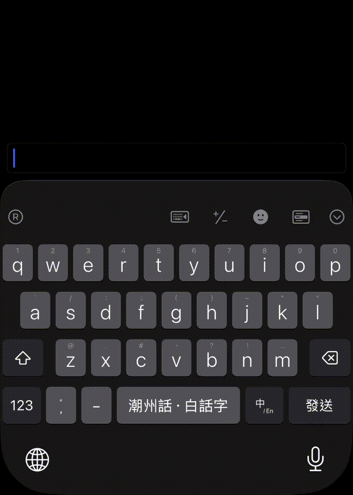

| 語言 | 寫法 | 
|:----|:---:|
| 普通話 | 給阿嬤的情書 |
| 普通話 | 給奶奶的情書 |
| 潮州話 | 乞阿媽个情書（khṳt a-má kâi/âi chhêng-tsṳ） |
| 潮州話 | 乞阿媽个情批（khṳt a-má kâi/âi chhêng-phoi） |
| 福建話 | 互阿媽个情書（hō͘ a-má ê chêng-su） |
| 福建話 | 互阿媽个情批（hō͘ a-má ê chêng-phoe） |

<!--more-->

## 轉換密碼

1. 給 -> 乞/互/予
   1. 「乞」通常是請求个意思， 如:「乞食」， 亦有與人物件之意。【正韻】凡與人物，亦曰乞。
   2. 潮州話中慣習用「乞」，白話字是 khṳt。
   3. 福建話中慣習用「互」，白話字是 hō͘。 
   4. 「互」又可寫做「予」。「給予」是同義複詞，可換用。
2. 奶奶 -> 阿媽
   1. 向來是「公」對「媽」，「阿公」對「阿媽」， 不管是祖父母還是外祖父母。
   2. 「媽」，白話字是 má（陰上聲）， 「媽祖」、「媽人」亦發此個音。
   3. 普通話「奶奶」，閩南語中是「媽」或「內媽」（當需要區別「外媽」時用）。
   4. 普通話「爺爺」，閩南語中是「公」或「內公」（當需要區別「外公」時用）。
   5. 普通話「外婆」或「姥姥」，閩南語中是「外媽」。
   6. 普通話「外公」或「姥爺」，閩南語中是「外公」。
   7. 「媽」，白話字是 ma（陰平聲），稱呼母親， 原是對普通話來。
   8. 稱呼母親時，受教育个後生慣習用「媽」，本土个「娘」逐漸被時尚个「媽」取代。
   9. 從此，「媽」既有祖母，亦有母親个意思，用字混亂。
   10. 大眾逐漸掠陰上聲个「媽」換作「嬤」，「阿媽」變作「阿嬤」。
   11. 不過，「媽祖」還是「媽祖」。
3. 的 -> 个
   1. 普通話中「我的」、「美好的」等中个「的」，閩南語用「个」。
4. 書/信 -> 批
   1. 「家書」、「飛鴿傳書」中个「書」攏毋是整本書，而是書信。
   2. 「書信」又喊做「信批」、「批」。
   3. 「情書」又喊做「情批」。
   4. 「信紙」又喊做「批紙」。
   5. 「信封」又喊做「批皮」。
   6. 「僑批」中的「批」是「信紙」加「銀紙」。

## 便捷查詢

- 潮州話拍字方案：https://github.com/hokkien-writing/rime-teochew
- 福建話拍字方案：https://github.com/hokkien-writing/rime-hokkien
