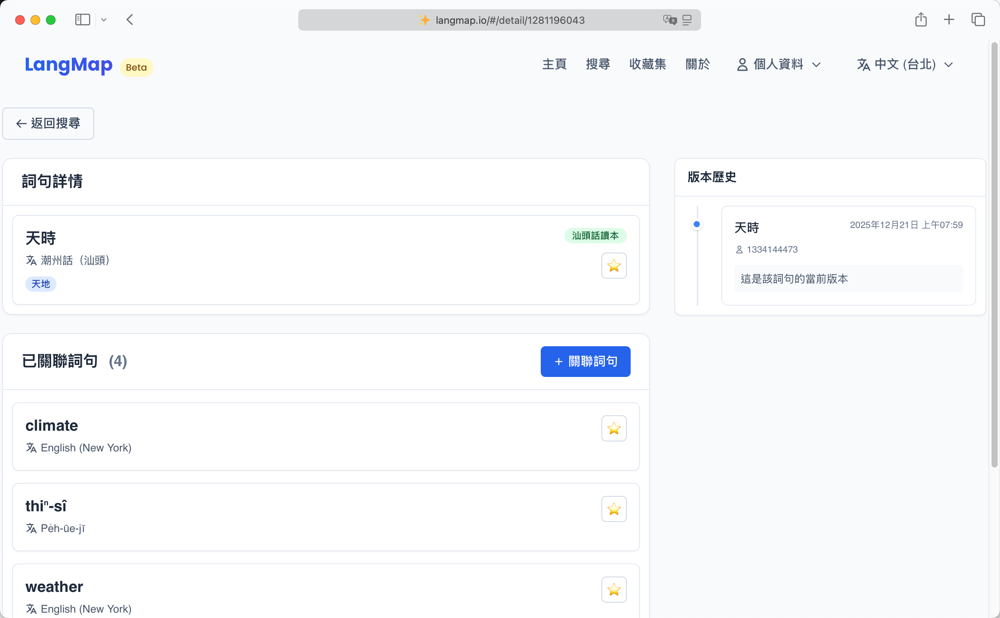
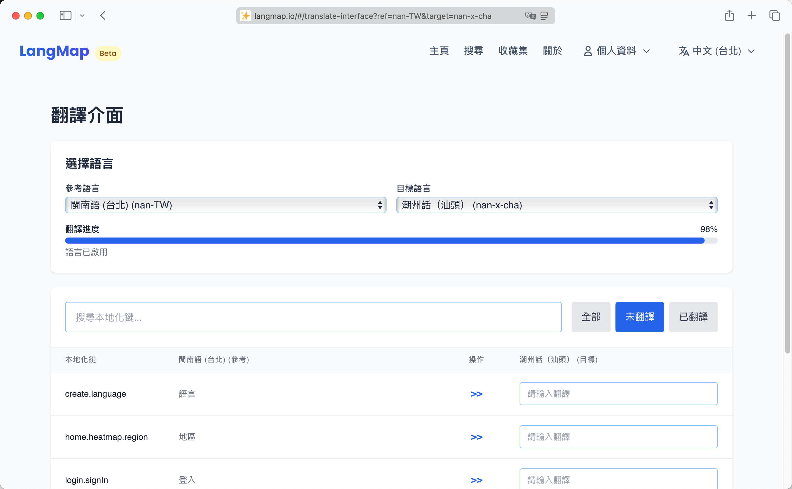

保護語言多樣性最好的方式就是多學幾門新語言。根據教科文組織的統計，包括口語和手語在內，世界上共有 8324種語言，其中還在使用的大概有 7000種，並且**每兩周就有一種語言消失**。

消失的不僅是語言本身，還有在此之上的文化，那些與古老的過去連結的聲音和符號，那些流傳下來的鮮活的表達，彷彿在世界上不曾存在過。

為此，我特地創建了一個網站，意在連結所有的語言，不管大語種還是小語種，不管是標準語還是方言，不管是用什麼書寫方式，都歡迎連結起來。這樣，即使再小眾的語言都能被看見和被學習。

<!--more-->

網站名叫 LangMap，中文可以叫語言映射或語言地圖，網址是：[https://langmap.io](https://langmap.io)，歡迎大家來訪問。

差不多內容的網站並非沒有，比如[維基詞典](https://zh.wiktionary.org/wiki/Wiktionary:%E9%A6%96%E9%A1%B5)就記錄了不同語言的詞彙，還有 [Tatoeba](https://tatoeba.org/) 連結了不同語言的句子，還有 [opus](https://opus.nlpl.eu/) 收集了大量的平行語料。

但 LangMap 不一樣，LangMap 從設計之初就是多語言的，網站上的每一處都是可翻譯的，並且不限制語言，讓語言先被看見再說。

還有多語言間可以通過選定語言較為豐富的作為錨定語言進行相互關聯，比如漢語族的各語言可以錨定到現代標準漢語（普通話、國語、華語），拉丁語族的各語言可以錨定到西班牙語，日耳曼語族的錨定到英語等等。

在詞句的詳情頁面，可以搜索並關聯其他詞句。新關聯的詞句會自動錨定到當前詞句錨定的某個語言版本的詞句或者是它本身。

如果檢索不到詞句，還可以進行新增。同時，考慮到語言的地區差異，為了讓每個小地區的鮮活表達都可以被記錄上去並被看見，在新增語句時還支持指定地區。

另外，LangMap介面中的多語言文本是統一錨定到英語的，用戶可以幫手翻譯或增加新的介面語言。

此外，網站還特意開發了收藏集功能，看見好的詞句可以收藏起來，以便日後回顧。收藏集中的詞句還可以全部匯出成 JSON/CSV 格式檔案以便程式處理。

以上，就是該小站的大概功能啦，**目前還是用戶測試階段，功能相對粗糙，歡迎留言建議或許願新功能**。

------

**題外話**

本站大部分代碼都是 AI 生成的，其中通義靈碼、ChatGPT 和 Gemini貢獻突出，在此表示感謝。另外感謝 Cloudflare 提供的實用的雲服務和免費額度，讓本站得以快速上線。
