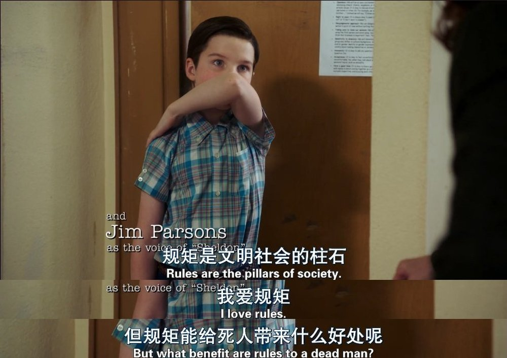

自 19 年末以降，我們就進入了一個嶄新的時代，一個戴口罩的時代，一個做核酸的時代，一個進門先看健康碼、行程卡的時代，一個出門甚至不出門都可能被隔離的時代。

每個時代都有每個時代的生存之道，拒絕適應時代變化的人不是偉人就是塵埃。作爲大多數普通人通常很難改變時代，即使可能也無法驟然改變。爲了不淪爲塵埃（直白點就是苟活著），從現在開始（可能對有些人來說已經晚了）適應「新時代」才是比較務實的選擇。

<!--more-->

## 守則一：未雨綢繆，有備無患

永遠不要心存僥倖，你永遠不知道封控、隔離和明天哪個先來。忽視可能的危險可能會令你陷入危險的境地。**明智的做法是爲最壞的情況做打算，然後堅定地去生活。**

從現階段看，最壞的情況就是你被集中隔離了一段時間，同時陽性了，發燒了，觸發基礎病，來不及救治，死了。

不要覺得我是在危言聳聽，不要以為發生在其他人身上的事離你很遙遠。等到發生在你身上的時候，你是否做好了準備呢？

不如現在就開始準備吧。

最常見的情況就是居家隔離，短則 7天，長則……不好說，已知新疆的同胞有被居家隔離 3 個多月的。更麻煩的情況是被轉運隔離、集中隔離，生活條件存在很大的不確定性。

我拍了拍腦袋想了想，爲應對隔離，大概需要做好以下的準備。

### （1）生活起居類

你要習慣自己做飯 。總是吃泡麵的話營養不夠，抵抗力會下降，疲於抵御病毒。如果你還不會做飯，現在開始學幾樣簡單的菜式還不遲，會煮飯、煮粥、炒幾個小菜和煲幾個湯就足矣。

如果廚房裏裝備不全，或者沒有廚房，那麼最好現在開始購買，並確定做飯的位置。廚房裝備包括但不限於：

1. 烹飪用具：多功能電飯煲、電磁爐、電熱水壺、鍋鏟。
2. 食材處理用具：菜刀、砧板、刮削器、水果刀、洗菜盆。
3. 餐具：大碗、小碗、盤子、筷子、勺子、碗櫃。
4. 調料：油、鹽、醬、醋。
5. 乾淨的水，如對當地水質不放心，則需保證至少 7 天的礦泉水儲備。

爲了保證自己的營養和熱量，請斟酌儲備以下食品：

1. 蛋白質類：牛奶、奶粉、雞蛋。
2. 乾貨類：魷魚乾、蝦乾、臘肉、臘腸、蘑菇、脫水蔬菜。
3. 豆類：黃豆、黑豆、綠豆、花生。
4. 凍貨類：雞翅、排骨、肉丸。
5. 熱量類：大米、非油炸麵、麥片、玉米、土豆、蕃薯。
6. 微量元素類：白蘿蔔、紅蘿蔔。
7. 零食：堅果、薯片、可樂、紅茶、咖啡。

吃飯的問題解決了之後，接下來就是穿衣了。秋冬之際，天氣冷了，禦寒的衣物必須準備好。身體就像一個緩慢燃燒的火爐，聰明的人善於維持自身熱量的穩定。

無論什麼時候，保持自身乾淨衛生是作為人基本的體面。基於此，洗髮水、沐浴露、牙刷牙膏、洗手液、洗面奶、洗衣液、毛巾、紙巾等等清潔用品要夠用。男生還需要剃鬚刀，女生還需要準備衛生巾之類的。

爲了應對更壞的情況，即被集中隔離到不確定性大的地方，最好準備好若干條一次性內褲、水壺、排插、充電器等等。

### （2）健康用藥類

家中常備急救用品和常用藥物，比如創可貼、酒精片、紗布、感冒藥、腸胃藥（水土不服必備）、頭痛藥、跌打損傷藥、口腔潰瘍藥等等。如果你有持續用藥的需要，務必保證藥品充足。另外，長時間隔離營養未必均衡，可以備一些維生素 C。

一旦感染了新冠也不必過於憂慮，按照目前的數據，你大概率不會死。即使你有基礎病，只要保證身體營養，相應的基礎病有妥善的藥物治療，調整好心態並保證好充足的睡眠，死亡也是離你很遠很遠的。

### （3）居家辦公類

居家辦公不易，容易受到各種打擾，因此生活和工作要盡量分開，最好有單獨的辦公區域。辦公要有辦公的樣，最好有單獨的辦公桌、顯示器和電腦。（沒有也問題不大，老闆也不知道你在摸魚[坏笑]）

### （4）健身、讀書及娛樂類

隔離期間，活動範圍受限，需要準備在受限的範圍內可行的活動，避免無聊，甚至精神受損。

要經常運動健身，保持健康的身體和愉快的心情。若熱愛讀書，則準備好感興趣的紙質書或電子書，確保有書可讀，精神充實。若喜歡遊戲，則準備些遊戲或遊戲機，適當的遊戲可以讓人暫時脫離魔幻的現實，對心理健康很有益處。

## 守則二：危邦不入，亂邦不居

頻繁隔離、封控、層層加碼、瞞報疫情或者粗暴對待被隔離人員的地方，就是「危邦」、「亂邦」。**生命可貴，請遠離危亂之邦。**

簡單的判定規則就是：南邊比北邊普遍好，發達地區比欠發達地區好。當然要具體地區具體分析，多關注多種來源的新聞，客觀分析所在地區的情況，及時脫離苦海。

## 守則三：眼觀六路，耳聽八方

**時刻關注多種渠道的消息（越多越好）**，比如微博、抖音、公眾號上各地方的官方發佈，以及各種群消息等等。

你需要根據獲得的信息，適當調整對未來情況的判斷，並及時適應新的變化，千萬避免到潛藏危險的地方出差或旅遊或生活。

最後，希望大家都能在新時代中好好地生活著，體面地生活著。
