中秋假期，跟著杜同學及其同事前往廣西桂林旅遊，導遊姓張。這是我第一次跟團旅遊，種種見聞令人難忘，不妨一書以待「後之覽者亦將有感於斯文」。

<!--more-->

第一日，早上先在萬福廣場吃了一頓桂林米粉，這米粉咬下去很乾脆地斷了，不粘連，很有口感。隨後坐車到陽朔興坪鎮灕江景區，坐船游灕江。

這山直直聳立又層巒疊嶂，水乾乾淨淨又綠意盎然。杜同學直言其想跳水入江游泳，我深感贊同。然恨游藝不精，未能施行。

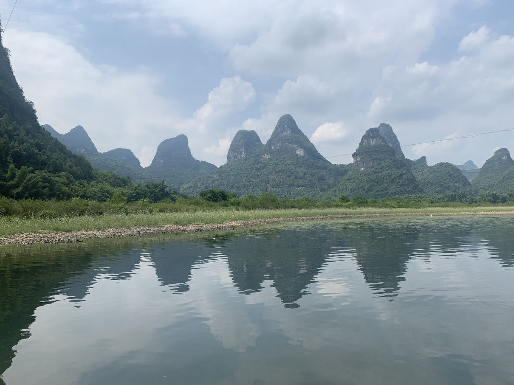

遊到「20元人民幣背景」時，停船，開始收費拍照服務，還有付費鸕鶿道具服務。兩隻鸕鶿被綁住腳、綑住喙、套住喙尖後置於一根竹竿之上，遊客擔起竹竿拍照。見此場景，我心裏閃過一想法：放過鸕鶿吧，既然不再需要用其捕魚，就令其自由吧。而後又想到這背後可能牽涉到一些以其維生的家庭。但再想想還是要逐步放棄鸕鶿表演爲好，文明的社會不應以施虐動物爲樂。

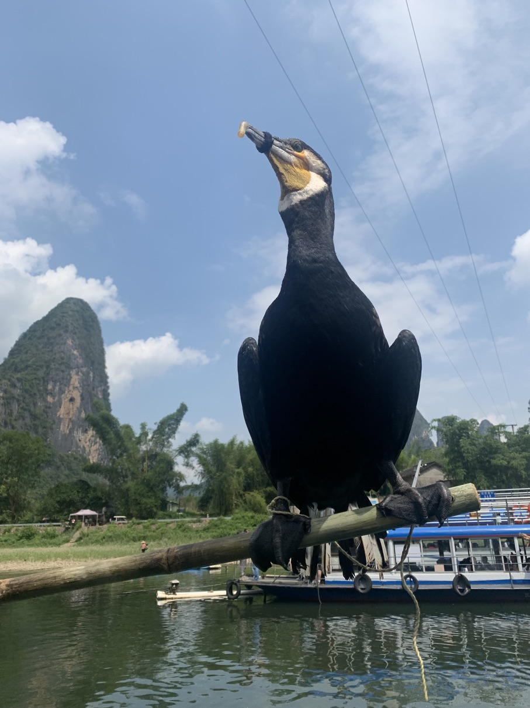

中午團餐吃了啤酒魚，味道不錯。

下午到另一處坐「竹筏」`（現在都是用PVC塑料管了，杜同學想體驗真正的竹筏估計要自己造一個了）`遊江，筏上風光旖旎，風徐徐地吹過，相當愜意。

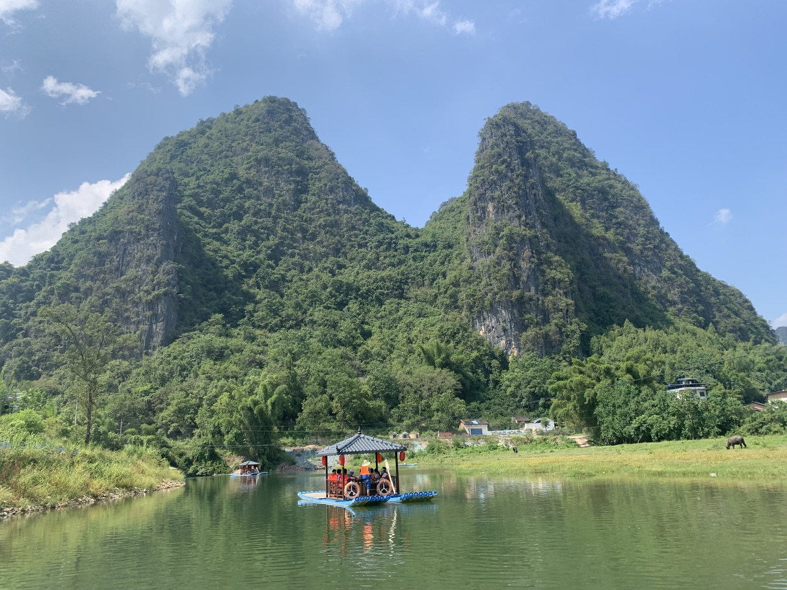

遊畢到一古戲樓，樓下有一榕樹，其樹幹被雕刻上凸眼獠牙怪，而其上枝葉正茂。

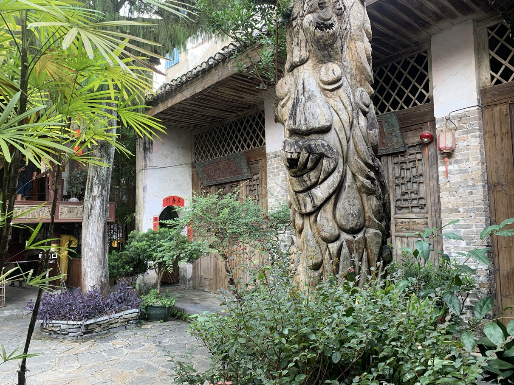

遊出戲樓門口前有吆喝摸烏龜，順手一摸，說是送一銅錢去一處包裝，去到是一個傢伙吧啦吧啦問屬相開始算命，我心不在焉地聽了，算完說是在一本上添香火錢。我一看，好傢伙！這些都是土豪嗎，一次都是上百的。我擺擺手說：太多了。然後離開了戲樓。21世紀了，還有人在宣傳烏龜、貔貅和命理，進而撈錢。

又到一景區，門可羅雀，景區內所有的景點都以逍遙爲名，瀑布叫逍遙瀑，湖叫逍遙湖，樓叫逍遙樓。造此景者大概詞窮了，於是通通都是逍遙，乏味得很。

景區內有收費坐筏遊湖唱山歌服務，工作人員看我們走上山路，說：上面是遊客出口，下面才是風景。

我看這水這般濁，這筏如此舊，山也不及灕江好看，怎的是風景了？

行到逍遙樓，登上樓，樓內空空如也又破落不堪，底下居然自稱與黃鶴樓齊名。

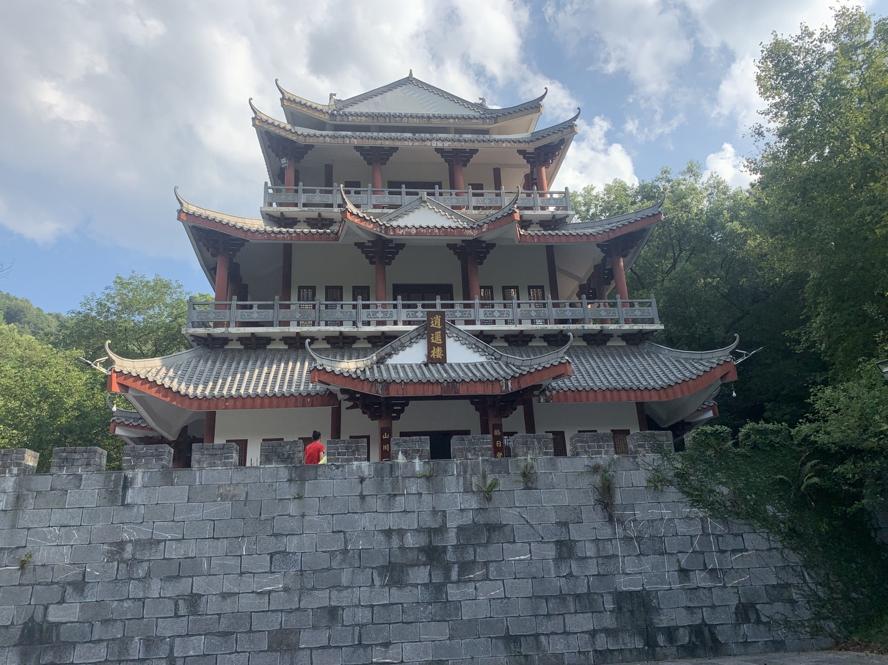

晚上團餐吃了啤酒魚，難吃。

第二日先到一處「博物館」，名曰「抱樸博物館」，掛牌爲3A景區。此館有 A、B 兩區，A 區直通賣大型翡翠珠寶賣場，B 區有展出一些化石和玉石。

我深深感覺到「博物館」這個詞遭到了污辱，假博物館之名，行銷售賣貨之實，真真是掛羊頭賣狗肉啊。館內有工作人員跟著你，向你推薦商品。如果你脫離了跟屁蟲，到處遊蕩，會被路過的工作人員詢問要去哪裏。而我只回答：看看。

翡翠珠寶看膩了，實在無聊得很，只能找一處坐著看書去了。

中午團餐吃了啤酒魚，難吃。

下午又去坐「竹筏」，不過這次另有收費服務，是水槍，開槍費一把 20 元。船夫先用水槍射鄰筏遊客以帶節奏，鄰筏遊客反擊，我們筏上的人巋然不動，船夫不樂。

接著去到銀子岩看溶洞看喀斯特地貌。溶洞少不了人造的燈光，以及收費的拍照服務。實話說這裏確實有不少令人稱奇的景觀。但是經過「博物館」和「竹筏」的折騰之後興味淡了很多。

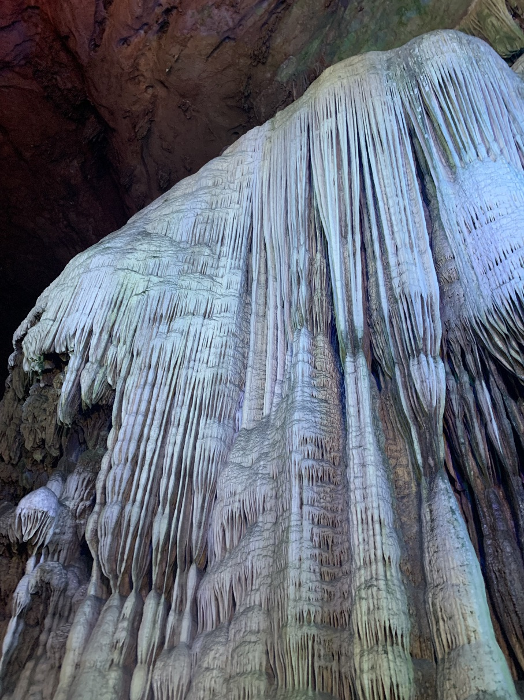

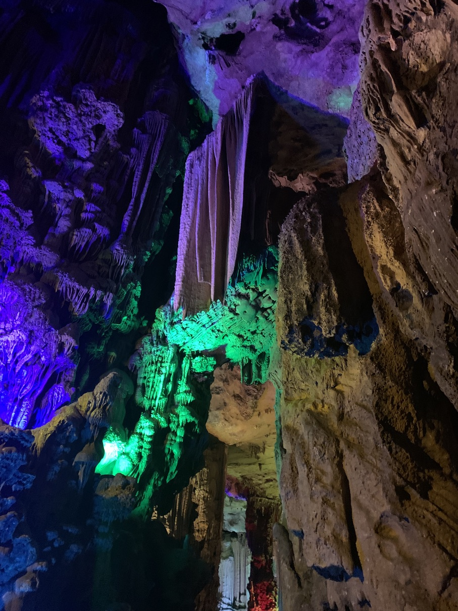

晚上我們逛到一家掛名 CCTV 的店裏希望吃到正宗的啤酒魚、釀田螺和香芋扣肉，個人覺得不及米飯香。吃罷，去到陽朔西街。

這街市如此吵鬧，巷子裏滿是酒吧還有拉人的酒吧店員，聒噪不已。我漫步到一巷，甚安靜，有一屋，名爲徐悲鴻故居，大門緊閉。查了下維基百科，了解到原來是抗戰時期，徐拋棄妻子，跟情人避亂的所在。

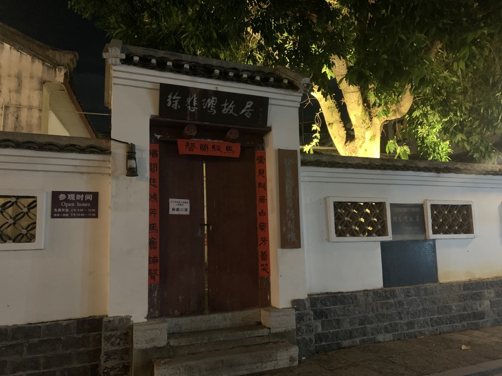

第三日早上打算借車從陽朔到市區然後脫團。

巴士快開到木龍湖旁邊的「博物館」時，張導遊說：這裏面的老闆有很多礦區，且因為是他贊助了此次旅遊活動，所以團費才這麼便宜，但是裏面的價格較貴，有錢可以去買。心裏一軟想著：這團費確實便宜，也不好影響張導掙錢。於是就留下了。

進入裏面，實在令人受到莫大的侮辱，寥寥幾個展品，底下還有紙箱擋道，上書「XX老板」，估計是要寄賣的。工作人員引我們進入負一樓，果然是賣場，不過比昨日的小型多了。

一樣的跟屁蟲，但是有不一樣的講解。這次有兩個工作人員值得關注：一個黑臉大媽，一個是紅臉小伙。黑臉大媽負責推銷商品和委屈，紅臉小伙負責斥責黑臉大媽推銷商品並講解如何看玉。這場戲感動了一些遊客，隨後紅臉小伙一個打到骨折的降價，令幾個遊客紛紛掏出了錢包。同行的東北大爺大媽倒是機警，早早離開，沒有上當。另外值得注意的是這裏售賣的物品沒有發票，只有收據但無公司名頭。

賣貨的居然在教買貨技巧，而買貨的居然信以為真。此種戲在生活中實在普遍啊。不信請回顧下自己以往的經歷，是否有見過賣基金的教買基金技巧，賣電腦的教買電腦技巧...

看完聽完，工作人員把廁所旁邊的門一開，就進入了木龍湖景區。哈，好一個合謀。

中午去到萬福廣場上的超市，裏面全是特產，一團團人進去又出來。張導遊說：這次你一定要買點東西，不然我鄙視你。我想可能是我拉低了整團的消費水平以及她的收入了，實在不好意思，但是我只會買我想買的東西，絕不會買別人要我買的東西。逛了一圈，帶了點金桂酥和芒果乾之類的，然後用小票跟導遊換了張午餐券，又吃了一頓桂林米粉。

吃完，立馬脫團自由行，前往第一天就想去的白崇禧故居。

從信義橋下沿榕湖繞行，就到了白崇禧故居，然而白崇禧故居連同白公館在景區的導覽圖上竟然無一標註，故居及公館大門緊閉，禁止遊客入內，景區內其他景點如：宋靜江府城牆皆如此。難道這個城市已經忘記了白崇禧了嗎？又或者這個城市的待客之道就是在正常營業時間閉門不接嗎？

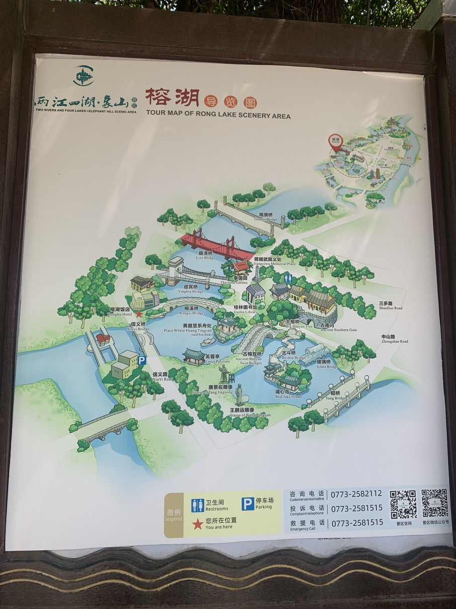

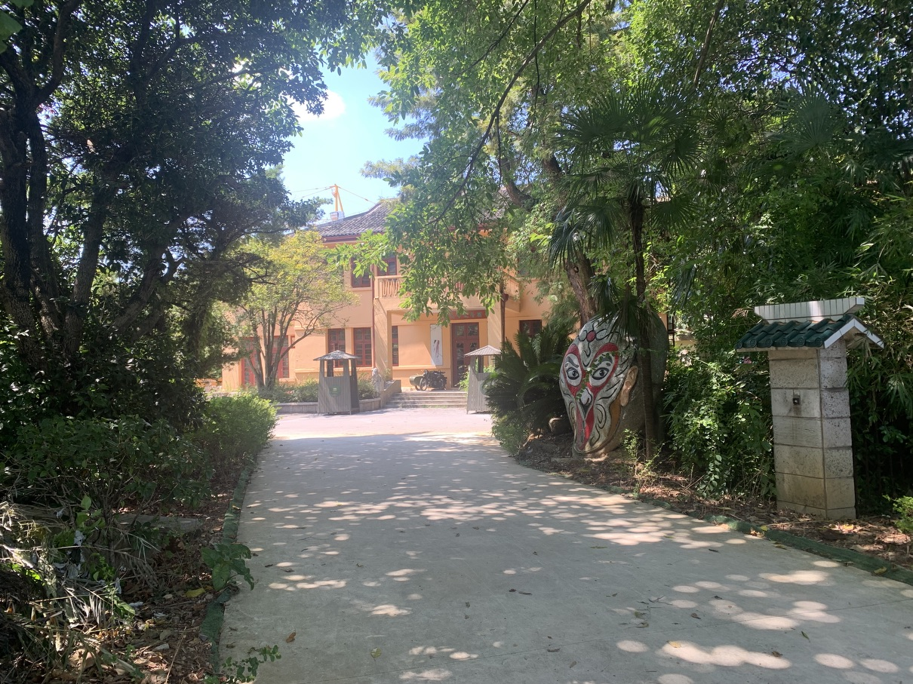

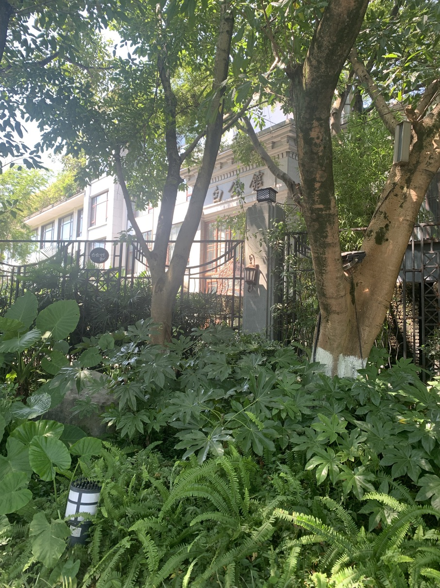

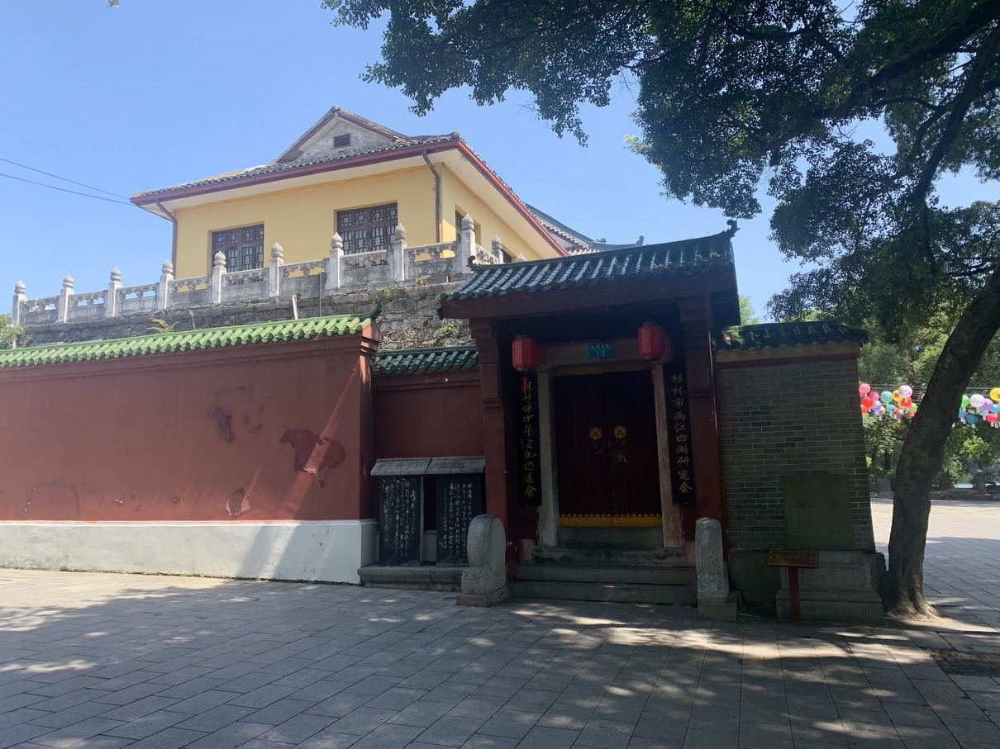

遊來蕩去，又去了李宗仁官邸，這是正常開放的。

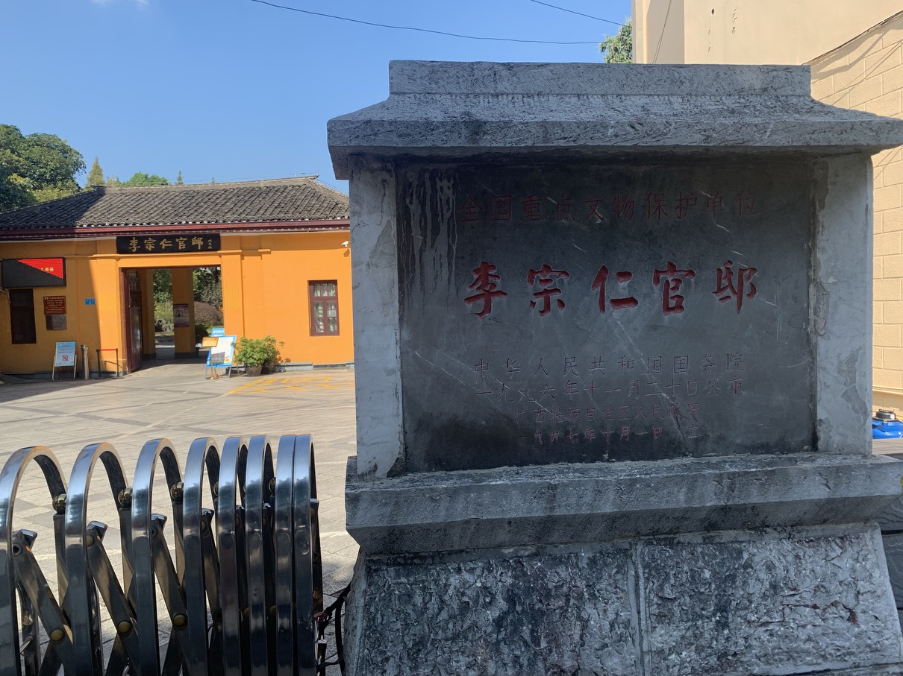

又行到衫湖旁邊的日月雙塔，這是 2001年始建的銅塔，上標AAAAA國家級旅遊景區，下書桂林市歷史建築。建築在了，可這歷史在哪呢？入塔費 35元，覺得貴了累了又無趣，未上去。

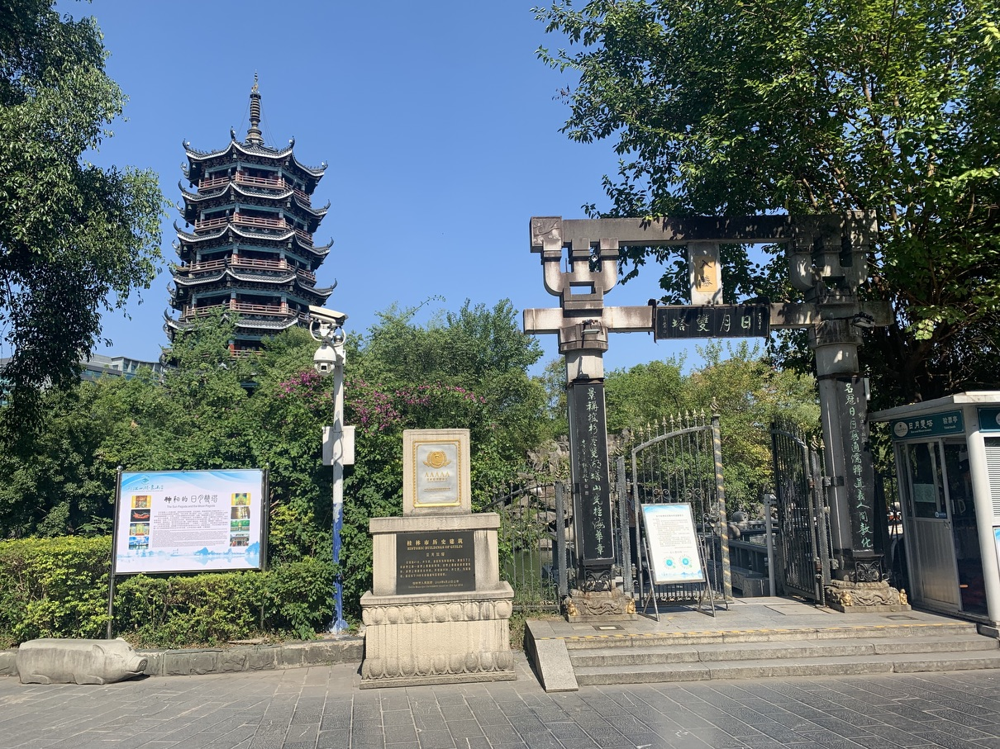

稍作休息後，決定去看梯田。本來跟順風車司機談攏了價格，約好了時間，沒想到司機拖延再三。一怒之下，等到司機終於快開到的時候，取消了訂單。打算北上走走，然後打道回府。

去到金順昌以及屈臣氏買了些特產，然後去到東西巷吃了日式烤肉還有自帶的月餅，皆美味。

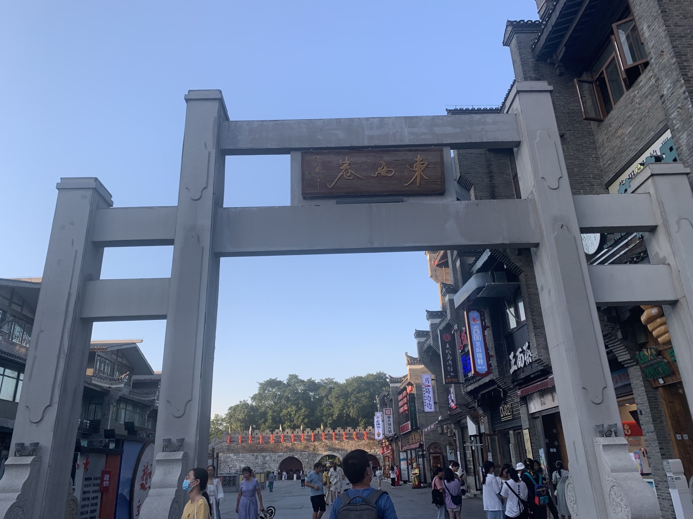

晚上，從端禮門進入，漫步靖江王府。行到一路牌，上面標註的「逍遙樓」令我猛然一驚，接著隨路走上狀元廊，直通逍遙樓。

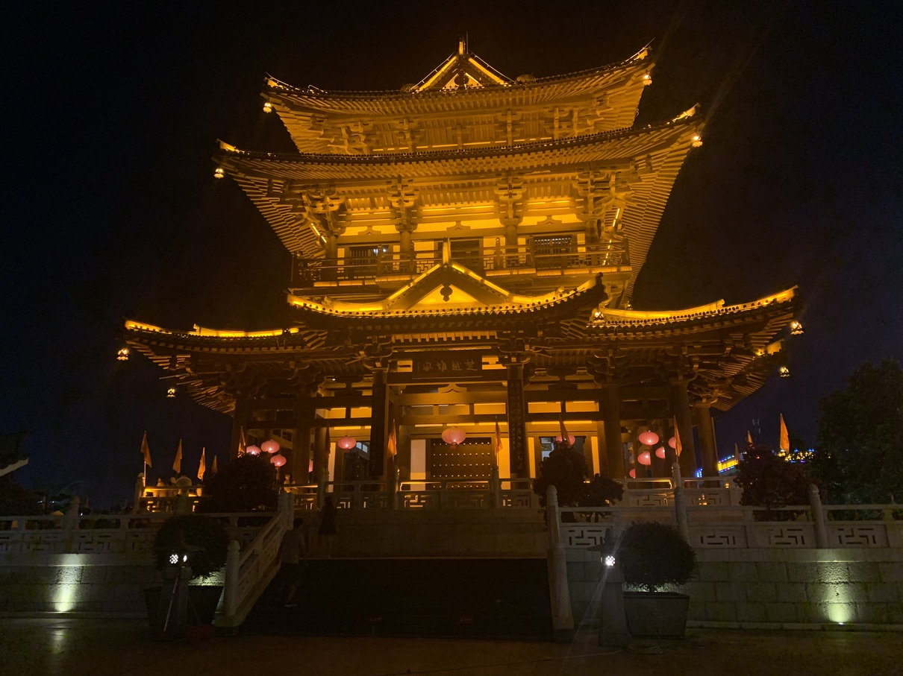

見到這逍遙樓，我有點激動，跟杜同學說：此行不虛啊。

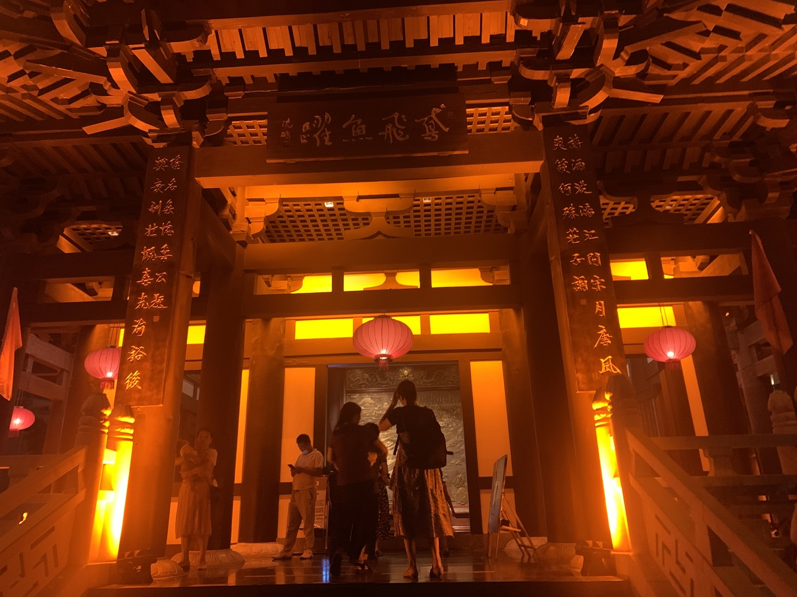

樓下石碑說明了這才是真正的與黃鶴樓齊名的逍遙樓`（雖然是重建的）`，樓上燈火璀璨，過道上有不少書畫作品，有一聯曰：「逍遙樓上觀日月，東西巷中話滄桑」，誠然。內部因為過了時間未可入內參觀。登樓賞月拍照者眾，我們也未能免俗。

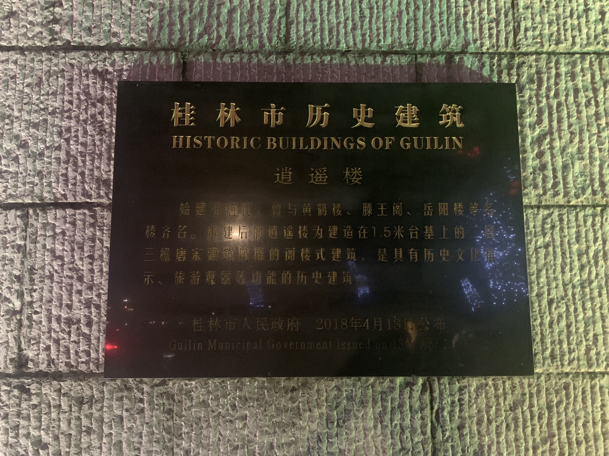

天熱無風，觀月一會就不想繼續留了。於是乎，打道回府。

