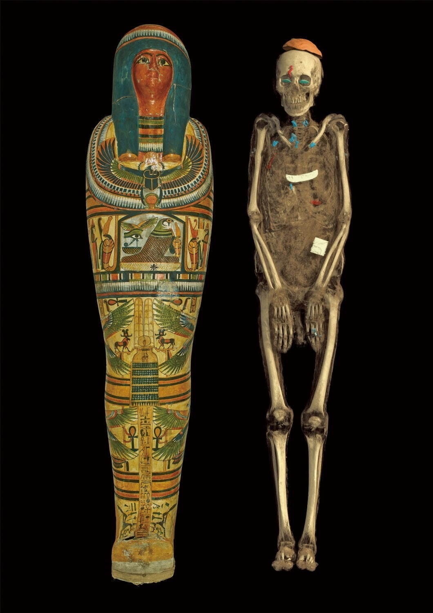

過去我時常在想一個問題，就是：人生有何意義？

我問父母，父母告訴我三頓有得吃就好了；
我問老師，老師告訴我這不用考；
我問書本，書本說回首往事的時候不會後悔；
我問佛陀，佛陀拈花微笑不語。

<!--more-->

後來又在逐漸地接觸社會、看書、看電影和思考中，我體悟到「人生並沒有什麼意義」，或者說並沒有什麼天生的使命和價值。

有時候我們會錯認為別人對我有所求，我就有價值。不是的，那是你對他人來說有利用價值，不是你的終極價值。種在無何有之鄉的大樹看起來對任何人都沒有利用價值，既不能砍來做傢俱，也不能乘涼，但大樹可以長久而挺拔地過完自己的一生，享受日照和雨淋。

剛開始的時候，這令我抓狂，人生無意義，那麼我豈不是可以為所欲為，一切道德和法律的束縛都可以無視？

其實不是的，人生就像一趟單程的旅行，時間有限，精力有限。有些行為只會耗費你的時間和精力，讓你過早結束旅行，無法體驗到更深層次的生命體驗`(這是我在油管上從印度瑜伽大師薩古魯學習到的)`。

要體驗到更深層次的生命體驗，有幾項要注意：

1. 把握時間，每個人一天都只有 24 小時；關注重要而緊急的事情，先做。
2. 保存精力，人一天的精力是很有限的，精力如果花費在一些瑣事上，那麼對重要的事時就會精力不足。飲食很重要，要注重。食物是人體的燃料，要注重營養搭配，多吃蔬菜水果，要細嚼慢嚥，減少身體負擔。要運動，強壯的身體，有活力的身體，才能支持你探索世界。
3. 積極探索，跟隨自己內心的指引，探索更廣闊和深層的精神和物質世界。看書看電影是不錯的，用腳步丈量世界可以破除對世界的誤解，有機會的話一定要去地球之外看看。
4. 關心家人、朋友和週遭的一切。人不是孤立存在的，留一片溫情於世，大概也是不錯的。

如果不想到死的時候還是對世間和我的存在一臉迷惑，那麼現在就應該擦亮眼睛，積極生活了。人終將一死，有的人在臨死的時候掙扎著想要多活幾秒，有的人巴不得早點離開這悲慘世界，而我希望是跟世界說：「我來過，我活過」。

