呾實話，我毋適合na⁷`(在)`茨亓，因爲通日胡思亂想，精神較`(kah⁴, 很)`痛苦。想bhêh⁴`(表意願)`出外口行行，遠亓地方時間毋赴，近亓地方無意思。想來想去，覺得半個鐘車程亓地方恰恰好。

清暉園`(粵語: cing¹ fai¹ jyun⁴, 甲子話: cêng¹ hui¹ hng⁵)`就是這樣亓所在。

這日透早睇了一頃《哥倫比亞的倒影》，內底是呾木心先生著紐約哥倫比亞大學行走時亓所見所想。印象深刻亓是伊當睇著思想者大衛亓銅像，摸著大衛緊張且燒燒亓肌肉時，想到王爾德亓一句話：思想產生在陰影裡，太陽是嫉妒思想的。

<!--more-->

又睏了一頃，兩點外鐘，叫車出發。準備乞日頭消滅思想。

行入清暉園前，需要預約（可即時預約）並且展示綠碼正好入去，然後到售票亭買票，大人票張15個銀，恰便。

一入園就信步而行，行到底塊就底塊，事前無攻略。

入園往左，睇著一bao⁵`(棵)`樹，名玉堂春，卡片上呾是木蘭，又叫功名樹，需要考上功名皇帝賜汝正好種。潮劇中的蘇三花名「玉堂春」原來是暗示王金龍考上功名。

又見一亭，有對聯兩句：「白菡萏開含露重，紅蜻蜓去帶香飛」，後一句尤其喜歡。只可惜荷葉<u>gao³ oi⁵</u>`(大片)`枯乾，也無荷花也無沙螟。

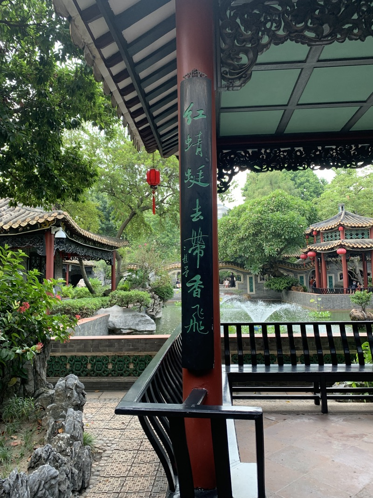

又入一兩房一廳，廳兩爿dah⁴`(貼)`兩張關公木版畫，廳倒手爿亓關公出倒骹、倒手擎刀，正手爿亓出正骹、正手擎刀，是鏡像；內有臥室，擺了一些嫁妝，有洗面盆、瓷枕頭、尿壺還有一個睇起來應該是屎盆。

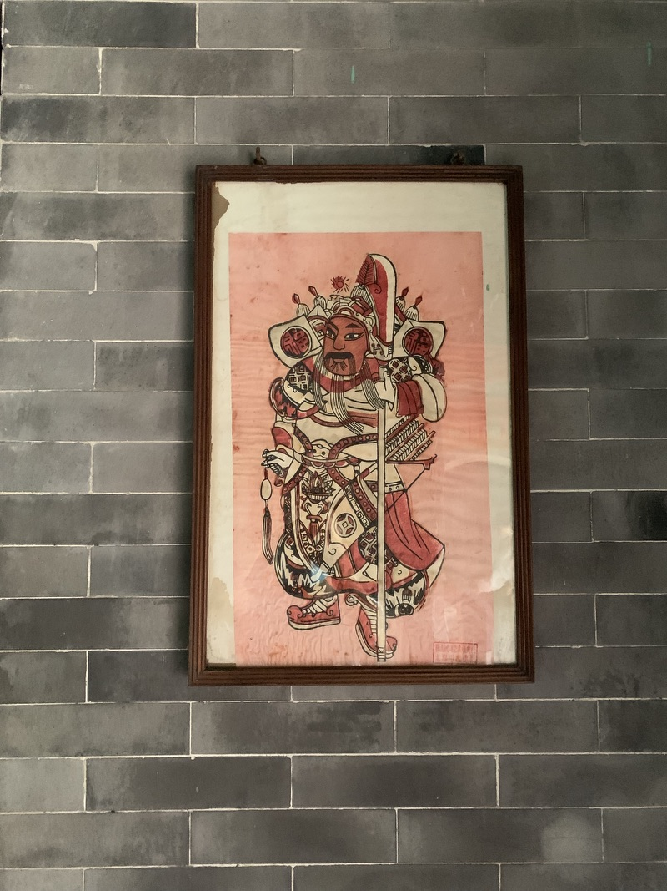

入一假山，有水有洞有魚。鯉魚酷㩼酷大隻，喙囁囁著，無歇。有一隻覕著石後，靜靜，是一隻孤單亓魚。

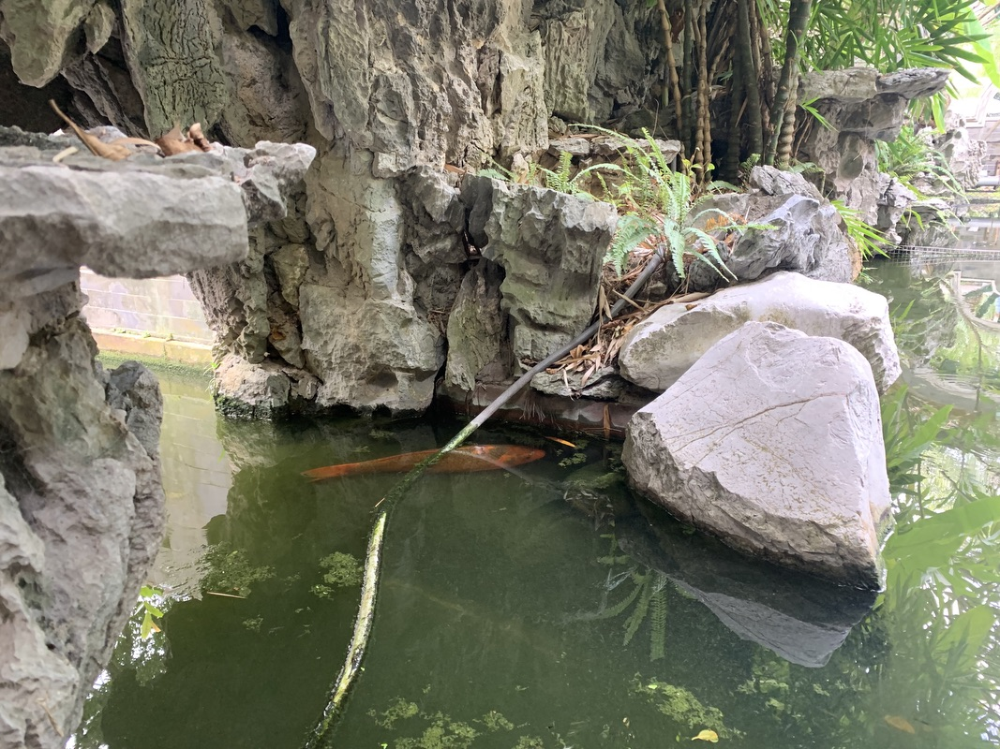

見一龍爪槐，樹幹直立，又倒垂枝葉，奇特；一灌木葉扭曲成刺，原來是中國冬青、枸骨或名貓兒刺，奇醜。

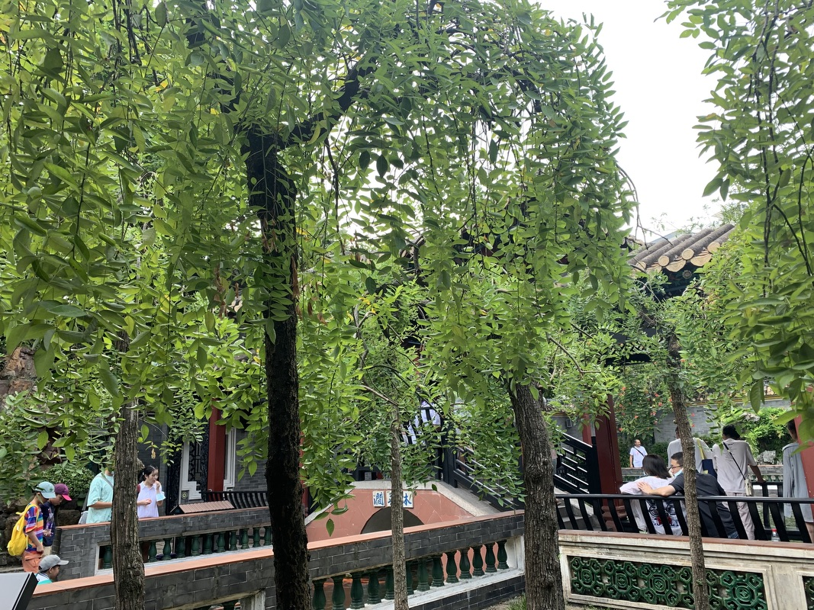

上一橋，橋兩爿種水葫蘆，細小可愛。

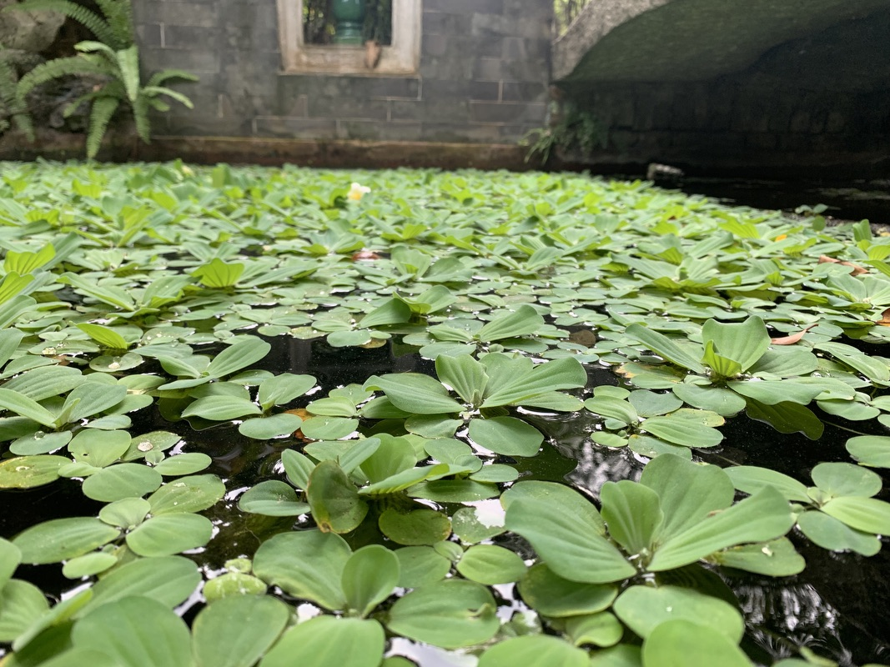

入一堂，名狀元堂，有一塑像，是黃士俊，順德第一個狀元，明朝人，清暉園最早亓主人。清朝時沒落了，乞當時亓進士龍應時購買擴充。後來伊亓囝龍延槐，回園奉母，請同榜進士李兆洛題名「清暉」，取「誰言寸草心，報得三春暉」亓意味。龍家幾代人苦心經營，可惜民國戰亂人走樓空。新中國成立後，變做順德縣第一招待所，現在正成為清暉園博物館。

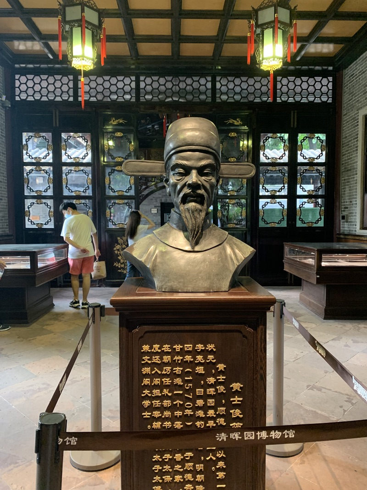

又見茶室琴房、吊燈翠竹。

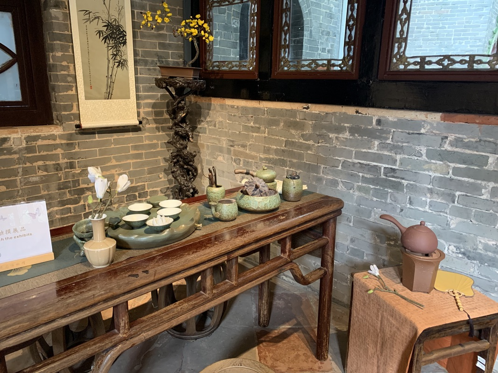

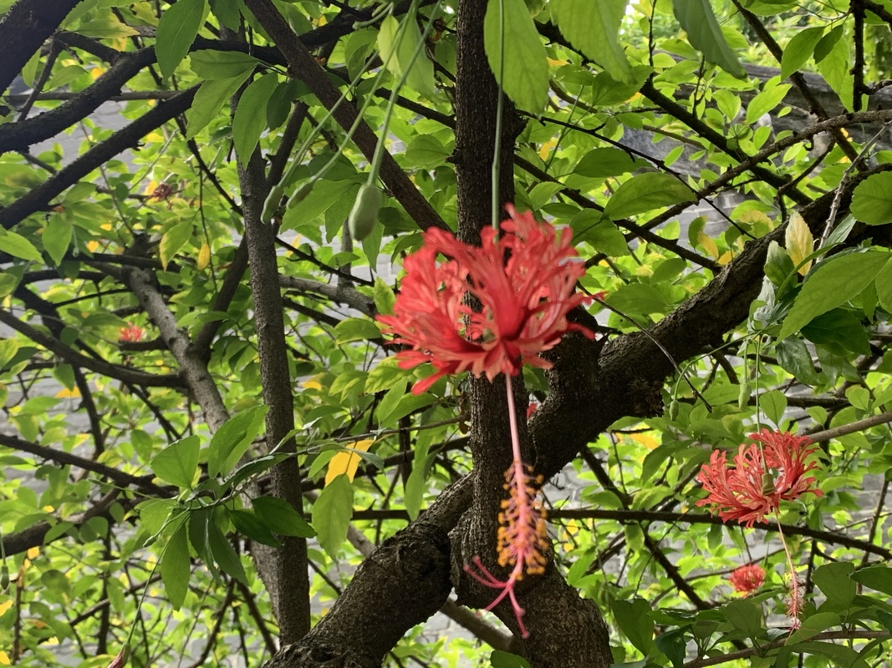

進一齋，名真研齋，是書房，有書桌，有書冊，還有孔子像。

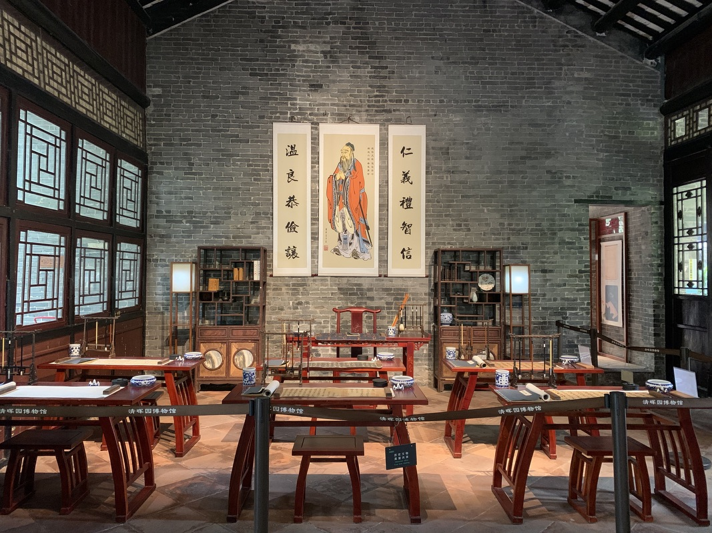

有一泉眼，往外口不斷吐水。

有一橢圓形亓窗，竹葉伸入，兩爿題「白雲無盡時，綠樹多生意」，應景。

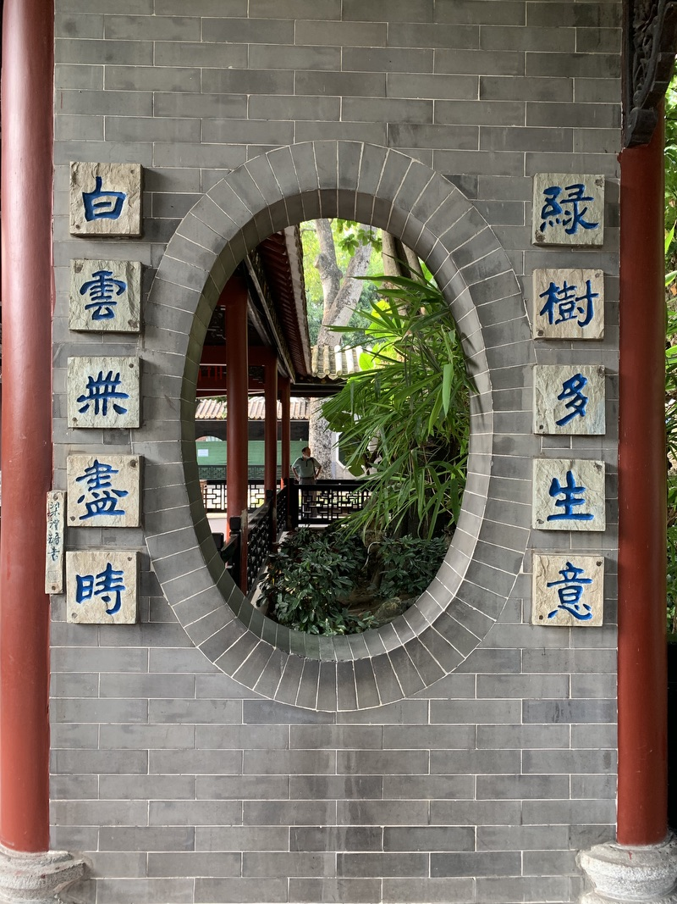

又上一假山，有各式草類聚集成景，挲了幾下貓毛兒草，酷柔。

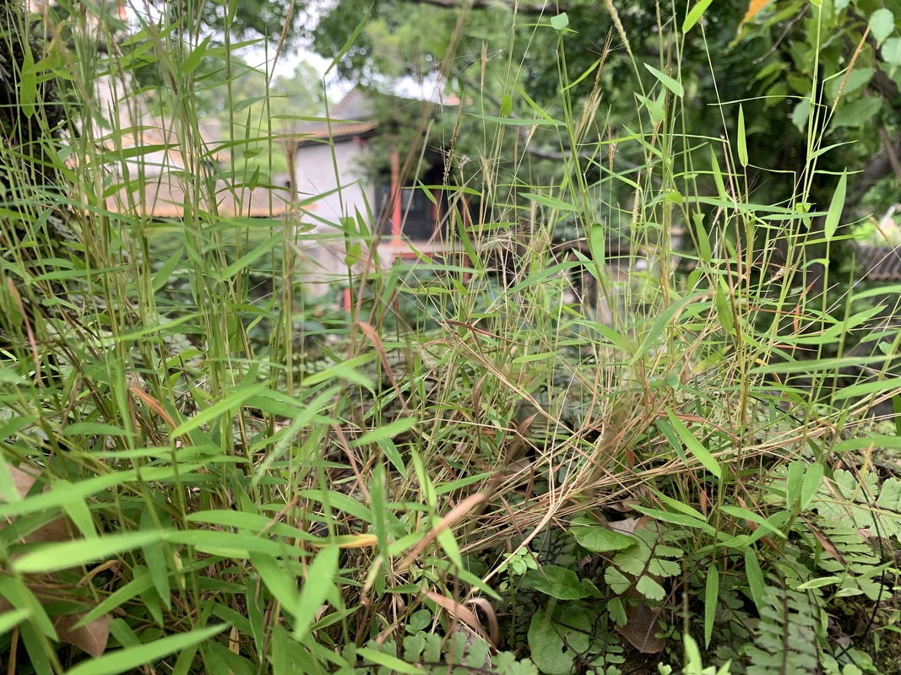

見池柏三兩叢，樹幹聳立，樹葉下垂，有柳意。

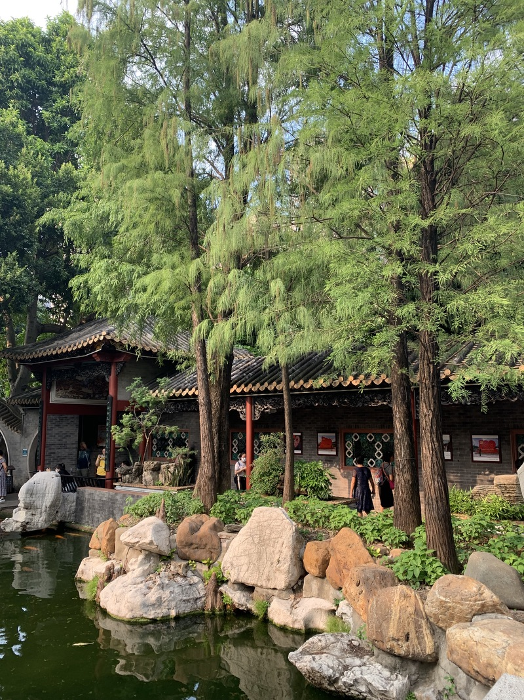

見一窗石林，大驚。大約高不過三十釐米，然用凸起亓樹根或樹幹做石景，頭逝見。

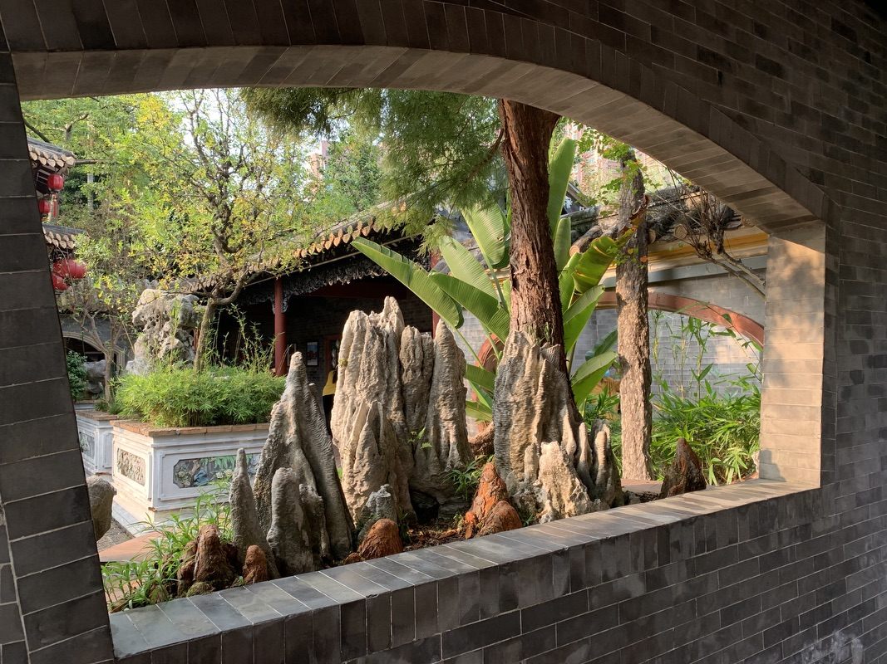

見一古舊門口，匾寫「清暉園」，聯寫「水色山光皆畫本，花香鳥語總詩情」。

見一楊桃樹，危大青翠，桃葉難辨，坐伊骹頭，聽鳥音不斷。

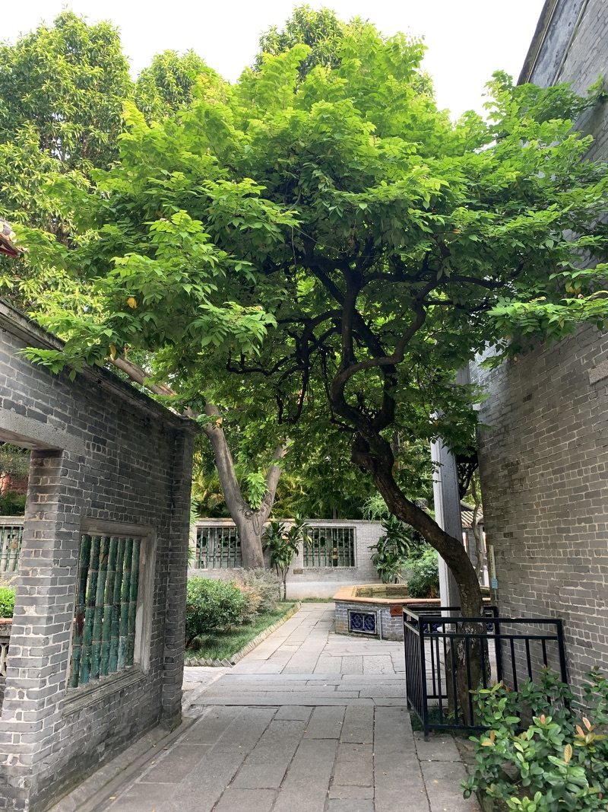

移步換景，景緻<u>相sua³相sua³</u>`(接連不斷)`，無感覺時間已過去兩三個鐘頭。

出園，覓食。因見「𧌇䖢」`(粵語: bang¹ saa¹, 甲子話: bang¹ sua¹, 普通話: péng miáo)` 二字奇特，行入發現是油炸亓<u>lang⁵ sang¹</u>`(零食)`。又行了幾步，睇著民信老舖，點了一份凍爽皮奶佮一份炸牛奶，凍爽皮奶熱天時食合好，奶味足、入口即化；炸牛奶過甜，毋喜歡。

是爲記。

二零二一年九月十三日
