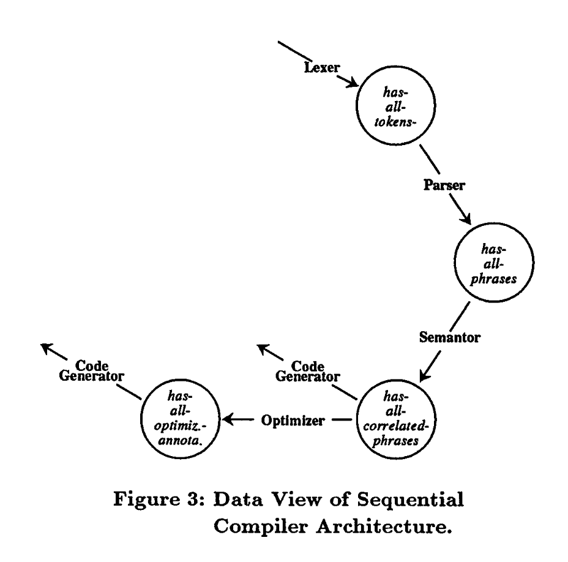

最近讀了一篇名爲 *Foundations for the Study of Software Architecture* 的論文。它是由 AT&T 公司的 Dewayne E. Perry 和卡羅拉大學的 Alexander L. Wolf 於 1992 聯合署名發表。

這篇論文不得了，光看名字就覺得很重要，這可是研究軟件架構的基石啊。文中提出了一個重要的軟件架構模型，即：

```
Software Architecture = { Elements, Form, Rationale }
```

翻譯過來就是：

```
軟件架構 = { 元素, 形式, 理論依據 } 
```

Perry 和 Wolf 如何得出該模型呢？

<!--more-->

## 康德的哲學理論

讓我們先大略了解下康德的哲學理論吧。

康德認爲對象通過我們的感性形成直觀，然後再經由我們的悟性所思維形成概念。感性的對象我們稱之爲現象，非物自身，物自身我們不知道。現象中之質料(Materie)經由感性，形成感覺，是爲經驗直觀；現象中之形式(Form)，是指先天存在我們心中用來整理感覺的東西，即時間和空間關係，是爲純粹直觀。

簡單來說，就是：

```
物自身 --> 現象 --> 直觀 --> 概念
```

以杯子為例，我們怎麼得出杯子的概念的呢？首先我們用感性感覺到它的存在，但它自身我們並不知道，我們所知的只是它所展現給我們的現象。從現象之質料上，我們直觀知曉它形狀像個碗，但比較小；有的有把手，有的又沒有；有的表面比較粗糙，但更多的是表面光滑；有的木製的，但更多的是玻璃或陶瓷的。從現象之形式上，我們知道可以從上往下倒入液體到它中，隨著時間的流逝，它會盛滿至溢出。按照康德的邏輯，我們思維這些直觀，然後形成了杯子的概念。牛津詞典上如是解釋：

```
Cup

[C] a small container shaped like a bowl, usually with a handle, used for drinking tea, coffee, etc.
```

翻譯過來就是：

```
杯子

【可數名詞】一種小的容器，狀似碗，通常有個把手，用來喝茶或咖啡等等。
```

同樣地，我們要形成軟件架構的概念，必須先建構軟件架構的直觀。

## 軟件架構的直觀

Perry 和 Wolf 審視了當前的軟件架構，並與已有的建築架構学科進行類比，建構了軟件架構的直觀（intuition）：

1. 軟件架構是多視圖的（multiple views）。架構應該是多個面向的，正如建築架構會提供立面圖和平面圖一樣。
2. 軟件架構是有不同架構風格的（architecture styles）。正如建築架構有哥特式、羅馬式等不同的風格，軟件架構也有不同風格，並且架構風格約束著架構元素以及它們之間的關係。
3. 架構（風格）是跟工程原理（engineering principle）密切相关的。不同的架構風格需要不同的工程原理。
4. 架构風格是跟質料（materials）密切相關的。正如摩天大樓不能用木頭構建。

再者，從軟件製品的整個生產流程看，架構處在 `需求-架構-設計-實現` 流程中的一環，溝通著問題域（需求）和解域（實現）。

* 需求：決定著系統中的用戶需要的信息和處理過程。
* 架構：關心元素、交互和約束。
* 設計：關心模塊化、詳細接口、算法和數據類型。
* 實現：關心算法和數據結構的最終表示。

可見，架構的上下文（context）即是需求、設計和實現。

還有，架構會隨著新需求（通常是定制化的需求）不斷演進，稍有不慎可能導致架構腐化（architectural erosion）或架構偏移（architectural drift）。架構腐化是架構不斷被違反導致的，架構的違反增加了系統的脆性，從而導致災難；而架構偏移是由於對架構的頓感，這種頓感導致架構變得模糊不清，很容易演變成架構違反以至腐化。

爲避免演進過程架構的腐化和偏移，我們期望有這樣的架構規範：

1. 以最少約束原則規定需要的約束級別。
2. 區分主幹和裝飾。
3. 使用恰當的方式展現架構的不同視圖。
4. 進行依賴和一致性分析。

## 架構模型

從上述的直觀中，Perry 和 Wolf 得出以下的架構模型：

```
軟件架構 = { 元素, 形式, 理論依據 } 
```

該模型認爲軟件架構是由一組具有特定形式的架構元素構成。

* 架構元素（elements），包含處理元素、數據元素和連接元素。處理元素是主動的，負責處理數據；數據元素是被動的，被處理元素處理；連接元素是在處理元素之間運載數據元素的機制，它限制著數據元素。例如：在「人在水池中打水球」場景中，人是處理元素，水池則連接元素，水球則是數據元素。換到「人在足球場上踢足球」的場景中，人依然是處理元素，而連接元素變為足球場，數據元素變為足球。顯然，我們無法在足球場中打水球，因此當連接元素變化時，數據元素也跟著變化了，即連接元素限制著數據元素。
* 形式（form），指架構元素之間的關係，主次、先後等等。
* 理論依據（rationale），指架構風格、元素和形式的選擇動機，以及其滿足功能性或非功能性的約束（或需求）的依據。

在得出軟件架構的概念後，我們仍然不滿足，因爲架構基本都是定製化的，實在太多了。

### 架構風格

於是，我們基於眾多特定架構，抽象出了架構風格的概念。這個抽象過程其實就是減少約束和減少完成度的過程。

我們知道架構是一系列決策（決定使用哪些架構元素以及何種形式）的集合，因此也可以說架構風格是一系列重要決策的集合，包含關鍵的架構元素和形式。

常見的架構風格有：

* 獨立構件（Independent Components）
* 虛擬機（Virtual Machines）
* 數據流（Data Flow）
* 數據中心（Data-Centered）
* 調用返回（Call-and-return）
* MVC（Model-View-Controller）
* 代理架構風格（Broker Architecture Style）
* 面向服務架構（Service Oriented Architecture (SOA)）
* 點對點架構（Peer-to-Peer Architecture）

需要注意的是：架構與架構風格之間沒有明顯的分界線，一個架構可以成為另一個架構的架構風格。

### 3 視圖

架構模型的三種元素相互依賴，分別從三種元素的視角觀察，可以得出三種視圖，即：

1. 處理視圖：從處理元素的視角看到的是系統的數據流（data flow）以及處理元素之間的連接。
2. 數據視圖：從數據元素的視角看到的是系統的處理流（processing flow）。
3. 連接視圖：從連接元素的視角看到的是處理元素之間的互動，一個處理元素的輸出是另一個處理元素的輸入，輸入輸出的數據元素在連接協議中定義。

Perry 和 Wolf 說是有 3 種視圖，但是只給了 2 種，可能是連接視圖沒有畫的必要性。

處理視圖展現了數據流，數據視圖展現了處理流，有趣。處理視圖強調了處理元素的主觀能動性，數據在其中被處理和流轉；而數據視圖強調了數據本身的變化，處理過程是數據產生變化的原因。




Perry 和 Wolf 論文中的內容到此結束了，但是 3 視圖在軟件架構中是遠遠不夠的，我們還有必要放眼看看有什麼其他的架構視圖供我們選用。

## 其他重要的視圖

### 4+1 視圖

三視圖是從架構元素的視角觀察得出的，我們能否從其他角度進行觀察呢？

Rational 軟件公司的 Philippe Kruchten 就是這樣思考的，他於 1995 在 IEEE Software 上發表了題為 *Architectual Blueprints--The "4+1" View Model of Software Architecture* 的論文探討了 4+1 視圖。 

4+1 視圖是從用戶視角觀察的，不同用戶的視角得出不同的視圖，4+1 視圖共整理了 5 種視圖，即：

1. 邏輯視圖，從終端用戶的視角，關注的是功能。
2. 處理視圖，從集成方的視角，關注的是性能和伸縮性。
3. 開發視圖，從開發者的視角，關注的是軟件管理。
4. 物理視圖，從系統工程師/運維人員的視角，關注的是拓撲、通信。
5. 場景視圖，場景串聯以上 4 種視圖，講述某個場景如何被實現。


### 5 視圖

CSAI 的架構師們於2009年11月在第六屆中國軟件大會上提出了一種軟件架構設計方法 ADMEMS（Architecture Design Method has been Extended to Method System）。

該方法上承需求、下接實現，包括 3 個階段和 1 個貫穿環節，即：

1. 預備架構階段（PA, Pre-Architecture）：關注充分理解需求，把握需求特點。
2. 概念架構階段（CA, Conceptual Architecture）：關注功能、質量、約束等等。
3. 細化架構階段（RA, Refined Architecture）：使用 5 視圖。
4. 貫穿環節：對非功能性目標的考量。

所謂的 5 視圖包括：

1. 邏輯視圖：面向對象或結構化，關注職責劃分和職責間協作。
2. 運行視圖：面向控制流，關注控制流及其組織。
3. 物理視圖：面向節點，關注物理節點及其拓撲。
4. 數據視圖：面向Table或文件，關注持久化數據單元和數據存儲格式。
5. 開發視圖：面向文件，關注程序單元及其組織。


### C4 模型

架構師 Simon Brown 在 2006 年到 2011 年間基於 UML 和 4+1 視圖構建了 C4 模型（C4 model），並隨後創辦了 c4model.com 宣傳該模型。2018 年，他在 InfoQ 上發表了題爲 *The C4 Model for Software Architecture* 的文章，受到廣泛關注。

C4 是四個首字母爲 C 的單詞的統稱，即：上下文（Context）、容器（Container）、組件（Component）和代碼（Code）。


C4 模型體現了一種頂層設計、逐步細化的思維方式。它就像使用地圖軟件一般，逐步放大，獲取所關注級別的信息。首先從系統的上下文開始，梳理此系統與別的系統之間的關係；然後再深入到系統內部，看內部各個容器（包括應用程序、微服務或數據存儲等等）之間的交互；然後繼續深入到某個容器內部，看容器中各個組件（或功能模塊）之間如何交互；最後如果有必要還可以深入到代碼級別，看看內部各個類之間如何交互。

綜合上面提到的眾多視圖，顯見架構視圖是上承需求、下接實現的；架構視圖是頂層設計、逐步細化的；架構視圖可以從架構元素的角度觀察，也可以從用戶角度觀察。每種視圖模型都各自的優點，可以視團隊規模、面向的用戶以及系統的複雜度選擇。

## 參考

1. [Dewayne E. Perry & Alexander L. Wolf, *Foundations for the Study of Software Architecture*](https://www.ics.uci.edu/~andre/ics223w2006/perrywolf.pdf)
2. [Philippe Kruchten, *Architectural Blueprints—The “4+1” View Model of Software Architecture*](https://www.cs.ubc.ca/~gregor/teaching/papers/4+1view-architecture.pdf)
3. 溫昱著《軟件架構設計(第2版)》, p176
4. [Simon Brown 著, 无明譯 《用于软件架构的 C4 模型》](https://www.infoq.cn/article/c4-architecture-model)
5. [Simon Brown, *The C4 Model for Software Architecture*](https://www.infoq.com/articles/C4-architecture-model/)
