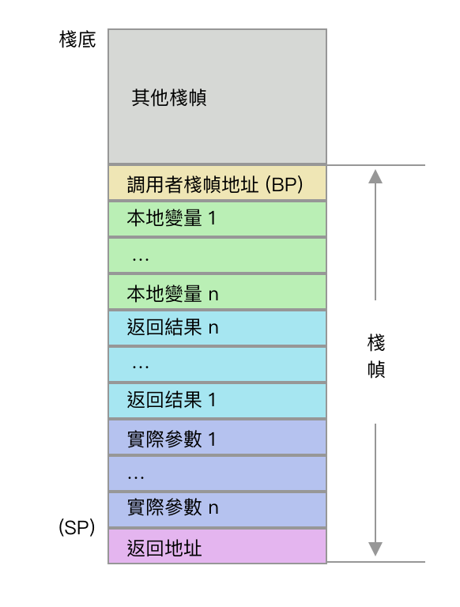

深入學習 Go 語言的設計與實現之前要準備以下工作：

1. 克隆 Go 倉庫源代碼並編譯它。
2. 了解 Plan 9 彙編，知道 Go 的棧結構並能分析代碼的執行過程。

彙編者，二進制代碼的文本形式也，其最大的特點就是不可移植。Plan 9 彙編是貝爾實驗室的九號計劃的產物，目前被用於 Go 程序編譯的中間代碼，因爲 Go 的作者 Rob Pike，同時也是 Plan 9 彙編的作者。

Plan 9 彙編指令與 Intel 等彙編等的不同在於：

1. 一般情況下，命令的源操作數在先，目的操作數在後。 如同樣是將十六進制的 10 傳送到 AX寄存器，在 Plan 9 中是 `MOVQ $0x10, AX` ，而在 Intel 彙編中是 `mov rax, 0x10` 。
2.  棧的調整通過硬件 SP 寄存器進行加減運算實現。而 Intel 彙編中通過 push 和 pop 命令實現。
3. 操作的數據長度取決於命令的後綴。而 Intel 彙編取決於寄存器。

    ```go
    // plan 9 彙編
    MOVB $1, DI      // 1 byte
    MOVW $0x10, BX   // 2 bytes
    MOVD $1, DX      // 4 bytes
    MOVQ $-10, AX     // 8 bytes

    // intel 彙編
    mov rax, 0x1   // 8 bytes
    mov eax, 0x100 // 4 bytes
    mov ax, 0x22   // 2 bytes
    mov ah, 0x33   // 1 byte
    mov al, 0x44   // 1 byte
    ```

通過分析 Plan 9 彙編代碼我們可以繪製出如下的棧結構：



<!-- more -->

## 1.1 調試 Go 語言

### **1.1.1 克隆 go 倉庫並查看代碼行數**

cloc (Count Lines of Code) 工具可以計算源代碼行數。執行後可知 Go 源代碼超過 140 萬行。

```bash
$ git clone https://github.com/golang/go.git
$ cloc go/src
6277 text files.
6156 unique files.
1298 files ignored.
# 省略部分內容
-----------------------------------------------------------------------------------
Language                         files          blank        comment           code
-----------------------------------------------------------------------------------
Go                                4340         143352         253857        1412372
Assembly                           497          12862          18550         108301
C                                   68            763            599           4745
# 省略部分內容
```

### 1.1.2 編譯源碼

在源代碼中找到 fmt 包，修改 Println 函數如下：

```bash
func Println(a ...interface{}) (n int, err error) {
	println("draven")
	return Fprintln(os.Stdout, a...)
}
```

隨後執行  `./src/make.bash` 編譯源代碼，成功之後用編譯出來的 Go 二進制文件來執行你的代碼：

```bash
$ cat main.go
package main

import "fmt"

func main() {
	fmt.Println("Hello World")
}
$ src/github.com/golang/go/bin/go run main.go
draven
Hello World
```

## 1.2 Plan 9 彙編

### **1.2.1 彙編**

在正式學習 Plan 9 彙編之前，建議先看下阮一峰老師的[《汇编语言入门教程》](http://www.ruanyifeng.com/blog/2018/01/assembly-language-primer.html)以理解以下結論：

1. 匯編語言是二進制指令的文本形式。
2. 較之CPU 緩存，CPU 訪問寄存器速度更快且不需要尋址。
3. 寄存器依靠名稱而不是地址來區分數據。
4. 內存中的堆自下而上分配，棧自上而下分配。

    

### **1.2.2 Plan 9**

Plan 9，貝爾實驗室九號計劃，是一個基於 Unix 的分布式操作系統，該系統開源但並未商業化使用。Go 語言的作者 Rob Pike 是其帶領者之一。

Go 使用了 Plan 9 彙編作爲中間代碼，最後再編譯成二進制代碼。了解 Plan 9 彙編有助於分析 Go 語言的底層實現和排查問題。

彙編語言具有不可移植性，各個平台上的平台指令集和寄存器都不一樣。學習時我們以 Linux amd64 爲例。

### **1.2.3 寄存器**

amd64 上的寄存器有：

1. **AX**：累加寄存器(AccumulatorRegister)，用於存放數據，包括算術、操作數、結果和臨時存放地址。
2. **BX**：基址寄存器(BaseRegister)，用於存放訪問存儲器時的地址。
3. **CX**：計數寄存器(CountRegister)，用於保存計算值，用作計數器。
4. **DX**：數據寄存器(DataRegister)，用於數據傳遞，在寄存器間接尋址中的I/O指令中存放I/O端口的地址。
5. DI：目的寄存器(DestinationIndex)，用於存放目的操作數的偏移地址。
6. SI：源變址寄存器(SourceIndex)，用於存放源操作數的偏移地址。
7. **BP：**棧基指針(BasePointer)，保存在進入函數前的棧頂基址。
8. **SP：**棧指針(StackPointer)，指向當前棧幀的局部變量的開始位置。如果是symbol+offset(SP)的形式表示**偽寄存器**，offset 的合法取值是 [-framesize, 0)，注意是个左闭右开的区间；如果是offset(SP)的形式表示**硬件寄存器**。（注意：對於編譯輸出(`go tool compile -S / go tool objdump`)的代碼來講，目前所有的 SP 都是硬件寄存器 SP，無論是否帶 symbol）
9. **FP**：棧幀指針(FramePointer)，偽寄存器。指向引用函數的輸入參數，形式是symbol+offset(FP)，例如 arg0+0(FP)。
10. SB：靜態基指針(StaticBasePointer)，偽寄存器。一般用來聲明函數或全局變量。
11. PC：程序計數器(ProgramCounter)，偽寄存器。存放下一條指令的地址。
12. R8
13. R9
14. R10

**偽寄存器**(pseudo register)：僞寄存器與平台無關，只在生成目標代碼時才與平台上的硬件寄存器對應起來。Plan 9 彙編有四個偽寄存器，FP、SP、SB、PC。FP 存放引用函數的輸入參數，SP 存放當前棧幀的局部變量的開始位置，SB 聲明函數和全局變量，PC 存放下一條指令的地址。

### **1.2.4 基本指令**

1. **棧調整**

    通過對 SP 寄存器進行操作實現，這與 intle 或 AT&T 匯編不同，他們是使用 push、pop 指令實現。

    ```go
    SUBQ $0x18, SP // 對 SP 做減法，為函數分配函數棧幀
    ...               // 省略無用代碼
    ADDQ $0x18, SP // 對 SP 做加法，清除函數棧幀
    ```

    注意：SP 一開始處於棧頂且棧是自上而下分配的，所以要通過減法分配棧幀，通過加法清除棧幀。示意圖如下：

    

2. **數據搬運**

    將源操作數複製到目的操作數。Plan 9 中用 `$num` 形式表示常數，默認爲十進制，也可用 `$0x123` 形式表示十六進制。搬運的長度由 `MOV` 的後綴決定。

    格式：`MOVB source destination`

    ```go
    // move byte
    // 搬運一個字節長
    MOVB $1, DI
    // move word = 2 bytes
    // 搬運一個字長
    MOVW $0x10, BX
    // move double word = 4 bytes
    // 搬運兩倍字長
    MOVD $1, DX
    // move quad word = 8 bytes
    // 搬運四倍字長
    MOVQ $-10, AX
    ```

3. **地址傳送**

    將源操作數的地址複製到目的操作數。

    > lea is an abbreviation of "load effective address"。— [Stack Overflow](https://www.google.com/url?sa=t&rct=j&q=&esrc=s&source=web&cd=&cad=rja&uact=8&ved=2ahUKEwif6oDs8PbtAhWNzIsBHb-kDG0QFjADegQICBAC&url=https%3A%2F%2Fstackoverflow.com%2Fquestions%2F1658294%2Fwhats-the-purpose-of-the-lea-instruction&usg=AOvVaw1XNxphxiOi5AcnWxGpYRbV)

    ```go
    // 把AX內容的地址傳送到BX中
    LEAQ AX, BX
    ```

4. **計算**

    ```go
    // add quad word from AX to BX
    // BX += AX
    ADDQ  AX, BX
    // subtract quad word from AX to BX
    // BX -= AX
    SUBQ  AX, BX
    // 無符號乘法 IMUL
    // BX *= AX
    IMULQ AX, BX
    // 無符號除法 IDIV
    // 除數是CX，被除數是AX，結果存儲到AX中
    IDIVQ CX
    // 比較SI和CX的大小。與SUBQ類似，只是不賦值
    // 其結果會存放到寄存器中
    CMPQ SI CX
    ```

5. **跳轉**

    ```go
    // -- 無條件跳轉 -- 
    // 跳轉到地址，地址可為代碼中的地址，不過實際上手寫不會出現這種東西
    JMP addr
    // 跳轉到標籤，可以跳轉到同一函數內的標籤位置
    JMP label
    // 以當前指令為基礎，向前跳轉 x 行
    JMP 2(PC)
    // 以當前指令為基礎，向後跳轉 x 行
    JMP -2(PC)

    // -- 有條件跳轉 --
    // jump target if zero
    // 如果 zero flag 被 set 過，則跳轉
    JZ target
    // jump target if less
    // 上一行的比較CMP結果，左邊小於右邊則執行跳到0x0185地址處(十進制389轉換成十六進制0x0185)
    JLS 389
    ```

6. **指令集**

    見源代碼的 [arch 部分](https://github.com/golang/arch/blob/master/x86/x86.csv)。

### 1.2.5 **案例分析：函數調用**

編寫以下代碼於 call.go 文件：

```go
package main

func Callee(x, y int) int {
	r := x + y
	return r
}

func Caller() {
	Callee(1, 2)
}
```

執行以下命令可查看彙編代碼：

```go
// -S 輸出彙編代碼到控制台 Print assembly listing to standard output (code only).
// -l 禁止內聯 Disable inlining.
// -N 禁止優化 Disable optimizations.
// 更多參數：https://pkg.go.dev/cmd/compile@go1.15.6
go build -gcflags="-S -l -N" call.go
```

輸出結果爲（有刪減）：

```go
"".Callee STEXT nosplit size=52 args=0x18 locals=0x10
0x0000 00000 (call.go:3)    TEXT    "".Callee(SB), NOSPLIT|ABIInternal, $16-24
0x0000 00000 (call.go:3)    SUBQ    $16, SP
0x0004 00004 (call.go:3)    MOVQ    BP, 8(SP)
0x0009 00009 (call.go:3)    LEAQ    8(SP), BP
// 將40(SP)處的變量~r2的值爲0，即返回值初始化爲0
0x000e 00014 (call.go:3)    MOVQ    $0, "".~r2+40(SP)
// 將24(SP)處的變量x的值傳送到AX中
0x0017 00023 (call.go:4)    MOVQ    "".x+24(SP), AX
// 將32(SP)處的變量y加到AX中
0x001c 00028 (call.go:4)    ADDQ    "".y+32(SP), AX
// 將AX的值傳送到(SP)處的變量r中
0x0021 00033 (call.go:4)    MOVQ    AX, "".r(SP)
// 將AX中的值傳送到40(SP)處的變量~r2，即返回值賦值爲AX中的值
0x0025 00037 (call.go:5)    MOVQ    AX, "".~r2+40(SP)
0x002a 00042 (call.go:5)    MOVQ    8(SP), BP
0x002f 00047 (call.go:5)    ADDQ    $16, SP
0x0033 00051 (call.go:5)    RET

// Go 彙編的固定開頭，Caller爲函數名，
// args 爲入參和返回值佔用的字節大小 0x0=0，
// locals 爲局部變量佔用的字節大小 0x20=32
"".Caller STEXT size=71 args=0x0 locals=0x20
// 聲明函數Caller
0x0000 00000 (call.go:8)    TEXT    "".Caller(SB), ABIInternal, $32-0
// 將(TLS)複製到CX寄存器，(TLS)是指向當前G(goroutine的一種數據結構)的指針
0x0000 00000 (call.go:8)    MOVQ    (TLS), CX
// 比較當前棧指針和CX正偏移16個字節的地址
0x0009 00009 (call.go:8)    CMPQ    SP, 16(CX)
// 如果比較值左邊小於右邊，則跳轉到地址 64 處，即 CALL    runtime.morestack_noctxt(SB)
0x000d 00013 (call.go:8)    JLS     64
// SP減去32，函數開始入棧
0x000f 00015 (call.go:8)    SUBQ    $32, SP
// 把BP中的值傳送到24(SP)處開始的內存空間，保存調用者棧幀地址到本棧。
0x0013 00019 (call.go:8)    MOVQ    BP, 24(SP)
// 將24(SP)處的地址傳送到BP，保存當前棧幀地址到BP。
0x0018 00024 (call.go:8)    LEAQ    24(SP), BP
// 將數字1傳送到(SP)處開始的內存空間
0x001d 00029 (call.go:9)    MOVQ    $1, (SP)
// 將數字2傳送到8(SP)處開始的內存空間
0x0025 00037 (call.go:9)    MOVQ    $2, 8(SP)
// 調用Callee函數
0x002e 00046 (call.go:9)    CALL    "".Callee(SB)
// 調用Callee函數時BP寄存器的值會指向Callee的棧幀地址，因此結束後需要復位。
0x0033 00051 (call.go:10)   MOVQ    24(SP), BP
// 出棧
0x0038 00056 (call.go:10)   ADDQ    $32, SP
// 返回
0x003c 00060 (call.go:10)   RET
// 無操作
0x003d 00061 (call.go:10)   NOP
0x003d 00061 (call.go:8)    NOP
// 調用runtime.morestack_noctxt函數
0x0040 00064 (call.go:8)    CALL    runtime.morestack_noctxt(SB)
// 跳轉到函數聲明處
0x0045 00069 (call.go:8)    JMP     0
```

分析可得棧結構如下：


## 1.3 參考

1. [Go 语言设计与实现：第一章 准备工作 — draveness](https://draveness.me/golang/docs/part1-prerequisite/ch01-prepare/golang-debug/)
2. [汇编语言入门教程 — 阮一峰的网络日志](http://www.ruanyifeng.com/blog/2018/01/assembly-language-primer.html)
3. [Go 系列文章3 ：plan9 汇编入门 — 曹春晖@No Headback](https://xargin.com/plan9-assembly/)
4. [深入Go的底层，带你走近一群有追求的人 — Stefno@博客园](https://www.cnblogs.com/qcrao-2018/p/10562216.html)
5. [go plan9汇编入门 — yuchanns@Go 语言中文网](https://studygolang.com/articles/26380)
6. [go编译工具的使用之汇编 — yuchanns@github.com](https://github.com/yuchanns/Atelier/blob/theme/hermit/src/_posts/golang-assembly.md)
7. [Go Assembly by Example](https://davidwong.fr/goasm/)
8. [A Quick Guide to Go's Assembler — golang.org](https://golang.org/doc/asm)
9. [A Manual for the Plan 9 assembler — Rob Pike](http://doc.cat-v.org/plan_9/4th_edition/papers/asm)