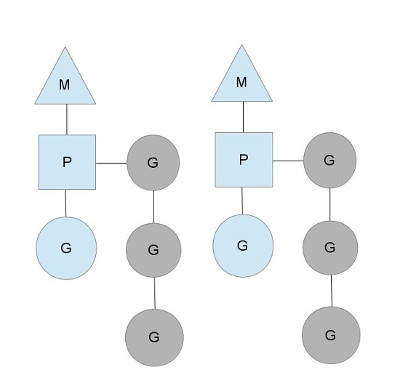

現在有三種常見的線程模型，包括：
1. N:1，即 N 個用戶線程對應一個系統線程，節省上下文（context switch）切換開銷；
2. 1:1，即 1 個用戶線程對應一個系統線程，充分利用多個核心（multi-core）；
3. M:N，即 M 個用戶線程對應 N 個系統線程，節省上下文開銷並充分利用多個核心。

Go的線程調度模型就是 M:N。

<!-- more -->

我們使用三個實體來表示 Go 的線程：
1. 三角框的 M，代表系統線程，在運行時代碼中寫作 M（Machine）；
2. 圓框的 G，代表 goroutine，包含棧和指令指針等等信息；
3. 方框的 P，代表調度的上下文（context for scheduling），在運行時代碼中寫作 P（Processor）。

在這種模型中，M 持有 P 來運行 G（M hold P to run G），藍色的G表示正在運行，灰色的G置於P本地的 runqueue 中等待被調度，P 的數量可以通過 GOMAXPROC 設置（從GO1.5起默認等於CPU核心數）。

為什麼不直接將 G 掛在 M 上，而是通過 P 來調度呢？

因為使用P可以靈活高效地管理G，具體如下：

第一，P 可以在 M 阻塞（比如syscall）時，從阻塞的M脫離，掛到其他可用的M上，保證後續的G正常運行。

第二，在阻塞的M解除阻塞狀態時，會從其他M搶奪P；如果搶不到，就將G置放到全局的 runqueue中，然後將自己放入線程緩存並休眠。

第三，P 會定時檢查全局的 runqueue 中是否有G，有的話拿過來運行。

第四，當 P 運行完本地 runqueue中的任務後，會檢察全局的 runqueue 是否有G；如果沒有，就從其他P搶奪一半的G過來運行。

參考：[The Go scheduler - Morsing's blog](https://www.morsmachine.dk/go-scheduler)
