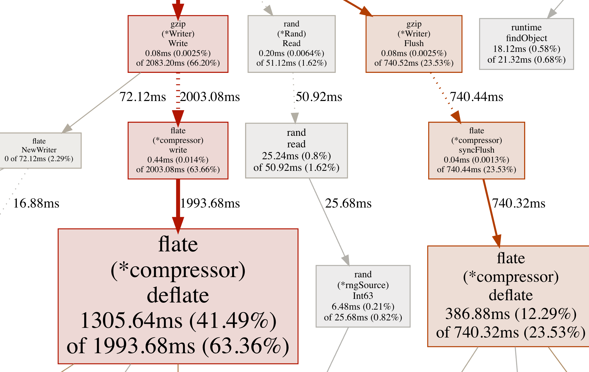

pprof 是 program profiling（程序分析）的縮寫，是 Go程序中重要的性能分析工具，包含兩個部分：

1. 數據採集，由編譯到程序中的 pprof 庫實現。pprof 庫主要是指 "runtime/pprof" 包，另有 "net/http/pprof" 包引用 "runtime/pprof" 並以 HTTP 接口形式提供實時性能數據。
2. 數據分析，使用 `go tool pprof <source>` 工具分析採集到的數據。 

<!--more-->

## 啓用 pprof

**（1）使用 `go test`**

`go test` 中內建支持基準測試的性能分析。運行下面的命令就可以啓動基準測試並將 CPU 性能數據寫入 cpu.prof，內存性能數據寫入 mem.prof：

```bash
go test -cpuprofile cpu.prof -memprofile mem.prof -bench .
```

**（2）使用 "runtime/pprof" 包**

```go
var cpuprofile = flag.String("cpuprofile", "", "write cpu profile to `file`")
var memprofile = flag.String("memprofile", "", "write memory profile to `file`")

func main() {
    flag.Parse()
    if *cpuprofile != "" {
        f, err := os.Create(*cpuprofile)
        if err != nil {
            log.Fatal("could not create CPU profile: ", err)
        }
        defer f.Close() // error handling omitted for example
        if err := pprof.StartCPUProfile(f); err != nil {
            log.Fatal("could not start CPU profile: ", err)
        }
        defer pprof.StopCPUProfile()
    }

    // ... rest of the program ...

    if *memprofile != "" {
        f, err := os.Create(*memprofile)
        if err != nil {
            log.Fatal("could not create memory profile: ", err)
        }
        defer f.Close() // error handling omitted for example
        runtime.GC() // get up-to-date statistics
        if err := pprof.WriteHeapProfile(f); err != nil {
            log.Fatal("could not write memory profile: ", err)
        }
    }
}
```

**（3） 使用 "net/http/pprof" 包**

如果原有 HTTP 服務使用默認路由，則直接導入該包即可，語句如下：

```
import _ "net/http/pprof"
```

導入之後會在默認的服務路由（DefaultServeMux）中註冊 HTTP handler， 包含：

```go
func init() {
    http.HandleFunc("/debug/pprof/", Index)
    http.HandleFunc("/debug/pprof/cmdline", Cmdline)
    http.HandleFunc("/debug/pprof/profile", Profile)
    http.HandleFunc("/debug/pprof/symbol", Symbol)
    http.HandleFunc("/debug/pprof/trace", Trace)
}
```

如果要在單獨的 HTTP 服務和端口中提供 pprof，則原有服務不要使用默認路由（DefaultServeMux），並使用默認路由和另外的端口啓動單獨的服務。

```go
package service

import (
    "net/http"
    _ "net/http/pprof"
)

func RunPprof() {
    go http.ListenAndServe("0.0.0.0:6060", nil)
}
```

當然，你還可以在自定義的服務路由中手動註冊 pprof Handler。

## 分析數據

使用 `go tool pprof` 可以進行數據分析。

### 使用方式

pprof 有三種使用方式：

**（1）生成報告**

運行以下命令，將生成指定格式的報告：

```bash
go tool pprof <format> [options] source
```

支持文本格式和圖形格式，

文本格式包含：

- -text，普通文本格式；
- -tree，函數調用樹形文本格式；
- -peek=*regex*，正則過濾函數；
- -traces，打印每一個樣本。

圖形格式包含：

- -dot，.dot 格式；
- -svg，SVG 格式；
- -web，生成臨時的 SVG 格式文件，並使用瀏覽器打開；
- -png, -jpg, -gif, -pdf


例如：

```bash
go tool pprof -text mem.prof
```

**（2）進入交互終端**

運行以下命令進入交互終端：

```
go tool pprof [options] source
```

例如：

```bash
# 實時分析堆內存（通過前文第三種方式啓動的pprof），會自動下載 profile文件
go tool pprof http://localhost:6060/debug/pprof/heap
```

進入類似以下界面的交互終端：

```
Type: alloc_space
Time: Dec 1, 2021 at 3:44pm (CST)
Entering interactive mode (type "help" for commands, "o" for options)
(pprof) 
```

**（3）通過網絡接口**

運行以下命令開啓網絡接口：

```
go tool pprof -http=[host]:[port] [options] source
```

例如：

```bash
# 分析30s內的CPU性能（通過前文第三種方式啓動的pprof），會自動下載 profile文件
go tool pprof -http=:8080 http://localhost:6060/debug/pprof/profile?seconds=30
```

### options 說明

- -flat [default], -cum，文本報告的排序指標，默認按 flat 值，也可指定為 cum 值。
- -functions [default], -filefunctions, -files, -lines, -addresses，指定報告的粒度，默認函數級別。
- -noinlines，將內聯函數的資源佔用歸到 out-of-line 調用者中。
- -nodecount=*int*，指定報告字段的最大數量。
- -focus=*regex*，僅分析匹配的樣本數據。
- -ignore=*regex*，忽略匹配的樣本數據。
- -show_from=*regex*，不顯示第一個匹配的字段。
- -show=*regex*，僅顯示匹配的字段。
- -hide=*regex*，不顯示匹配的字段。

### 交互終端命令

**（1）top**

降序顯示佔用資源最高的 10 個函數。

```go
(pprof)  top
Showing nodes accounting for 3189.91kB, 100% of 3189.91kB total
Showing top 10 nodes out of 17
      flat  flat%   sum%        cum   cum%
 1184.27kB 37.13% 37.13%  1184.27kB 37.13%  runtime/pprof.StartCPUProfile
  902.59kB 28.30% 65.42%  1485.59kB 46.57%  compress/flate.NewWriter
  583.01kB 18.28% 83.70%   583.01kB 18.28%  compress/flate.newDeflateFast (inline)
...
```

指標說明：

1. flat：函數本身佔用的資源值。
2. cum（cumulative）：函數及其調用的函數加總佔用的資源值。

**（2）web**

使用瀏覽器打開調用棧矢量圖(callgraph)。


### 圖形報告說明



圖形規則：

1. 色彩越鮮艷表明 cum 越高；
2. 方框越大表明 flat 越高；
3. 虛箭頭表明中間有省略函數調用，實箭頭表明中間沒有函數調用；
4. 粗和鮮艷的箭頭表明耗用資源多，細和灰色的箭頭表明耗用資源少。

### 比較 profile

pprof 可以在提供兩個相同類型的 profile 文件時進行減法比較，有兩種方式：

* -diff_base=*profile*，輸出數據中的百分比是相對於 base profile 中的總樣本。
* -base=*prifile*，輸出數據中的 cum 是減去了 base profile 中的 cum值，百分比是相對於source profile 和 base profile 的差值。
* -normalize，當使用上面的tag時，可以使用 -normalize 縮放 source profile 樣本數，使得 base profile 的樣本總數一樣。

### 拉取 profiles

pprof 可以從一個文件或 URL 中讀取 profiles，並以 gzipped profile.proto 格式存儲。拉取時可配置選項：

- -secondes=*int* ，讀取指定時間間隔內的profile。當且僅當對基於時間流逝的profile有用，比如 CPU profiles。
- -timeout=*int*，設置當通過 URL 讀取 profile 時的超時時間，如未設置將通過試探法確定一個合理的超時時間。

## 其他

pprof 採集的樣本數據會以 [profile.proto](https://github.com/google/pprof/blob/master/proto/profile.proto) 的格式寫入。

## 延伸閱讀

1. [pprof README文檔](https://github.com/google/pprof/blob/master/doc/README.md)
2. [net/http/pprof 註釋](https://pkg.go.dev/net/http/pprof)
3. [runtime/pprof 註釋](https://pkg.go.dev/runtime/pprof)
4. [Profiling Go Programs -- go.dev](https://go.dev/blog/pprof)

