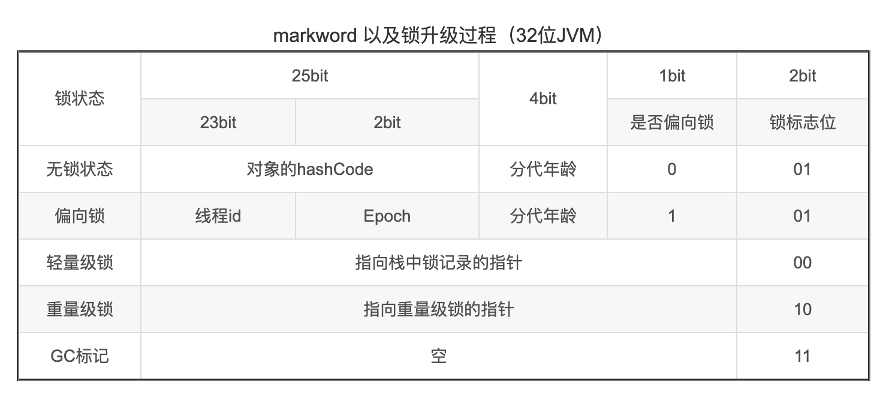

首先區分進程和線程。進程是程序運行的基本單位，也是系統分配資源的最小單位；而線程是 CPU 調度的最小單位，一個進程可以有多個線程，而各個線程擁有獨立的程序計數器、虛擬機棧和本地方法棧，但共享同一個堆和方法區。爲著充分利用系統資源，減少 CPU 空等，多線程技術應運而生。系統使用時間片輪轉法分配 CPU 資源到各個線程，如果線程在分配的時間片內未能處理完任務，則會導致上下文切換。

Java 中線程類爲 `Thread` ，其 `start` 方法會使線程進入 Runnable 狀態；其 `sleep` 方法會阻塞線程而不釋放鎖，跟 `Object.wait` 有別；其 `interrupt` 方法並不停止線程，而是設置一個標誌位通知線程應當關閉，線程可以根據該標誌位決定是否要停止運行。

多個線程可以通過線程池進行統一管理，好處是還可以提前 Ready 好一些線程避免等待線程創建的時間損耗；還可以使用舊的線程，減少線程的頻繁創建和銷毀的資源損耗。線程池推薦直接使用 `ThreadPoolExecutor` 的構造方法去創建，以便設置合適的構造參數。調用 `ThreadPoolExecutor.execute` 可以將一個 `Runnable` 任務放入線程池處理； 調用`ThreadPoolExecutor.submit`  可以將一個 `Callable` 任務放入線程池處理，返回一個 `Future` 代表處理結果，後續通過調用 `Future.get` 獲取處理結果，其過程是阻塞的。

Java 1.5 開始提供`AbstractQueuedSynchronizer`，用於創建多線程訪問共享資源的同步器，其內部使用一個名爲 CLH 的 FIFO 的雙向隊列進行資源分配。其常見實現類有：`ReentrantLock`、`ReadWriteLock` 和 `CountDownLatch` 。其中 `ReadWriteLock` 性能優於 `ReentrantLock` ，因爲兩個讀操作在 `ReadWriteLock` 中不互斥而在 `ReentrantLock` 中互斥。

Java 1.8 開始提供了 `CompletableFuture` ，其實現了 `Future` 接口，並提供了基於回調的函數式異步編程方式和對`CompletableFuture` 的組合，使用者可以不關心底層的線程池，大大簡便了異步編程。

Java 還提供了 ThreadLocal 類可以使得各個線程擁有變量的副本而不會相互影響，底層是使用 Thread 類的 `ThreadLocalMap`，一個類似 HashMap 的結構，其 Key 爲 ThreadLocal 對象的弱引用。

多線程因會有多個線程操作共享的資源而引發了線程安全的擔憂。線程安全要求**原子性、可見性和有序性**。Java 提供了多種方式可以保證線程安全：

1. synchronized 同步鎖，這是一個重量級鎖。可以使用當前類的 class 對象，當前類的對象或者任意對象對方法和代碼塊進行加鎖，方法結束或代碼塊結束則鎖自動釋放。當使用非靜態同步方法時，會使用當前對象爲鎖，因此多個非靜態同步方法共享同一鎖。Java 1.6 後引入**偏向鎖**和**輕量級鎖**的概念，使得 synchronized 不那麼「重」了。
2. volatile 關鍵字。使用該關鍵字修飾的變量在編譯時不會有寄存器緩存而是直接使用主存、不會進行代碼重排序優化，保證了可見性和有序性；在解釋執行時使用 CPU 內存屏障技術防止指令重排序。
3. CAS(Compare and Swap) 技術，相比於 synchronized，其假定操作是不會產生衝突的，將舊的預期值和內存中的值進行比較，若相同則更新內存中的值，否則自旋。因此被稱之爲「樂觀鎖」，而 synchronized 被稱之爲「悲觀鎖」。Java 中的 Atomic 類是典型的 CAS 實現。

多線程操作共享資源還會出現死鎖。死鎖產生的條件是：**互斥、請求/等待、不可剝奪和循環等待**。解決死鎖問題的關鍵是破壞死鎖產生的條件。

<!-- more -->

## 多線程

### **程序、進程與線程**

1. 程序：程序是含有指令和數據的文件，被靜態存儲於存儲設備之中。
2. 進程：进程是程序的一次執行過程，是**操作系統運行程序的基本單位**，是動態的。它佔用一定的系統資源（包括 CPU 時間、內存空間、文件、輸入輸出設備等等），**是資源分配的最小單位**。各進程之間相互獨立。
3. 線程：**線程是 CPU 調度的最小單位**，擁有**程序計數器、虛擬機棧和本地方法棧**，相比進程，它佔用資源更小，產生和切換線程的負擔更小，也被稱爲**輕量級進程**。一個進程可以產生多個線程。同個進程的多個線程之間共享同一塊**堆和方法區**。

- 堆是幹什麼用的？

    堆是進程中最大的一塊內存，用於存放新建的對象。

- 方法區是幹什麼的？

    根據 JVM 規範，方法區邏輯上是堆的一部分。這是一塊存放程序執行代碼的區域，類似於 UNIX 中的進程對內存的劃分的文本區/代碼段(java-concurrent/code segment)，通常只讀。具體來說，它存放了每個類的結構，例如運行時常量池，字段和方法數據，以及方法和構造函數的代碼，包括用於類和實例初始化以及接口初始化的特殊方法。

    另外，UNIX 中的進程將內存劃分成三個部分：text segment,文本區，例如代碼，data segment，數據區，例如變量，stack segment，棧區域。

- 程序計數器爲什麼是線程私有的？

    程序計數器（Program Counter，PC）用於存放下一條指令所在單元的地址（注意：執行native方法時該地址爲 undefined）。字節碼解釋器通過改變 PC 來依次讀取指令，實現代碼的流程控制。在多線程的環境下，可以可以當前線程執行的位置，這樣當線程被切換回來的時候就可以從上次的位置繼續。通俗的譬喻就是遊戲中存檔。

    因此，PC 必須是線程私有的，否則線程切換後無法恢復到正確的位置。

- 虛擬機棧和本地方法棧爲什麼是線程私有的？
    - **虛擬機棧**：每個 Java 方法在執行的同時會創建一個棧幀用於存儲方法的局部變量表、操作數棧、動態鏈接和方法返回地址等信息。從方法調用直到執行完成的過程，對應著一個棧幀在虛擬機棧入棧和出棧的過程。
    - **本地方法棧**：類似虛擬機棧，只不過是爲 native 方法服務。在 HotSpot 虛擬機中本地方法棧和虛擬機棧合而爲一。

    爲了保證線程中的方法執行所需的數據（包括局部變量等）不被其他線程訪問，所以虛擬機棧和本地方法棧是線程私有的。

### **線程有哪些基本狀態**

Java 線程共有 6 中狀態，如下：

1. New：新創建的線程，尚未執行。
2. Runnable：運行中的線程，`run` 方法正在執行中。可細分爲 Ready 和 Running 兩個狀態。
3. Blocked：運行中的線程，因爲某些操作被阻塞而掛起。
4. Waiting：運行中的線程，因爲某些操作在等待。
5. Timed Waiting：運行中的線程，因爲執行 `sleep` 等方法正在計時等待。
6. Terminated：線程終止，因爲 `run` 方法執行完畢。


### 並發和並行的區別

並發（concurrent）：同一時間段，多個任務都在執行。

並行（parallel）：單位時間內，多個任務同時執行。

### 多線程的優勢

1. 提高 CPU 和 IO 設備的綜合利用率，確保 CPU 或 IO 設備不空等。
2. 提高 CPU 核心利用率，確保 CPU 的多個核心都能被利用到。
3. 提高系統整體的並發能力和性能，應對高並發場景。

### 上下文切換

**上下文切換就是舊任務被暫停，保存自身狀態，然後新任務被執行的過程**。造成上下文切換的原因是需要同時執行的任務大於 CPU 核心數，而單個 CPU 同一時刻只能執行一個任務。CPU 採用時間片輪轉法分配 CPU 時間給多個線程，當時間片結束舊任務如果未執行完畢會被暫停，保存當前狀態，然後執行新的任務。

上下文切換所需的時間很可觀，可能是操作系統中時間消耗最大的操作。操作系統中數 Linux（及其他類 Unix 系統） 上下文切換時間消耗最少。

### 爲什麼調用 `Thread.start` 方法而不是 `Thread.run` 方法？

調用 `start` 方法會啟動一個新線程並進入就緒狀態，當分配到時間片後會自動調用 `run` 方法。直接調用 `run` 方法只會在調用者所在的線程執行。

### 比較 `Thread.sleep` 方法和 `Object.wait` 方法

共同點：

1. 都可以暫停線程的執行。
2. `sleep(long)`和 `wait(long)` 都可以在指定時間段後使線程自動甦醒。

不同點：

1. sleep 是 Thread 類的方法，wait 是 Object 類的方法。
2. **sleep 沒有釋放鎖，wait 釋放了**。
3. `wait()` 被調用後線程不會自動甦醒，需要別的線程調用同一對象上的 `notify()` 或 `notifyAll()` 方法來喚醒。
- 代碼

    ```java
    // Data.java
    public class Data {
        private String packet;

        // 单次传输是否结束
        // True if Receiver should wait
        // False if Sender should wait
        private boolean isTransfer = true;

        public synchronized void send(String packet) {
            while (!isTransfer) {
                try {
                    wait();
                } catch (InterruptedException e) {
                    e.printStackTrace();
                }
            }
            this.packet = packet;
            isTransfer = false;
            notifyAll();
        }

        public synchronized String receive() {
            while (isTransfer) {
                try {
                    wait();
                } catch (InterruptedException e) {
                    e.printStackTrace();
                }
            }
            try {
                Thread.sleep(1000);
            } catch (InterruptedException e) {
                e.printStackTrace();
            }
            isTransfer = true;
            notifyAll();
            return packet;
        }
    }

    // Sender.java
    public class Sender implements Runnable {

        private final Data data;

        public Sender(Data data) {
            this.data = data;
        }

        @Override
        public void run() {
            String[] packets = new String[]{"Hello", "Are", "You", "Ok", "Over"};
            for (String packet : packets) {
                data.send(packet);
            }
        }
    }

    // Receiver.java
    public class Receiver implements Runnable {

        private final Data data;

        public Receiver(Data data) {
            this.data = data;
        }

        @Override
        public void run() {
            String packet = data.receive();
            while (!"Over".equals(packet)) {
                System.out.println(packet);
                packet = data.receive();
            }
        }
    }

    // Main.java
    public class Main {

        public static void main(String[] args) {
            Data data = new Data();
            new Thread(new Receiver(data)).start();
            new Thread(new Sender(data)).start();
        }
    }
    ```

### 調用 `Thread.interrupt` 意味著什麼？

調用 interrupt 方法並不會中斷一個線程，而是發出出一個中斷信號到目標線程（設置中斷標誌位的值爲 true），目標線程收到信號後可以決定是否處理。

與之相關的方法有：

```java
// 測試當前線程是否已經中斷。當線程中斷時調用該方法將會清除線程的中斷狀態
public static boolean interrupted()
// 測試線程是否已經中斷。不改變線程的中斷狀態。
public boolean isInterrupted()
// 中斷線程
public void interrupt()
```

[廖雪峰的官方網站](java-concurrent//www.liaoxuefeng.com/wiki/1252599548343744/1306580767211554)提供了以下的代碼：

```java
public class Main {
  public static void main(String[] args) throws InterruptedException {
      Thread t = new MyThread();
      t.start();
      Thread.sleep(java-concurrent// 暫停1毫秒
      t.interrupt(java-concurrent// 中斷t線程
      t.join(java-concurrent// 等待t線程結束
      System.out.println("end");
  }
}

class MyThread extends Thread {
  public void run() {
      int n = 0;
      while (! isInterrupted()) {
          n ++;
          System.out.println(n + " hello!");
      }
  }
}
```

值得注意的是：

1. 本線程中斷自己是被允許的；其它線程調用本線程的`interrupt`方法時，會通過`checkAccess`檢查權限。這有可能拋出`SecurityException`異常。
2. 調用線程的`wait` 方法會讓它進入等待(阻塞)狀態，或者調用線程的`join`, `sleep` 方法也會讓它進入阻塞狀態。若線程在阻塞狀態時，調用了它的`interrupt`方法，那麼它的「中斷狀態」會被清除並且會收到一個`InterruptedException`異常。例如，線程通過`wait()`進入阻塞狀態，此時通過`interrupt()`中斷該線程；調用`interrupt()`會立即將線程的中斷標記設為「true」，但是由於線程處於阻塞狀態，所以該「中斷標記」會立即被清除為「false」，同時，會產生一個`InterruptedException`的異常。
3. 如果線程被阻塞在一個`Selector`選擇器中，那麼通過`interrupt()`中斷它時；線程的中斷標記會被設置為true，並且它會立即從選擇操作中返回。
4. 如果不屬於前面所說的情況，那麼通過`interrupt()`中斷線程時，它的中斷標記會被設置為「true」。
5. 中斷一個「已終止的線程」不會產生任何操作。

### 線程池技術

**（1）爲什麼要使用線程池？**

線程池管理了一組線程資源，並維護了一些基本的統計信息。

《Java 並發編程的藝術》中講述到使用線程池的好處：

1. 降低資源消耗。通過重複使用已創建的線程減少線程創建和銷毀的消耗。
2. 提高響應速度。線程池預先創建了線程，在需要時可以直接使用不用等。
3. 提供線程的可管理性。線程是稀缺資源，不能無限制地分配，使用線程池可以進行統一分配、調優和監控。

**（2）Runnable 接口和 Callable 接口的區別**

1. Runnable 始於 Java 1.0 ，Callable 接口始於 Java 1.5.
2. Runnable 不會返回結果或拋出檢查異常，而 Callable 會。

另外，工具類 `Executors` 可以實現 Runnable 對象和 Callable 對象之間的相互轉換，如下：

```java
Executors.callable(Runnable task)
Executors.callable(Runnable task，Object resule)
```

**（3）`execute` 方法和 `submit` 方法有什麼區別？**

1. `execute` 提交任務之後沒有返回值，無法判斷任務是否被執行成功。
2. `submit` 提交任務之後有返回值 Future，可以知道任務是否被執行成功。調用 `Future.get()` 會阻塞線程直到任務完成；調用 `Future.get(long timeout，TimeUnit unit)`  則是阻塞指定的一段時間後立即返回，不管任務是否執行完成。當然如果提交的是 Runnable，那麼返回的 Future 中的泛型爲 Void。

**（4）如何創建線程池？**

《阿里巴巴 Java 開發手冊》中要求直接用 `ThreadPoolExecutor` 的構造方法去創建線程池，而非通過 Executors 去創建線程池，因爲：

1. `FixedThreadPool` 和 `SingleThreadPool` 中允許請求的隊列長度爲 `Integer.MAX_VALUE`，可能會堆積大量請求，導致 OOM；
2. `CachedThreadPool` 和 `ScheduledThreadPool` 中允許線程數爲 `Integer.MAX_VALUE`，可能會創建大量線程，導致 OOM。

`ThreadPoolExecutor` 的參數分析：

```java
public ThreadPoolExecutor(
  // 核心線程數，規定了最小的可以同時運行的線程數量
	int corePoolSize,
  // 最大線程數，當請求隊列滿時，可以同時運行的線程數量
	int maximumPoolSize,
  // 當線程空閒且大於規定的核心線程數時，等待 keepAliveTime 時間後多餘的線程會被銷毀
	long keepAliveTime,
  // keepAliveTime 的時間單位
	TimeUnit unit,
  // 請求隊列，當新任務進來時，當前運行的線程達到核心線程數，則新任務會被放置到請求隊列
	BlockingQueue<Runnable> workQueue,
  // 線程工廠，用於創建新線程
	ThreadFactory threadFactory,
  // 飽和策略，當線程數量達到最大線程數且請求隊列也滿的情況下觸發飽和策略
	RejectedExecutionHandler handler) {
}
```

線程池中的飽和策略有：

1. `ThreadPoolExecutor.AbortPolicy`：默認策略，拋出異常，拒絕處理新任務。
2. `ThreadPoolExecutor.CallerRunsPolicy`：直接在調用 `execute` 所在的線程執行。
3. `ThreadPoolExecutor.DiscardPolicy`：不拋出異常，直接丟棄新任務。
4. `ThreadPoolExecutor.DiscardOldestPolicy`：不拋出異常，丟棄最早未處理的任務。

**（5）線程池對新任務的處理過程**


### AQS（抽象隊列式同步器）

**（1）概述**

AQS，即 `AbstractQueuedSynchronizer` ，加入於 Java 1.5，作者爲大名鼎鼎的 Doug Lea，其定義了一套多線程訪問共享資源的同步器框架。其下有諸如 `ReentrantLock`、`ReadWriteLock`、`CountDownLatch` 等等實現。

AQS 的實現思路是：如下圖所示，當請求的共享資源空閒時，請求資源的線程會被設置爲有效的工作線程，該資源會被鎖定；當請求的共享資源被佔用時，將請求資源的線程加入 CLH 隊列中。CLH 是三個人名的首字母，CLH 隊列是一個雙向隊列，FIFO。而共享資源的狀態是一個整型值，採用 CAS 方式進行值的原子更新，通常加鎖 state 會加 1，釋放則減 1。


AQS 可以定義兩種資源共享方式，獨佔 or 共享。其採用模板方法模式編寫，實現類需要選擇性地實現以下方法（默認實現是拋出`UnsupportedOperationException`）：

```java
//該線程是否正在獨佔資源。只有用到condition才需要去實現它。
isHeldExclusively()
//獨佔方式。嘗試獲取資源，成功則返回true，失敗則返回false。
tryAcquire(int)
//獨佔方式。嘗試釋放資源，成功則返回true，失敗則返回false。
tryRelease(int)
//共享方式。嘗試獲取資源。負數表示失敗；0表示成功，但沒有剩餘可用資源；正數表示成功，且有剩餘資源。
tryAcquireShared(int)
//共享方式。嘗試釋放資源，成功則返回true，失敗則返回false。
tryReleaseShared(int)
```

**（2）ReentrantLock**

ReentrantLock，可重入鎖，同一線程可以反覆加鎖，然後釋放同樣次數的鎖。synchronized 修飾的方法用的也是可重入鎖，但 ReentrantLock 提供了更爲靈活的控制，有 lock、unlock 方法還有類似於 `Object.wait` / `Object.notify` 的 `Condition.await` / `Condition.signal` 方法。

- 代碼

    參考：[https://examples.javacodegeeks.com/core-java/util/concurrent/locks-concurrent/condition/java-util-concurrent-locks-condition-example/](java-concurrent//examples.javacodegeeks.com/core-java/util/concurrent/locks-concurrent/condition/java-util-concurrent-locks-condition-example/)

    ```java
    // SharedFifoQueue.java
    public class SharedFifoQueue {

      private final Object[] content;
      // 標識當前隊列中擁有的對象數目
      private int current = 0;
      private int addIndex = 0;
      private int removeIndex = 0;

      private final ReentrantLock lock = new ReentrantLock();
      private final Condition fullCondition = lock.newCondition();
      private final Condition emptyCondition = lock.newCondition();

      public SharedFifoQueue(int capacity) {
          content = new Object[capacity];
      }

      public void add(Object item) throws InterruptedException {
          lock.lock();
          while (current >= content.length) {
              fullCondition.await();
          }
          content[addIndex] = item;
          addIndex = (addIndex + 1) % content.length;
          current++;
          emptyCondition.signal();
          lock.unlock();
      }

      public Object remove() throws InterruptedException {
          lock.lock();
          while (current <= 0) {
              emptyCondition.await();
          }
          Object item = content[removeIndex];
          removeIndex = (removeIndex + 1) % content.length;
          current--;
          fullCondition.signal();
          lock.unlock();
          return item;
      }
    }

    // Producer.java
    public class Producer implements Runnable {

      private final SharedFifoQueue queue;
      private final Random random = new Random();

      public Producer(SharedFifoQueue queue) {
          this.queue = queue;
      }

      @Override
      public void run() {
          try {
              for (int i = 0; i < 20; i++) {
                  queue.add("Hello " + i);
                  Thread.sleep(random.nextInt(200) );
              }
              queue.add(null);
          } catch (InterruptedException e) {
              e.printStackTrace();
          }
      }
    }

    // Consumer.java
    public class Consumer implements Runnable {

      private final SharedFifoQueue queue;

      public Consumer(SharedFifoQueue queue) {
          this.queue = queue;
      }

      @Override
      public void run() {
          try {
              while (true) {
                  Object item = queue.remove();
                  if (item == null) {
                      break;
                  }
                  System.out.println(item.toString());
              }
          } catch (InterruptedException e) {
              e.printStackTrace();
          }
      }
    }

    // Main.java
    public static void main(String[] args) throws InterruptedException {
        SharedFifoQueue sharedFifoQueue = new SharedFifoQueue(10);
        Thread consumerThread = new Thread(new Consumer(sharedFifoQueue));
        Thread producerThread = new Thread(new Producer(sharedFifoQueue));

        producerThread.start();
        consumerThread.start();
        // join 可以讓主線程等待子線程結束
        producerThread.join();
        consumerThread.join();
    }
    ```

**（3）ReadWriteLock**

ReadWriteLock 相比 ReentrantLock 性能更高，體現在兩個讀操作在 ReadWriteLock 裏是不互斥的，而在 ReentrantLock 裏是互斥的。

- 代碼

    代碼來源：[https://examples.javacodegeeks.com/core-java/util/concurrent/locks-concurrent/readwritelock/java-readwritelock-example/](java-concurrent//examples.javacodegeeks.com/core-java/util/concurrent/locks-concurrent/readwritelock/java-readwritelock-example/)

    ```java
    public class ThreadSafeArrayList<E> {
      private final ReadWriteLock readWriteLock = new ReentrantReadWriteLock();
      private final Lock readLock = readWriteLock.readLock();
      private final Lock writeLock = readWriteLock.writeLock();

      private final List<E> list = new ArrayList<>();

      public void set(E o) {
          writeLock.lock();
          try {
              list.add(o);
          } finally {
              writeLock.unlock();
          }
      }

      public E get(int i) {
          readLock.lock();
          try {
              return list.get(i);
          } finally {
              readLock.unlock();
          }
      }
    }
    ```

**（4）CountDownLatch**

CountDownLatch 可以讓一個或多個線程等待指定的操作完成後再開始工作。初始化 CountDownLatch 時需要指定一個 count 值，需要等待的線程使用 `CountDownLatch.await()` 進行等待，當 `CountDownLatch.countDown()` 被調用 count 次時，等待的線程才得以繼續執行。

- 代碼

    代碼來源：[http://tutorials.jenkov.com/java-util-concurrent/countdownlatch.html](java-concurrent//tutorials.jenkov.com/java-util-concurrent/countdownlatch.html)

    ```java
    // Main.java
    CountDownLatch latch = new CountDownLatch(3);

    Waiter      waiter      = new Waiter(latch);
    Decrementer decrementer = new Decrementer(latch);

    new Thread(waiter)     .start();
    new Thread(decrementer).start();

    Thread.sleep(4000);
    // Waiter.java
    public class Waiter implements Runnable{

      CountDownLatch latch = null;

      public Waiter(CountDownLatch latch) {
          this.latch = latch;
      }

      public void run() {
          try {
              latch.await();
          } catch (InterruptedException e) {
              e.printStackTrace();
          }

          System.out.println("Waiter Released");
      }
    }
    // Decrementer.java
    public class Decrementer implements Runnable {

      CountDownLatch latch = null;

      public Decrementer(CountDownLatch latch) {
          this.latch = latch;
      }

      public void run() {
          try {
              Thread.sleep(1000);
              this.latch.countDown();

              Thread.sleep(1000);
              this.latch.countDown();

              Thread.sleep(1000);
              this.latch.countDown();
          } catch (InterruptedException e) {
              e.printStackTrace();
          }
      }
    }
    ```

**（5）Semaphore**

Semaphore 用於限制訪問資源的線程數量，以對資源進行保護。[有人將其比做是廁所的坑位數](java-concurrent//blog.csdn.net/eson_15/article/details/51577191)，譬如一個廁所有 3 個坑，則同時上廁所的人只能有 3 個，其他人要上只能等這 3 個人之一釋放坑位。

使用前通過調用 `Semaphore.acquire` 獲取訪問，使用後通過  `Semaphore.release` 釋放許可。

- 代碼

    ```java
    public static void main(String[] args) {
        ExecutorService threadPool = Executors.newFixedThreadPool(10);
        Semaphore semaphore = new Semaphore(3);
        for (int i = 0; i < 10; i++) {
            threadPool.execute(() -> {
                try {
                    semaphore.acquire();
                    System.out.printf("Running Thread Id: %s, Available permit: %d, Queue length: %d\n", Thread.currentThread().getId(), semaphore.availablePermits(), semaphore.getQueueLength());
                    Thread.sleep(300);
                } catch (InterruptedException e) {
                    e.printStackTrace();
                } finally {
                    semaphore.release();
                }
            });
        }
    }
    ```

    運行結果：

    初始化總許可量爲 3，一開始被用掉一個許可，可用許可剩餘 2；隨後許可被用光，其他線程開始排隊，出現長度爲 6 的請求隊列，之後隨之許可釋放，隊列長度遞減，直到所有任務處理完成，隊列長度爲 0，許可復爲 3。

    ```java
    Running Thread Id: 13, Available permit: 2, Queue length: 0
    Running Thread Id: 15, Available permit: 0, Queue length: 0
    Running Thread Id: 14, Available permit: 1, Queue length: 0
    Running Thread Id: 16, Available permit: 0, Queue length: 6
    Running Thread Id: 17, Available permit: 1, Queue length: 5
    Running Thread Id: 18, Available permit: 0, Queue length: 4
    Running Thread Id: 19, Available permit: 0, Queue length: 3
    Running Thread Id: 20, Available permit: 1, Queue length: 2
    Running Thread Id: 21, Available permit: 0, Queue length: 1
    Running Thread Id: 22, Available permit: 2, Queue length: 0
    ```

### CompletableFuture

參考：[https://colobu.com/2016/02/29/Java-CompletableFuture/](java-concurrent//colobu.com/2016/02/29/Java-CompletableFuture/)、[https://www.jianshu.com/p/6bac52527ca4](java-concurrent//www.jianshu.com/p/6bac52527ca4)

CompletableFuture 是 Java 1.8 提供的類，可以方便函數式異步編程。CompletableFuture 實現了 Future 接口。

Future 是 Java 1.5 引入的接口，它代表這異步執行的結果。可以通過 `isDone` 判斷執行是否完畢，通過 `get` 阻塞獲取結果，通過 `cancel` 取消執行。

Future 獲取結果的方式不優雅，要輪詢或一直阻塞等待結果。 CompletableFuture 提供了回調的方式處理結果（正常結果 & 異常結果），還有組合多個 CompletableFuture 的能力。

有了 CompletableFuture，我們甚至可以不關心線程、線程池和同步，因爲 CompletableFuture 內部已經幫我們處理好了，我們只需要鏈式調用函數就可以了。

```java
CompletableFuture.allOf(CompletableFuture.runAsync(() -> {
  try {
      Thread.sleep(200);
  } catch (InterruptedException e) {
      e.printStackTrace();
  }
  System.out.println(Thread.currentThread().getId() + " done!");
}), CompletableFuture.runAsync(() -> {
  try {
      Thread.sleep(200);
  } catch (InterruptedException e) {
      e.printStackTrace();
  }
  System.out.println(Thread.currentThread().getId() + " done!");
})).handle((BiFunction<Void, Throwable, Void>) (unused, throwable) -> {
  if (throwable != null) {
      System.out.println("Exception:" + throwable.getMessage());
  } else {
      System.out.println("All done!");
  }
  return null;
}).join();
```

### ThreadLocal

ThreadLocal 可以讓每個線程擁有變量的副本進行讀寫而互不影響。ThreadLocal 的原理就是 Thread 類本身的 ThreadLocalMap，當調用 `ThreadLocal.set` 方法時會去獲取當前線程的 ThreadLocalMap，然後以當前 ThreadLocal 爲 key，將值放入其中；當調用`ThreadLocal.get`時則從 ThreadLocalMap 中讀取。如此每個 Thread 都有各自的專屬變量，不受其他線程影響。


ThreadLocalMap 中的 key 採用弱引用，如果 key 即 ThreadLocal 沒有強引用的話，key 會被 GC 回收變爲 null，而 value 因爲是強引用不會被 GC 回收，於是出現了 key 爲 null 的 Entry，造成內存泄漏。ThreadLocalMap 在調用 `get`、`set` 方法時會清理 key 爲 null 的Entry，雖如此還是在使用完 ThreadLocal 後手動調用下 `remove` 方法爲好。

```java
static class Entry extends WeakReference<ThreadLocal<?>> {
  /** The value associated with this ThreadLocal. */
  Object value;

  Entry(ThreadLocal<?> k, Object v) {
      super(k);
      value = v;
  }
}
```

## 線程安全

### 線程安全的保證

1. 原子性：多項操作要麼都執行，要麼都不執行。synchronized 可以保證代碼片段的原子性。
2. 可見性：當一個線程對共享變量做了修改，其他線程要立即可以看到修改後的值。volatile 可以保證共享變量的可見性。
3. 有序性：代碼編寫時的順序同編譯執行時的順序一致。volatile 可以禁止指令重排序。

### **synchronized 同步鎖的用法**

synchronized 使用時需要指定一個鎖，當程序進入 synchronized 代碼塊或方法時該鎖會被鎖住，直到離開 synchronized 代碼塊或方法，鎖才會被釋放。注意：同步的範圍越小越好。

**同步代碼塊**

```java
public void f() {
  synchronized(this){
  }
}
```

同步代碼塊的鎖可以選擇使用當前對象（this）、當前類 class 對象或其他任意對象。

**同步方法**

```java
public synchronized void f() {
}
```

此時鎖爲同步方法所在類的對象。**同一個對象的多個同步方法共享同一個鎖**，多個實例對象時各個對象有各自的鎖。子類重寫父類的同步方法時可以去除同步。

**同步靜態方法**

```java
public static synchronized void f() {
}
```

此時鎖為同步靜態方法所在類的 class 對象，即使多個實例對象也共享同一個鎖。

### 使用 String 作爲鎖的注意點

1. 首先 String 是一個特殊的類，JVM 使用常量池技術對其進行了緩存，通過字面量使用時會總是返回同一個 String 對象。
2. 使用 `new String`、`StringBuilder.toString` 和 `StringBuffer.toString` 每次會返回一個新的 String 對象。
3. 使用 `String.intern`，當常量池中有值等同的 String 對象時返回該對象，如無則將其加入常量池。

### **Java 同步鎖的本質**

**Java 的鎖是存在於對象頭**中的，具體就 Hotspot 虛擬機來說，是存在於對象頭中的 Mark Word（標記字段）中的鎖標誌位。Java 對象可有四種鎖狀態：

1. 一開始對象無鎖，當一段同步代碼一直被一個線程訪問時，該線程自動獲得鎖，此時該鎖爲**偏向鎖**；
2. 當鎖是偏向鎖時，另一個線程訪問同步代碼，偏向鎖會升級爲**輕量級鎖**，其他線程會通過**自旋**（指嘗試獲取鎖的線程不會立即阻塞，而是採用循環的方式獲取鎖）嘗試獲取鎖；
3. 當鎖是輕量級鎖時，另一個線程自旋到一定次數仍然未獲得鎖，輕量級鎖會自動升級爲**重量級鎖**，其他線程進入阻塞狀態。



當處於重量級鎖時，對象頭存儲的指針指向的重量級鎖也叫 **monitor 鎖**（監視器鎖）。多個線程爭搶的就是這個 monitor 對象，誰持有誰就可以運行同步代碼。通過使用 `javap -c -s -v -l xx.class` 反彙編字節碼知道：當使用 `synchronized` 同步代碼塊時其實現時 `monitorenter` 和 `monitorexit` 指令，其中的 `monitorenter` 指令指向同步代碼塊開始的位置，`monitorexit` 則指向結束的位置；當使用 `synchronized` 修飾方法時，則是使用 `ACC_SYNCHRONIZED` 標識該方法爲同步方法。

獲取鎖的過程如下圖所示：需要訪問同步代碼的多個線程首先進入 Entry Set，當線程獲取到 monitor 對象時會進入 The Owner 區域，然後將 monitor 對象中的 owner 變量設置爲當前線程，計數器 count 加 1；若線程調用 wait 方法，將釋放持有的 monitor，owner 變量設置爲 null，計數器 count 減 1，同時該線程進入 Wait Set 等待被喚醒；若線程執行完畢也將釋放 monitor 並恢復 monitor 中相關變量的值。


### volatile 關鍵字

參考：[https://monkeysayhi.github.io/2017/12/28/一文解决内存屏障/](java-concurrent//monkeysayhi.github.io/2017/12/28/%E4%B8%80%E6%96%87%E8%A7%A3%E5%86%B3%E5%86%85%E5%AD%98%E5%B1%8F%E9%9A%9C/)

volatile 關鍵字可以修飾變量，其作用是：

標記該變量以在編譯時，取消編譯層面的緩存和重排序（編譯時的亂序優化）；在解釋執行時使用 CPU 內存屏障技術解決硬件層面的可見性和重排序。具體來說：

1. **被修飾的變量在寄存器中將不會有副本，而是直接從主存進行讀寫操作**，多線程環境下，變量的值的改變**即時可見**。所謂的主存和寄存器是計算機的解決訪問 CPU 處理速度和內存讀寫速度不匹配的手段。一般認爲寄存器的讀寫速度快於主存。

    

    未聲明 volatile 時

    

    聲明 volatile 時

2. 編譯器不對該變量進行亂序優化。
3. JVM 在解釋執行時使用對應 CPU 架構的內存屏障指令防止指令重排序，通常有以下三種：
    - mfence(StoreLoad Barriers、Full Barrier) 全能屏障
    - sfence(Store Barriers) 寫屏障
    - lfence(Load Barrirers) 讀屏障

    以 x86 架構爲例子，如有一以 volatile 修飾的變量 v，JVM 對其操作如下：

    1. 在寫入 v 之後插入一個 sfence，隔離了寫入 v 前後的寫入指令，防止其重排序，且 sfence 之前的修改會被寫入緩存並標記其他 CPU 核心中的緩存失效；
    2. 在讀取 v 之前插入一個 lfence，隔離了讀取 v 前後的讀取指令，防止其重排序，且 lfence 之後會先刷新緩存，從而讀取最新的值。

    sfence 和 lfence 兩相配合，保證了變量 v 的可見性。

### CAS 鎖

synchronized 是悲觀鎖，假定操作是有衝突的，要加鎖然後再執行程序，完畢後再釋放鎖。而 CAS(Compare And Swap) 是樂觀鎖，假定操作是沒有衝突的，不需要加鎖，而是把舊的預期值跟內存中已有的值進行比較，如果相同再把要更新的值更新到內存，如果不同則自旋（重試，重新獲取預期值進行比較和替換），Java 中的原子類（比如 AtomicInteger）的底層實現就是 CAS。

CAS 存在一個稱之爲 ABA 的問題，即對於變量 v = A，當其變爲 B 後又復原爲 A 時，無法判斷變量 v 是否被修改過。


使用 `AtomicStampedReference` 可以防止 ABA 的問題，因爲附帶的 Stamp可以標識 Reference 的版本，Reference 變化，Stamp 隨之遞增。

### Atomic 原子類

`java.util.concurrent.atomic` 包中提供了一系列原子類，包括：

1. 原子類型：
    - AtomicInteger：針對整型
    - AtomicLong：針對長整型
    - AtomicBoolean：針對布爾類型
2. 數組類型：
    - AtomicIntegerArray：針對整型數組
    - AtomicLongArray：針對長整型數組
    - AtomicReferenceArray：針對引用類型數組
3. 引用類型：
    - AtomicReference：針對對象引用
    - AtomicStampedReference：針對對象引用連同一個整型
    - AtomicMarkableReference：針對對象引用連同一個布爾類型
4. 對象的屬性修改類型：
    - AtomicIntegerFieldUpdater：修改對象的一個整型屬性
    - AtomicLongFieldUpdater：修改對象的一個長整型屬性
    - AtomicReferenceFieldUpdater：修改對象的一個整型屬性

其理論基礎就是 **CAS**(Compare and Swap) **鎖 + volatile + native 方法。**CAS 就是將舊的預期值與內存中的值進行比較，當相同時才將新的預期值設入，否則自旋。 

介紹下 AtomicInteger 類的幾個原子方法：

```java
public final int get(java-concurrent//獲取當前的值
public final int getAndSet(java-concurrent//獲取當前的值，並設置新的值
public final int getAndIncrement(java-concurrent//獲取當前的值，並自增
public final int getAndDecrement(java-concurrent//獲取當前的值，並自減
public final int getAndAdd(java-concurrent//獲取當前的值，並加上預期的值
boolean compareAndSet(java-concurrent//如果輸入的數值等於預期值，則以原子方式將該值設置為輸入值（update）
public final void lazySet(java-concurrent//最終設置為newValue,使用 lazySet 設置之後可能導致其他線程在之後的一小段時間內還是可以讀到舊的值。
```

### 死鎖 (deadlock)

如果一組線程中的每個線程都在等待一個事件，而這個事件只能由該組中的另一個線程觸發，這種情況會導致死鎖。

死鎖需要滿足四個條件（線程維度上）：

1. 互斥，該資源任意時刻只能由一個線程佔用。
2. 請求與保持，一個線程因請求資源被阻塞，另一個線程保持該資源不放。
3. 不剝奪/不可搶佔，一個線程不能強佔另一個線程擁有的資源，除非另一個線程釋放之。
4. 循環等待，若干個線程形成循環等待資源的關係。

那麼，防止死鎖只需要不滿足以上四個條件之一即可。具體來說：

1. 破壞互斥：不可，這是資源的固有屬性，不可破壞。
2. 破壞請求與保持：可以一次性請求所有需要的資源。
3. 破壞不剝奪：
    - 若有一佔有若干資源的進程請求某資源被拒絕，則它應釋放它佔有的資源。
    - 若有一進程請求當前被另一個進程佔有的資源，則操作系統可以剝奪另一個進程的資源。
4. 破壞循環等待：確定資源的申請順序和釋放順序。

下面是一個死鎖的實例，線程A 擁有資源1 後想要獲得資源2，線程B 擁有資源2 後想要獲得資源1。


```java
Object res1 = new Object();
Object res2 = new Object();

new Thread(() -> {
  synchronized (res1) {
      System.out.println(Thread.currentThread() + " get res1");
      try {
          Thread.sleep(1000);
      } catch (InterruptedException e) {
          e.printStackTrace();
      }
      System.out.println(Thread.currentThread() + " wait res2");
      synchronized (res2) {
          System.out.println(Thread.currentThread() + " get res2");
      }
  }
}, "Thread A").start();

new Thread(() -> {
  synchronized (res2) {
      System.out.println(Thread.currentThread() + " get res2");
      try {
          Thread.sleep(1000);
      } catch (InterruptedException e) {
          e.printStackTrace();
      }
      System.out.println(Thread.currentThread() + " wait res1");
      synchronized (res1) {
          System.out.println(Thread.currentThread() + " get res1");
      }
  }
}, "Thread B").start();

// 按相同順序申請和釋放資源，破壞循環等待條件，從而避免死鎖
new Thread(() -> {
  synchronized (res1) {
      System.out.println(Thread.currentThread() + " get res1");
      try {
          Thread.sleep(1000);
      } catch (InterruptedException e) {
          e.printStackTrace();
      }
      System.out.println(Thread.currentThread() + " wait res2");
      synchronized (res2) {
          System.out.println(Thread.currentThread() + " get res2");
      }
  }
}, "Thread B").start();
```