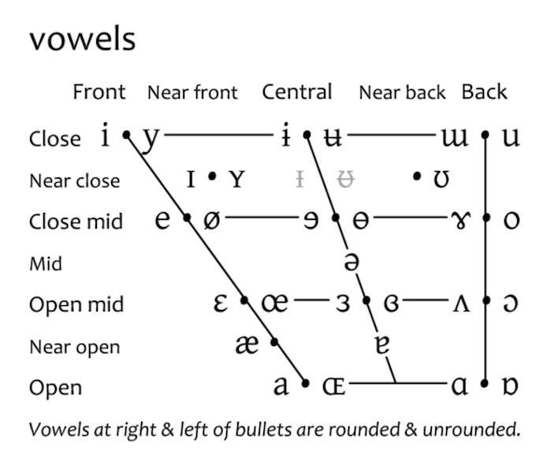

> 注意：本文中的「漢語」指代普通話、閩南語、粵語、客語、吳語等等所有方言的集合。「漢語拼音」指代普通話拼音，不包括其他方言。這是「漢語拼音」的侷限。「台羅拼音」指代閩南語台灣話羅馬字拼音。「粵語拼音」指代香港語言學學會粵語拼音方案。
> 

# 引子

漢字很長一段時間以來是中華大地乃至鄰國如現今的日本、朝鮮、韓國、越南等的主流書寫形式，儘管這片大地上的人們說著不同的方言。

如今漢字依然是中華大地的主流，而鄰國在二戰後普遍採用了新創制的表音文字，如日本的假名、朝韓的諺文、越南的國語字，間或夾雜些許漢字。

無疑，各種語言都應該有恰當的書寫形式，以便文化的傳承和發展。鄰國採用他種書寫形式，除了民族國家的因素外，必定是其語言中有跟漢字不相適應的地方。

拿日本來說，其語言文法本來就跟漢語不一樣。在沒有漢字傳入之前，他們是通過口耳相傳的方式傳承文化；漢字傳入後，才有了紙面上的紀錄，但終究是「言文殊途」。例如：「私」在漢語中是個單音節詞，有「我」的意思；而日語中表達「我」含義的詞卻是多音節詞，讀作「watashi」。在日本發明假名之前，表達「我」是借用漢字「私」表示；發明假名之後，表達「我」就可以直接寫作「わたし」。

- 漢語拼音: **wǒ**
- 漢語漢字: **我**
- 日語羅馬字: **watashi**
- 日語漢字: **私**
- 日語假名: **わたし**

<!--more-->

可見，假名既能準確地表音，又能與漢字書寫和諧。實際上，假名就是從漢字中簡化而來的，平假名脫胎自草書，而片假名取自楷書。

有了假名之後，日本雖然也陷入了廢止漢字的爭論中，但最終漢字、假名混寫成了主流。漢字和假名形成了一種互補的關係。當使用漢字書寫困難時，改用假名；當使用假名表意模糊時，改用漢字，又或者使用漢字並加註假名的方式進行書寫。

我所暢想的也是這樣一種既能準確表音、又能在書寫上與漢字相協調的表音方塊字，對於各地方言中難以使用漢字書寫的部分、或者一些外語借詞，不妨使用該表音方塊字進行書寫。

這樣不僅能最大程度地保留漢字及其背後承載的文化，還能有效記錄和傳承各地方言，快速吸收外語詞。不僅如此，各地方言使用者還可以自由流暢地表達各自的方言，漢語必將煥發出新的活力。

基於此，一種漢語表音方塊字在我腦海中醞釀而生，暫且命名為「補字」，其用意在於與漢字互補，共同作為漢語的書寫形式。

# 補字

## 設計原則

漢語總是一字一音的，補字的設計也不外如是，一個補字發一個音。

漢語中的音節包含三個部分：聲、韻、調。聲相當於英語中的輔音，韻相當於英語中的元音，調是漢語獨有的，即四聲八調（普通話中僅保留了陰平、陽平、上聲、去聲，潮州話中保留了完整的四聲八調）。

民國時期創制的注音符號使用章太炎發明的「紐文」、「韻文」來給國語注音，後面也發展支持了閩南語、粵語等，但其設計目的不是作為文字，並且結構比較零散，對方言的支持也不佳，難當文字的重任。

只有能將聲、韻、調完整地表達在一個方塊中，並且書寫流暢、美觀、有所變化，才是理想的與漢字互補的表音方塊字——補字。

總而言之，補字的設計應該滿足以下原則：

1. **在方塊內表音**，將聲、韻、調完整地表達在一個方塊中。
2. **美觀**，書寫流暢並且有所變化，既要避免複雜機構，也要避免單一結構的審美疲勞。
3. **和而不同**，既要與漢字相協調，又要避免跟漢字「撞衫」，要具備一定的辨識度。

## 聲母

補字的聲母採自漢字獨體字或合體字的偏旁及部分注音符號。

| 補字聲母 | 來源 | 國際音標 | 注音符號 | 漢語拼音 | 台羅拼音 | **粵語拼音** | 結構 |
| --- | --- | --- | --- | --- | --- | --- | --- |
| 匕 | 漢字「匕」 | p | ㄅ | b | p | b | 上下 |
| 覀 | 漢字「票」的上部 | pʰ | ㄆ | p | ph | p | 上下 |
| 亡 | 漢字「亡」或「忘」的上部 | b | ㆠ | - | b | - | 左右 |
| 皿 | 漢字「盟」的底部 | m | ㄇ | m | m | m | 上下 |
| ㄈ | 注音「ㄈ」 | f | ㄈ | f | - | f | 包圍 |
| 刀 | 漢字「刀」 | t | ㄉ | d | t | d | 上下 |
| 土 | 漢字「土」 | tʰ | ㄊ | t | th | t | 上下 |
| 女 | 漢字「女」或「娘」的左部 | n | ㄋ | n | n | n | 左右 |
| 力 | 漢字「力」 | l | ㄌ | l | l | l | 上下 |
| 工 | 漢字「工」 | k | ㄍ | g | k | g | 上下 |
| ㄎ | 注音「ㄎ」 | kʰ | ㄎ | k | kh | k | 左右 |
| 牛 | 漢字「牛」 | g | ㆣ | - | g | - | 左右 |
| 廿 | 漢字「黃」的上部 | ŋ | ㄫ | - | ng | ng | 上下 |
| ㄏ | 注音「ㄏ」 | x / h | ㄏ | h | h | h | 包圍 |
| ㄐ | 注音「ㄐ」 | t͡ɕ | ㄐ | j | tsi | - | 左右 |
| 忄 | 漢字「情」的左部 | t͡ɕʰ | ㄑ | q | tshi | - | 左右 |
| 入 | 漢字「入」 | d͡ʑ | ㆢ | - | ji | - | 上下 |
| 日 | 漢字「日」 | ʐ / ɻ | ㄖ | r | - | - | 上下 |
| 乡 | 漢字「鄉」的左部 | ɕ | ㄒ | x | si | - | 左右 |
| 止 | 漢字「止」 | ʈ͡ʂ | ㄓ | zh | - | - | 上下 |
| ㄔ | 漢字、注音「ㄔ」 | ʈ͡ʂʰ | ㄔ | ch | - | - | 左右 |
| 尸 | 漢字「尸」 | ʂ | ㄕ | sh | - | - | 包圍 |
| 子 | 漢字「子」 | t͡s | ㄗ | z | ts | z | 左右 |
| ㄘ | 注音「ㄘ」 | t͡sʰ | ㄘ | c | tsh | c | 左右 |
| 灬 | 漢字「熱」的底部 | d͡z | ㆡ | - | j | - | 上下 |
| ㄙ | 注音「ㄙ」 | s | ㄙ | s | s | s | 上下 |
| ㄧ | 注音「ㄧ」 | j | ㄧ | - | - | j | 上下 |
| 八 | 漢字「八」 | w | ㄨ | - | - | w | 上下 |

注：

1. 粵語拼音中的「gw」/ 「kw」可右「g」/ 「k」與「w」組合而成，即「工」 /「ㄎ」 與「八」的結合。

## 韻母

國際音標中元音部分嘴唇的開口度、圓扁、和發音的位置，劃分成以下的元音。如下圖所示：從上到下，開口越來越大；從左到右，發音位置越來越後；成對出現的元音，左邊是扁嘴，右邊是圓嘴。

補字中的韻母大致從上面的「一」到下面的「口」的小篆，筆畫約來越圓潤並逐漸變成「口」的小篆。

### 韻頭（介音）

| 補字韻母 | 國際音標 | 注音符號 | 漢語拼音 | 台羅拼音 | 粵語拼音 |
| --- | --- | --- | --- | --- | --- |
| ㄧ | i / j | ㄧ | y [i] | i [i] | j [j] |
| 八 | u / w | ㄨ | w [u] | u [u] | w [w] |
| 丨丨 | y / yː | ㄩ | yu [y] | - | yu [yː] |

### 韻腹

| 補字韻母 | 來源 | 國際音標 | 注音符號 | 漢語拼音 | 台羅拼音 | 粵語拼音 |
| --- | --- | --- | --- | --- | --- | --- |
| （「口」的小篆） | 「口」的小篆，張大嘴巴aaa | ä / a / aː | ㄚ | a [ä] | a [a] | aa [aː] |
| （倒立的「口」的小篆） | 倒立的「口」的小篆 | ɐ | 八 | - | - | a [ɐ] |
| 〇 | 就是「O」的形狀，「零」的另一種寫法，「日」的古字 | o / ɔ / ɔː | ㄛ | o [o / ɔ] | oo [ɔ] | o [ɔː / o] |
| 口 | 漢字「口iu」，發音位置靠前且扁唇的「〇」 | e / ɛ / ɛː | ㆤ / ㄝ | ê [ɛ] | e [e] / ee [ɛ] | e [ɛː / e] |
| 夕 | 漢字「夕」，見「多」「舞」「碗」 | ə / ɤ / o | ㄜ | e [ə / ɤ] | o [o / ə] | - |
| （「廿」底部圓滑） | 「廿」底部圓滑 | œː | サ | - | - | oe[œː] |
| 廿 | 漢字「廿」 | ɵ | 廿 | - | - | eo [ɵ] |
| ㄧ | 「一」的發音 | i | ㄧ | i [i] | i [i] | i [iː / ɪ] |
| 丨丨 | 國際音標中「y」就是扁唇的「i」，見「非」「業」 | y / yː | ㄩ | ü [ü] | - | yu [yː] |
| 八 | 國際音標中「u」就是發音位置靠後的「y」。見「兌」「喜」「只」 | ü / u / uː  | ㄨ | u [ü] | u [u] | u [uː / ʊ] |

### 韻尾

| 補字韻母 | 來源 | 國際音標 | 注音符號 | 漢語拼音 | 台羅拼音 | 粵語拼音 |
| --- | --- | --- | --- | --- | --- | --- |
| 又 | 見「又」「友」 | -n | ㄣ | -n | -n、-t | -n、-t |
| 乂 | 「又」鼻化，見「刈」、「艾」 | ~ | 末尾加個豬尾巴 | - | -nn | - |
| 攵 | 見「放」「處」「變」 | -ŋ | ㆭ | -ng | -ng、-k | -ng、-k |
| （「又」末尾加一撇） | 「又」末尾加一撇，閉口的「n」 | -m | ㆬ | - | -m、-p | -m、-p |

注：

1. 雙元音、三元音用上面韻頭、韻腹和韻尾的組合表示。
2. 書寫時「攵」可以拖長到調的位置，就像「處」的寫法一樣。

## 聲調

注：

1. 不區分陰陽的調，一律採用陰調表示。普通話中只有四個聲調，分別是陰平、陽平、上聲（用陰上記錄）、去聲（用陰去記錄）。
2. 陰平、陰上、陰去來自「非」字筆順。
3. 陽平來自「水」的右邊，陽上來自「卜」，陽去就是「卜」加多一點。
4. 入聲短促，因此有折，來自注音符號「ㄑ」，也可以認為是「腦」的筆順。
5. 粵語中陰入分為「上陰入」和「下陰入」，分別採用「ㄑ」+豬尾巴，還有 「ㄑ」 表示。

## 書寫

### 書寫規則

1. 基本上左邊是聲韻、右邊是調。
2. 聲韻的結構依照聲母的結構而定，如聲母常用於漢字的左右結構的偏旁，那麼聲韻就是左右結構。同理推導即可。
3. 韻母一般是上中下結構。
4. 聲母非零聲母、非左右結構偏旁時，如有韻母較長時可將韻尾獨立成為一個中間結構，以避免韻母結構冗長造成的書寫不變和結構不穩定。
5. 聲調一般不能省略，以便從視覺上與漢字區分。
6. 補字可以打散成左右結構，用於注音，此時陰平調可以省略。

### 漢字、補字及注音

以「春眠不覺曉」為例：

- 普通話補字：
    
    
    
- 國語注音：ㄔㄨㄣ  ㄇㄧㄢˊ  ㄅㄨˋ  ㄐㄩㄝˊ  ㄒㄧㄠˇ
- 閩南語補字：
    
    
    
- 閩南語注音：ㄘㄨㄣ　ㆠㄧㄢˊ　ㄅㄨㆵ　ㄍㄚㆻ　ㄏㄧㄠˋ

# 用例

## 替代生僻字及擬聲字

生僻字及擬聲字不如使用補字來的簡單方便和準確。補字本身就是表音字，在擬聲方面簡直是得天獨厚。

如：普通話「橐橐」（形容步履聲）可用補字表示為：

## 方言用字

漢語諸多方言中有經常會遇到有音無字可寫的情況，現在有了補字就可以順暢表達了。粵語不用再去造什麼「口」為偏旁的字了，閩南語、吳音也不用再去找什麼罕見字了。

如：潮州話中表示浪費的詞（白話字為 tak-nn̄g）無漢字可書寫，可用補字表示為：

## 外語借詞

外語詞，包括外國的人名、地名再也不用想破腦袋看怎麼轉成漢語詞了，直接一個使用補字借音，立即搞定。漢字繼續保持他原本的含義，再也不用借音來表示外語詞了。

如：英語人名「Billy」，以前用「比利」表示，但「比」和「利」有其本來的含義，是借了音來表示「Billy」，現在不妨用補字表示為：

# 參考

1. [IPA Chart](https://www.ipachart.com/)
2. [常用漢字 - 維基百科](https://zh.wikipedia.org/zh-tw/%E5%B8%B8%E7%94%A8%E6%BC%A2%E5%AD%97)
3. [日語 - 維基百科](https://zh.wikipedia.org/zh-tw/%E6%97%A5%E8%AF%AD)
4. [諺文 - 維基百科](https://zh.wikipedia.org/zh-tw/%E8%AB%BA%E6%96%87)
5. [國語字 - 維基百科](https://zh.wikipedia.org/zh-tw/%E8%B6%8A%E5%8D%97%E8%AA%9E%E5%AD%97%E6%AF%8D)
6. [臺灣台語羅馬字拼音方案使用手冊](https://language.moe.gov.tw/files/people_files/tshiutsheh_1131025.pdf)
7. [粵拼方案 - Jyutping](https://jyutping.org/jyutping/)
8. [香港語言學學會粵語拼音方案 - 維基百科](https://zh.wikipedia.org/zh-hk/%E9%A6%99%E6%B8%AF%E8%AA%9E%E8%A8%80%E5%AD%B8%E5%AD%B8%E6%9C%83%E7%B2%B5%E8%AA%9E%E6%8B%BC%E9%9F%B3%E6%96%B9%E6%A1%88)
9. [注音符號](https://zh.wikipedia.org/zh-tw/%E6%B3%A8%E9%9F%B3%E7%AC%A6%E8%99%9F)
10. [臺灣方音符號](https://zh.wikipedia.org/zh-tw/%E8%87%BA%E7%81%A3%E6%96%B9%E9%9F%B3%E7%AC%A6%E8%99%9F)
11. [粵語注音符號](https://zh.wikipedia.org/zh-hk/%E7%B2%B5%E8%AA%9E%E6%B3%A8%E9%9F%B3%E7%AC%A6%E8%99%9F)
