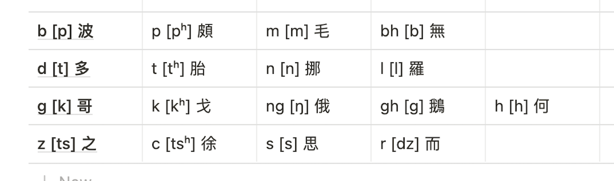
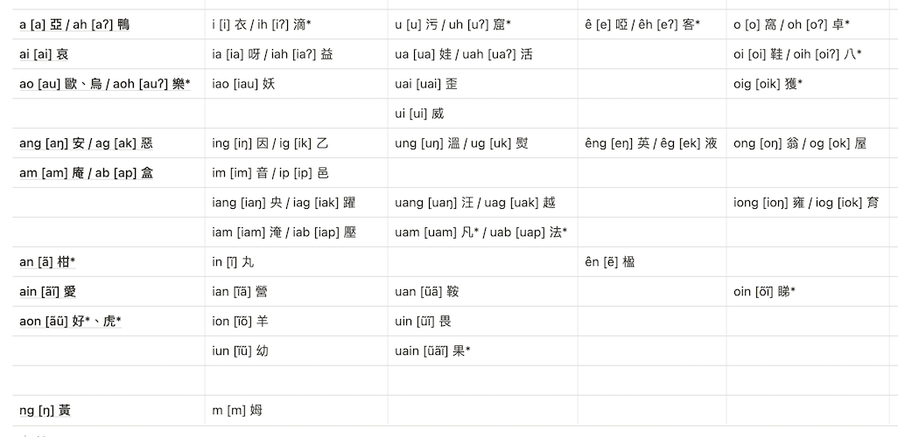

## 序言(su⁶ ngiang⁵)

甲子鎮處在陸豐市，與惠來縣交界，語言文化上偏惠來（其實五百年前與惠來交界處同屬海豐縣）。甲子話是三甲地區（甲子、甲西、甲東三鎮）通行的語言，是甲子地方文化的重要載體之一。在學術上，甲子話被歸入粵東閩南語潮汕話片。 

甲子話保留了好㩼中古乃至上古的漢語詞彙，比如：汝、諸母、新婦、箸、鼎、匏桸、雅、翹楚等等，還有極具地方特色的表達，比如：𨑨迌、走漆、理唔直、孤獨死相等等。然而無會寫甚至無會呾甲子話的人實在㩼，其中不少是受過義務教育其。 有鑑於此，本人草創此表，力求詞雅正且其音形義有所考據，權當拋磚引玉，歡迎大家儂做蜀討論改進。 

另附本表主要參考資料：

1. 《潮汕方言詞考釋》（林倫倫）
2. 《海豐話分類辭表》（羅志海、鍾顯坤）
3. [《潮典》](https://www.mogher.com/baike) 
4. 《新潮汕字典》（張曉山）
5. [《台灣閩南語常用詞辭典》](https://twblg.dict.edu.tw/holodict%5C_new/index.html) 
6. [《小學堂閩語》](https://xiaoxue.iis.sinica.edu.tw/minyu)

阿華
2020年10月成稿，12月修訂

<!--more-->

## 總表(zong² biao²)

### 🤵稱謂(cêng¹ ui⁶)

1. 我 /ua²/
2. 汝 /lu²/ 你
3. 伊 /i¹/ 他/她/它
4. 恁 /ning²/ 你們
5. 伊人 /i¹ nang⁷/ 他們
6. 家己 /ga¹ gi⁷/ 自己
7. 人家 /nang⁵ gê¹/ 別人
8. 諸夫 /za¹ bao¹/ 男人、男子
9. 諸母 /za¹ bhao²/ 女人
10. 諸娘 /zu¹ nion⁵/ 女子
11. 大人 /dua⁷ nang⁷/
12. 老人 /lao⁶ nang⁵/
13. 後生囝 /hao⁶ sên¹ gian²/ 年輕人
14. 孥囝 /nao⁵ gian²/、/nong⁶ gian²/ 小孩子
15. 諸夫囝 /za¹ bao¹ gian²/ 男孩子、兒子
16. 諸母囝 /za¹ bhao² gian²/ 女孩子、女兒
17. 諸娘囝 /zu¹ nion⁵ gian²/ 年輕女子
18. 阿公 /a¹ gong¹/ 爺爺
19. 阿媽 /a¹ ma²/ 奶奶
20. 媽人 /ma² nang⁵/ 婦女
21. 媽祖 /ma² zao²/ 原名林默，南海保護神
22. 爸爸 /ba¹ ba¹/ 爸爸
23. 媽媽 /ma¹ ma¹/
24. 父母 /bê⁶ bho²/
25. 兄 /hian¹/ 哥哥
26. 弟 /di⁶/ 弟弟
27. 姐 /zê²/ 姐姐
28. 妹 /moi⁷/ 妹妹
29. 姊妹 /zi² moi⁷/ 姐妹
30. 叔伯兄弟 /zêh⁴ bêh⁴ hian¹ di⁶/ 堂兄弟
31. 同沿 /dang⁵ iang⁵/ 同輩、同儕
32. 翁 /ang¹/ 丈夫
33. 母 /bhao²/ 妻子
34. 翁姐 /ang¹ zia²/ 夫妻
35. 新婦 /sing¹ bu⁶/ 媳婦
36. 大家 /dua⁷ gê¹/ 丈夫的母親、家婆
37. 大家官 /dua⁷ gê¹ guan¹/ 丈夫的父親、家公
38. 丈人 /dion⁶ nang⁵/ 岳父
39. 丈母 /dion⁶ m²/ 岳母
40. 妻舅 /ci¹ gu⁶/ 妻子的兄弟
41. 妻姨 /ci¹ i⁵/ 妻子的姐妹
42. 伯 /bêh⁴/ 伯伯
43. 姆 /m²/ 伯父的妻子
44. 叔 /zêh⁴/ 叔叔
45. 嬸 /sim²/ 叔父的妻子
46. 舅 /gu⁶/ 舅舅
47. 妗 /gim⁶/ 舅父的妻子
48. 姑 /gao¹/ 父親的姐妹、姑姑
49. 姑丈 /gou¹ dion⁶/ 姑姑的丈夫
50. 姨 /i⁵/ 母親的姐妹；母親
51. 姨丈 /i⁵ dion⁶/ 母親的姐妹的丈夫
52. 先生 /sing¹ sên¹/
53. 學生 /hag⁴ sêng¹/
54. 師父 /sai¹ bê⁶/ 工匠師傅
55. 師父 /su¹ hu⁶/ 出家人、和尚
56. 和尚 /hoi⁵ sion⁷/、/hua⁵ siang⁶/
57. 腳色 /ka¹ siao³/ 人手、幫手
58. 青暝囝 /cên¹ mên⁵ gian²/ 瞎子

### 🦶身體(sing¹ ti²)

1. 頭毛 /tao⁵ mo⁵/ 頭髮
2. 頭神 /tao⁵ sing⁵/ 思維、記憶的能力
3. 頭碗骨 /tao⁵ uan² gug⁴/ 頭蓋骨
4. 旋 /zng⁷/ 頭髮呈漩渦狀的地方
5. 囟 /sing³/ 嬰兒頭頂骨未合縫處
6. 額頭 /hia² tao⁵/
7. 面 /ming⁷/ 臉
8. 頰溝 /gih⁴ gao¹/ 腮
9. 痣 /gi³/
10. 目 /mag⁸/ 眼睛
11. 目仁 /mag⁸ ring⁵/ 眼珠子
12. 目汁 /mag⁸ zab⁴/ 眼淚
13. 眉 /bhai⁵/ 眉毛
14. 耳 /hin⁶/ 耳朵
15. 耳空、耳孔 /hin⁶ kang¹/
16. 鼻 /pin⁷/ 鼻子
17. 鼻空、鼻孔 /pin⁷ kang¹/
18. 喙、嘴 /cui⁷/ 嘴巴
19. 䶕牙 /bha³ ghê⁵/ 龅牙
20. 涎 /nua⁶/ 唾液
21. 痰 /tam⁵/
22. 頷 /am⁶/ 脖子
23. 下頦 /ê⁶ hai⁵/ 下巴
24. 喙後肚 /cui⁷ ao⁶ dao²/ 下巴後面柔軟處
25. 鬚 /ciu¹/ 鬍鬚
26. 嚨喉 /na⁵ ao⁵/ 喉嚨
27. 手 /ciu²/
28. 正手 /zian³ ciu²/ 右手
29. 倒手 /do³ ciu²/ 左手
30. 胳囊跤 /goh⁴ lang⁵ ka¹/ 腋下
31. 手後曲 /ciu² ao⁶ kiao¹/ 手肘
32. 手模 /ciu² bhao⁵/ 手印
33. 腡 /lê⁵/ 圓形手指紋
34. 指頭公 /zain² tao⁵ gong¹/ 大拇指
35. 尾指囝 /bhoi² zain² gian²/ 小指
36. 胸 /hêng¹/
37. 嬭、奶 /nê¹/
38. 𩩍篱 /pian¹ li⁵/ 肋骨
39. 肚臍 /dao² zai⁵/
40. 背脊 /ba¹ ziah⁴/ 脊背
41. 腰 /io¹/
42. 跤、骹、腳 /ka¹/
43. 跤頭趺 /ka¹ tao⁵ u⁶/ 膝蓋
44. 大跤腿 /dua⁷ ka¹ tui²/ 大腿
45. 跤腸肚 /ka¹ dng⁵ dao²/ 小腿後部肌肉凸出處
46. 跤後蹬 /ka¹ ao⁶ dên¹/ 腳後跟
47. 跤盤 /ka¹ buan⁵/ 腳板
48. 跤目 /ka¹ mag⁸/ 腳踝
49. 跤指公 /ka¹ zain² gong¹/ 腳大拇趾
50. 跤液 /ka¹ sio²/ 腳汗
51. 卵 /lang⁶/ 陰莖、屌、勢
52. 卵鳥 /lang⁶ ziao²/ 陰莖、屌、勢
53. 卵脬 /lang⁶ pa¹/ 精囊
54. 卵核 /lang⁶ hug⁸/ 睪丸
55. 膣 /zi¹/ 女陰
56. 膣眉 /zi¹ bhai¹/ 女陰
57. 尻川 /ka¹ cng¹/ 屁股
58. 雞母皮 /goi¹ bho² poi⁵/ 雞皮疙瘩
59. 汗 /guan⁷/
60. 垢圿 /gao² goih⁴/ 體表污垢

### 🍵飲食(im² ziah⁸)

1. 食 /ziah⁸/ 吃、喝、抽
2. 祭 /zi³/ 狼吞虎咽；坐享其成
3. 咬 /ga⁶/
4. 哺 /bao⁷/ 咀嚼
5. 吞 /tung¹/
6. 舐 /zi⁶/ 舔
7. 含 /gam⁵/
8. 啜 /coih⁴/ 喝
9. 啉 /lim⁵/ 小口喝
10. 灌 /guang¹/ 大口喝
11. 吸 /kib⁴/
12. 搵 /ung³/ 蘸
13. 買鹹 /moi² giam⁵/ 買菜
14. 食透早 /ziah⁸ tao⁷ za²/ 吃早飯
15. 食眠起 /ziah⁸ mng⁵ ki²/ 吃早飯
16. 食晝 /ziah⁸ dao³/ 吃午飯
17. 食當晝 /ziah⁸ dêng¹ dao³/ 吃午飯
18. 食夜昏、食暝昏 /ziah⁸ mê⁵ hng⁵/ 吃晚飯
19. 飯 /bng⁷/
20. 米 /bhi²/
21. 糜 /moi⁵/ 粥
22. 飲 /am²/ 米湯
23. 配 /poi³/ 菜
24. 菜式 /cai³ sêg⁴/
25. 粿、餜 /goi²/
26. 丸、圓 /in⁵/
27. 油䭔 /iu⁵ zui¹/ 一種油炸食品
28. 汰米 /tua⁷ bhi²/ 淘米
29. 熬 /ngao⁵/ 長時間煮。～糜。
30. 煲 /bu⁵/ 煮、熬。～藥。
31. 潘 /png¹/ 餿水
32. 油 /iu⁵/
33. 鹽 /iam⁵/
34. 醋 /cao³/
35. 豉油 /si⁷ iu⁵/ 醬油
36. 豆汁 /dao⁷ zab⁴/ 醬油
37. 雞卵 /goi¹ nng⁶/ 雞蛋
38. 豬肉 /du¹ nêg⁸/
39. 澀肉 /siab⁴ nêg⁸/、/siab⁴ bhah⁴/ 瘦肉。澀，少油。
40. 肉脞 /nêg⁸ co³/ 肉末
41. 烏糖 /ao¹ tng⁵/ 紅糖、黑糖
42. 赤砂糖 /ciah⁴ sua¹ tng⁵/
43. 白砂糖 /bêh⁸ sua¹ tng⁵/
44. 薰 /hung¹/ 香菸
45. 茶 /dê⁵/
46. 酒 /ziu²/
47. 淖 /cioh⁴/ 粥稀
48. 凊 /cing³/ 飯菜涼了
49. 燒 /sio¹/ 熱呼呼
50. 燒烘燒烘 /sio¹ hang¹ sio¹ hang¹/ 熱呼呼
51. 芳 /pang¹/ 香
52. 甘 /gam¹/
53. 甜 /diam⁵/
54. 鹹 /giam⁵/
55. 薟 /hiam¹/ 辛辣
56. 䭕 /zian²/ 清淡
57. 臊 /co¹/ 腥
58. 臭 /cao³/

### 👔穿戴(cêng⁷ dua³)

1. 帽 /bho⁷/
2. 目鏡 /mah⁸ gian³/ 眼鏡
3. 圍巾 /ui⁵ ging¹/
4. 頷幔 /am⁶ muan¹/ 披肩
5. 衫褲 /san¹ kao³/ 衣服
6. 西裝 /sai¹ zuang¹/
7. 褸 /lao¹/ 大衣
8. 葵笠 /goi⁵ loih⁸/ 斗笠，竹編成的圓錐形大帽子。
9. 羊毛衫 /ion⁵ mo⁵ san¹/
10. 長䘼衫 /dng⁵ ng² san¹/ 長袖衫
11. 短䘼衫 /dê² ng² san¹/ 短袖衫
12. 貼身衫 /dah⁴ sing¹ san¹/ 貼身的上衣
13. 䘥囝 /gah⁴ gian²/ 無袖內衣
14. 底衫 /doi² san¹/ 內衣
15. 肚綰 /dao² guan⁶/ 肚兜
16. 長褲 /dng⁵ kao³/
17. 短褲 /dê² kao³/
18. 褲頭 /kao³ tao⁵/ 短褲、內褲
19. 褲橛 /kao³ goi²/ 短褲、內褲
20. 三角褲 /san¹ gag⁴ kao³/
21. 裙 /gung⁵/
22. 圍裙 /ui⁵ gung⁵/
23. 文胸 /bhung⁵ hêng¹/ 胸罩
24. 奶帕、嬭帕 /nê¹ pê³/ 胸罩
25. 皮帶 /poi⁵ dua³/
26. 手囊 /ciu² lob⁴/ 套袖
27. 手鐲 /ciu² sio²/
28. 鞋拖 /tua¹ oi⁵/ 拖鞋
29. 波鞋 /bo¹ oi⁵/ 球鞋。波，英文 ball 的音譯。
30. 釘鞋 /dêng¹ oi⁵/ 運動鞋的一種
31. 皮鞋 /poi⁵ oi⁵/
32. 高跟鞋 /gao¹ ging¹ oi⁵/
33. 靴 /hia¹/
34. 襪 /ghoih⁸/
35. 布 /bao³/
36. 襊 /zoi⁷/ 折痕
37. 頷領 /am⁶ nia²/ 領子
38. 褲袋 /kao³ dê⁷/ 位於褲子的口袋
39. 衫袋 /san¹ dê⁷/ 位於上衣的口袋
40. 暗袋 /am³ dê⁷/ 內側袋
41. 內裏 /lai⁶ li²/ 衣物不露出在外的裏層
42. 鈕 /liu²/ 鈕扣
43. 針 /zam¹/
44. 線 /suan³/
45. 拉鍊 /la¹ liang³/
46. 穿 /cêng⁷/
47. 褪 /tng⁷/ 脱
48. 紩 /tin⁷/ 縫
49. 補 /bao²/
50. 車衫褲 /cia¹ san¹ kao³/ 用縫紉機縫衣服

### 🎏物件(mi² gian⁶、mian⁶)

1. 眠牀 /mng⁵ cng⁵/ 牀
2. 鋪 /pao¹/ 牀
3. 高低牀 /gao¹ di¹ cng⁵/ 上下鋪
4. 蓆 /cioh⁸/
5. 簟 /diam⁶/ 竹席
6. 毡 /ziang¹/
7. 被 /poi⁶/
8. 棉被 /mi⁵ poi⁶/
9. 被單 /poi⁶ duan¹/
10. 枕頭 /zim² tao⁵/
11. 枕頭囊 /zim² tao⁵ lob⁴/ 枕套
12. 蠓罩、蚊罩 /mang² da³/ 蚊帳
13. 蠓熏、蚊熏 /mang² hung¹/ 蚊香
14. 窗罩 /têng¹ zao⁶/
15. 口罩 /kao² zao⁶/
16. 壁櫥 /biah⁴ du⁵/
17. 椅 /in²/
18. 桌 /doh⁴/
19. 櫃 /gui⁷/
20. 架 /gê³/
21. 盒 /ab⁸/
22. 籃 /na⁵/
23. 瓶 /bang⁵/
24. 鎖頭 /so² tao⁵/
25. 鎖匙 /so² si⁵/ 鑰匙
26. 葉疊 /iab² diab⁸/ 合葉
27. 牙簽 /ghê⁵ ciam¹/
28. 茶盤 /dê⁵ buan⁵/
29. 茶壺 /dê⁵ hu⁵/
30. 沖罐 /cong¹ guang³/ 茶壺
31. 茶杯 /dê⁵ boi¹/
32. 茶几 /dê⁵ gi²/
33. 熏咬 /hung¹ ga⁶/ 煙斗
34. 熏碟 /hung¹ dih⁸/ 煙灰缸
35. 熱壺 /riag⁸ hu⁵/ 熱水瓶
36. 熨斗 /ug⁴ dao²/
37. 電燈 /diang⁶ dêng¹/
38. 電泡 /diang⁶ pa⁶/
39. 燈籠 /dêng¹ lang⁵/
40. 燈火 /dêng¹ hoi²/ 電燈；燈光
41. 風箏 /hong¹ zêng¹/
42. 米甕 /bhi² ang³/ 米缸
43. 水䀇 /zui² gao²/ 大型儲水器
44. 跤桶 /ka¹ tang²/ 原指洗腳桶，後泛指洗衣盆，也可用來給小孩洗澡。
45. 面盆 /ming⁷ png⁵/ 臉盆
46. 瓠桸 /bu⁵ hia¹/ 水瓢
47. 口㼦 /kao² gong²/ 漱口杯
48. 碗 /uan²/
49. 盤 /buan⁵/
50. 碟 /dih⁸/
51. 甌 /ao¹/ 大碗
52. 箸 /du⁷/ 筷子
53. 湯匙 /tng¹ si⁵/
54. 調羹 /tiao⁵ gên¹/ 喝粥用的小勺子；湯匙
55. 糜匙 /moi⁵ si⁵/ 舀粥用的勺子
56. 飯匙 /bng⁷ si⁵/ 飯勺
57. 飯添 /bng⁷ tin¹/ 飯勺
58. 鼎 /dian²/ 鍋
59. 鼎㧕 /dian² liu⁶/ 鍋鏟。㧕，存疑。
60. 鼎蓋 /dian² kain³/ 鍋蓋
61. 菜刀 /cai³ do¹/
62. 瓜刨 /goi¹ pao⁵/
63. 砧 /diam¹/
64. 篩 /tai¹/
65. 筅 /cain²/ 刷子
66. 菜篩 /cai³ tai¹/
67. 鉸刀 /ga¹ do¹/ 剪刀
68. 螺絲批 /lo⁵ si¹ poi¹/ 螺絲刀
69. 螺絲釘 /lo⁵ si¹ dêng¹/
70. 旋螺絲 /suag⁸ lo⁵ si¹/ 擰螺絲
71. 鐵錘 /tih⁴ tui⁵/
72. 鉸夾 /ga¹ giab⁸/ 鉗子
73. 扳手 /bang² ciu²/
74. 電筆 /diang⁶ big⁴/ 測電筆
75. 烏膠布 /ao¹ ga¹ bao³/ 電工膠帶
76. 黏紙 /niam⁵ zua²/ 透明膠帶
77. 布拖 /bao³ tu¹/ 拖把
78. 掃帚 /sao³ siu²/ 掃把
79. 畚斗 /bng³ dao²/ 垃圾鏟
80. 畚箕 /bng³ gi¹/

    

81. 梯 /tui¹/
82. 吸石 /hiab⁴ zioh⁸/ 磁鐵、磁石
83. 箠 /coi⁵/ 鞭子，可用來教育孩子。
84. 火箠 /hoi² coi⁵/ 火筷子，夾爐中煤炭或通火的用具。
85. 角畢 /gag⁴ big⁴/ 皮箱
86. 樹嬭 /ciu⁷ ni⁵/ 橡皮、橡膠。嬭，樹之乳膠。
87. 嬭漱 /ni⁵ ciu³/ 橡皮擦
88. 毛筆 /mo⁵ big⁴/
89. 鋼筆 /gng³ big⁴/
90. 鉛筆 /iang⁵ big⁴/
91. 鉛筆旋 /iang⁵ big⁴ suag⁸/ 卷筆刀、筆刨
92. 模 /bhao⁵/ 模子
93. 㨹 /zoi⁷/ 裂縫、痕跡
94. 離衣機 /li⁵ i¹ gi¹/ 洗衣機

### 🏠建築(giang³ dog⁴)

1. 茨、厝 /cu³/ 房子、家
2. 寮 /liao⁵/ 简陋小屋
3. 瓦茨 /hia⁶ cu³/ 瓦舍
4. 茨手 /cu³ ciu²/ 潮汕民居天井旁兩間廂房的名稱。
5. 兩間直 /no⁶ gain¹ dig⁸/ 傳統民居，兩房。
6. 獨腳靴 /dog⁸ ka¹ hia¹/ 傳統民居，一聽一茨手一房。
7. 下山虎 /hia⁶ suan¹ haon²/ 傳統民居，三合院，一廳二房二茨手。
8. 四點金 /si³ diam² gim¹/ 傳統民居，四合院，中軸爲前廳天井後聽，兩廳兩旁各有一房。
9. 竹竿茨 /dêg⁴ go¹ cu³/ 傳統民居，廚房客廳住房天井排列成狹長的空間，如竹竿。
10. 駟馬拖車 /si³ mê² tua¹ cia¹/ 傳統民居，在四點金上縱加一廳，橫加兩房，三廳二天丼。
11. 茨邊 /cu³ bin¹/ 鄰居
12. 起茨 /ki² cu³/ 蓋房子
13. 租茨 /zao¹ cu³/ 租房子
14. 搬茨 /buan⁵ cu³/ 搬家
15. 入新茨 /rib⁸ sing¹ cu³/ 搬入新家
16. 客廳 /kêh⁴ tian¹/
17. 客房 /kêh⁴ bang⁵/
18. 廚房 /dao⁵ bang⁵/
19. 浴室 /êg⁸ sig⁴/
20. 洗浴 /soi² êg⁸/ 洗澡
21. 廁所 /cê³ so²/
22. 屎壑 /sai² hag⁸/ 茅廁
23. 門窗 /mng⁵ têng¹/
24. 門閂 /mng⁵ cuan³/
25. 門楣 /mng⁵ bhai⁵/
26. 門橂 /mng⁵ dain⁶/ 門檻
27. 門扇後 /mng⁵ sin³ ao⁶/ 門後
28. 柱 /tiao⁶/
29. 牆壁 /cion⁵ biah⁴/
30. 庭、埕 /dian⁵/ 寬闊平地，可曬鹽、曬穀。
31. 临檐 /lim⁵ zin⁵/ 檐廊
32. 塗角 /tao⁵ gag⁴/ 土磚
33. 磚 /zng¹/
34. 廟 /bhio⁷/
35. 亭 /dêng⁵/
36. 祠堂 /su⁵ dng⁵/
37. 庵寺 /am¹ zin⁷/ 尼寺、僧寺的通稱。
38. 學校 /hag⁸ hao⁶/
39. 醫院 /ui¹ in⁷/
40. 鎮府 /ding³ hu²/ 鎮政府
41. 舖囝 /pao³ gian²/ 小賣部

### 🛵交通(gao¹ tong¹)

1. 腳車、跤車 /ka¹ cia¹/ 腳踏車、自行車
2. 摩托 /mo⁵ toh⁸/ 摩托，英文 motorcycle 音譯省。
3. 三輪車 /san¹ lung⁵ cia¹/
4. 的士 /dêg⁴ si⁶/ 計程車、出租車。的士，英文 taxi 音譯。
5. 小車 /sio² cia¹/ 小汽車
6. 麵包車 /min⁷ bao¹ cia¹/
7. 公交車 /gong¹ gao¹ cia¹/
8. 大巴 /dua⁷ ba¹/ 巴，英文 bus 音譯。
9. 車站 /cia¹ zam⁶/
10. 輪船 /lung⁵ zung⁵/
11. 龍船 /lêng⁵ zung⁵/ 龍舟
12. 火車 /hoi² cia¹/
13. 地鐵 /di⁷ tih⁴/
14. 高鐵 /gao¹ tih⁴/
15. 飛機 /boi¹ gi¹/
16. 行路 /gian⁵ lao⁷/ 走路
17. 踏腳車 /dah⁸ ka¹ cia¹/ 騎自行車
18. 駛車 /sai² cia¹/ 開車
19. 撐船 /tên¹ zung⁵/
20. 載客 /zai³ kêh⁴/
21. 拗䷀囝 /ao² gag⁴ gian²/ 摩托車司機。拗，載；扛。
22. 落車 /lo² cia¹/ 下車
23. 碼頭 /bhê² tao⁵/
24. 涵空、涵孔 /am⁵ kang¹/ 涵洞、涵管、地下水道
25. 橋墩 /gio⁵ dun¹/ 橋梁下面的圓柱狀基石

### 🐒眾生(zêng³ sên¹)

1. 眾生 /zêng³ sên¹/ 牲畜
2. 禽兽 /kim⁵ siu⁶/
3. 害蟲 /hai⁷ tang⁵/
4. 豬豭 /du¹ go¹/ 配種的公豬，也比喻好色之徒。
5. 豬槽 /du¹ zo⁵/
6. 羊牢 /ion⁵ lo⁵/
7. 雞翁 /goi¹ ang¹/ 雄雞
8. 雞母 /goi¹ bho²/ 母雞
9. 鴨囝 /ah⁴ gian²/ 小鴨子
10. 鵝 /gho⁵/
11. 貓牯 /ngiao¹ gao²/ 母貓
12. 鳥 /ziao²/
13. 燕囝 /in³ gian²/ 小燕子
14. 鶴 /hoh⁸/
15. 鷹 /êng¹/
16. 白鴿 /bêh⁸ gab⁴/
17. 白鷺鷥 /bêh⁸ lao⁷ si¹/
18. 鸚哥 /êng¹ go¹/ 鸚鵡
19. 麻雀 /mua⁵ ziah⁴/
20. 蝠婆 /big⁴ bo⁵/ 蝙蝠
21. 蛇 /zua⁵/
22. 雨傘節 /hao⁶ suan³ zag⁴/ 一种毒蛇。
23. 狗母蛇 /gao² bho² zua⁵/ 蛇舅母、石龍子、四腳蛇，蜥蜴的一種

    

24. 兩棲動物 /liang² ci¹ dong⁶ moih⁸/
25. 蟾蜍 /ziong¹ zu⁵/
26. 蛤虯 /gab⁴ giu²/ 青蛙
27. 蛤蛙 /gab⁴ guai¹/ 蝌蚪
28. 蚼蟻 /gao² hia⁶/ 螞蟻
29. 白蟻 /bêh⁸ hia⁶/
30. 蜜蜂 /bhig⁸ pang¹/
31. 虎頭蜂 /hao² tao⁵ pang¹/ 黄蜂
32. 龜 /gu¹/ 烏龜或像烏龜的昆蟲
33. 金龜 /gim¹ gu¹/ 金龜子

    

34. 鱉 /bih⁴/
35. 土蚓 /dao⁶ ung²/ 蚯蚓
36. 蜈蚣 /gê⁵ gang¹/
37. 火金蛄 /hoi² gim¹ gao¹/ 螢火蟲
38. 牛屎龜 /ghu⁵ sai² gu¹/ 屎殼郎、蜣螂
39. 烏點龜 /ao¹ diam² gu¹/ 七星瓢蟲

    

40. 紅新娘 /ang⁵ sing¹ nion⁵/ 紅姬緣椿象

    

41. 山蛚 /sua¹ lê⁷/ 蟬；多指[蚱蝉](http://museum.ioz.ac.cn/topic%5C_detail.aspx?id=14818)

    

42. 蝘悲蟬 /iam⁶ bi¹ sung⁵/ [蟪蛄](http://museum.ioz.ac.cn/topic%5C_detail.aspx?id=14817)

    

43. 蟋蟀 /tih⁴ sug⁴/ 又稱烏龍。
44. ䷀ // 螽斯、莎蟲、紡織娘、蟈蟈。

    

45. 草猴 // 稻蝦

    

46. ䷀ // 金盾龜金花蟲

    

47. 草蜢 /cao² mên²/ 螞蚱、蚱蜢。
48. 螳螂、螳蜋 /tang⁵ lang⁵/
49. 神螂 /sing⁵ lang⁵/ 壁虎，蜥蜴的一種。
50. 蛤蚧蛇 /gab⁴ gai³ zua⁵/ 大壁虎，蜥蜴的一種。
51. 土猴 /dao⁶ gao⁵/ 螻蛄
52. 蝶、蜨 /iah⁸/ 蝴蝶
53. 山螟 /suan¹ mê¹/ 蜻蜓
54. 米龜 /bhi² gu¹/ 米象，蛀食稻穀、麥粒等米糧爲生。
55. 蛀蟲 /zu³ tang⁵/
56. 蛓毛蟲 /ci³ mo⁵ tang⁵/ 毛毛蟲
57. 流鼻螺 /lao⁵ pin⁷ lê⁵/ 蝸牛
58. 戶蠅 /hao⁵ sing⁵/ 蒼蠅
59. 枯蠅 /gao¹ sing⁵/ 介殼蟲
60. 蠓、蚊 /mang²/
61. 蝨母 /sag⁴ bho²/ 蝨子
62. 曱甴、虼蚻 /ga¹ zuah⁸/ 蟑螂
63. 蜈蜞 /ghao⁵ ki⁵/ 水蛭，喜歡吸血人畜血液。

### 🐳水產(zui² suan²)

1. 䭕水魚 /zian² zui² hu⁵/ 淡水魚
2. 鹹水魚 /giam⁵ zui² hu⁵/ 海水魚
3. 刣魚 /tai⁵ hu⁵/ 宰魚
4. 魚春 /hu⁵ cung¹/ 魚卵。屈大均《廣東新語》：「粵方言凡禽魚卵皆為春。唐時吳君貢魚春子，即魚子也。」 
5. 魚鱗 /hu⁵ lang⁵/
6. 魚鰾 /hu⁵ pio⁶/
7. 魚鰓 /hu⁵ ci¹/
8. 魚刺 /hu⁵ ci³/
9. 鯁 /gên²/ 魚刺在喉
10. 馬鮫 /mê² ga¹/
11. 鯧 /cion¹/

    

12. 鰇魚 /riu⁵ hu⁵/ 魷魚
13. 墨斗 /bhag⁸ dao²/、/mag⁸ dao²/ 墨魚
14. 絲丁魚 /si¹ dêng⁶ hu⁵/ 龍頭魚、硬魚、橂魚(殿魚)、豆腐魚
15. 狗母魚 // 蝦虎魚、狗魽仔魚、九甘魚

    

16. 白目噯 /ain²/
17. 狗母囝 // 身體透明，似魩仔鱼，有淡水和海水兩種
18. 鰻魚 /muan⁵ hu⁵/
19. 花仙魚 /hoi¹ siang¹ hu⁵/ 鮐魚

    

20. 鸚哥魚 /êng¹ go¹ hu⁵/ 洛神項鰭魚、紅姑娘、紅新娘、碼頭魚

    

21. 癩瘑魚 /na³ go¹ hu⁵/、/lai³ go¹ hu⁵/ 多齒蛇鯔，俗稱「那哥魚」，常用於製魚丸。
22. 娘愛魚 /nion⁵ ain¹ hu⁵/ 泥猛魚、褐篮子鱼、臭肚鱼。

    

23. ䷀囝 /dêg⁸ gian²/ 又稱迪仔、綠鰭馬面魨、剝皮魚。

    

24. 䱛囝 /oig⁸ gian²/ 䱛仔、䱛魚

    

25. 金龍䱛 /gim¹ lêng⁵ oig⁸/ 金龍魚、黃花魚，狀似䱛魚但個頭大、嘴圓、體黃。

    

26. 福壽魚 /hog⁴ siu⁶ hu⁵/ 羅非魚

    

27. 鮭魚 /guai¹ hu⁵/ 河魨，俗稱「乖魚」，常指黃鰭東方魨。
28. 黃牆 /ng⁵ cion⁵/ 黃鰭鯛

    

29. 軟甘 /nng² gang¹/ 杜氏鰤、油甘，體側有黃色縱帶。 

    

30. 沙尖 /sua¹ ziam¹/ 多鱗鱚、沙鯪、北方稱沙丁魚。

    

31. 龍箭 /lang⁷ zin⁷/ 鯪魚 ，淡水魚，可用於做罐頭魚。
32. 石剎 /zio² sag⁴/ 又稱烏雞，松鯛。
33. 淡角魚 /dam⁶ gag⁴ hu⁵/ 鯒魚、辮子魚
34. 烏魚 /ao¹ hu⁵/ 又稱烏頭，鯔魚。
35. 烏前魚 /ao¹ zain⁵ hu⁵/
36. 塗虱 /tao⁵ sag⁴/ 鬍子鯰
37. 龍舌 /lêng⁵ zi²/ 龍利魚
38. 巴浪 /ba¹ lang¹/ 藍圓鯵
39. 鯇魚 /uang² hu⁵/ 草魚
40. 姑魚 /gao¹ hu⁵/ 金色小沙丁魚
41. 鯽魚 /zig⁴ hu⁵/
42. 秋刀魚 /ciu¹ do¹ hu⁵/
43. 紅目鰱 /ang⁵ mag⁸ liang⁵/ 紅目大眼鯛

    

44. 田鱔 /cang⁵ cuan⁶/ 鱔魚、黃鱔
45. 白帶魚 /bêh⁸ dua³ hu⁵/ 鞭魚、裙帶魚、海刀魚
46. 鰐魚 /ngag⁸ hu⁵/
47. 鯊魚 /sua¹ hu⁵/
48. 鯨魚 /kêng⁵ hu⁵/
49. 紅哥鯉 /ang⁵ go¹ li²/ 金線魚
50. 蝦 /hê⁵/
51. 蟹 /hoi⁶/
52. 三目蠘 /san¹ mag⁸ cih⁸/ 紅星梭子蟹、三目蟹

    

53. 海哲 /hai² diag⁴/
54. 蠔、蚝、蚵 /o⁵/ 牡蠣

    

55. 紅肉 /ang⁵ nê²/ 紅肉藍蛤
56. 蚶 /ham¹/
57. 蜆 /hain⁶/
58. 青匙 /cên¹ si⁵/ 綠殼菜蛤、翡翠貽貝

    

59. 花蛤 /hoi¹ gab⁴/ 菲律賓簾蛤、花甲

    

60. 車白 /cia¹ bêh⁸/ 文蛤，邊緣弧度較花蛤圓。

    

61. 青蛤 /cên¹ gab⁴/

    

62. 毛蚶 /mo⁵ ham¹/

    

63. 薄殼 /bo² kag⁴/ 尋氏肌蛤、海蛔、海瓜子

    

64. 指甲螳 /zain² gah⁴ tang⁵/ 又稱指甲蚌hong²，蟶sêng³子。

    

65. 田螺 /cang⁵ lê⁵/
66. 尖螺 /ziang¹ lê⁵/

    

### 🌾 蔬菜(so¹ cai³)

1. 五穀 /ngao⁶ gag⁴/
2. 稻 /diu⁶/
3. 粟 /cêg⁴/ 稻粒
4. 麥 /mê²/
5. 秫米 /zu² bhi²/ 糯米
6. 薏米 /in³ bhi²/
7. 薏仁 /in³ ring⁵/ 玉米
8. 蕃薯 /huang¹ zu⁵/、/hang¹ zu⁵/
9. 馬鈴薯 /mê² lêng¹ zu⁵/ 土豆
10. 黃豆 /ng⁵ dao⁷/ 大豆、菽
11. 綠豆 /lê² dao⁷/
12. 烏豆 /ao¹ dao⁷/ 黑豆
13. 赤豆 /ciah⁴ dao⁷/ 紅小豆
14. 荷目豆 /ho⁵ mag⁸ dao⁷/ 荷蘭豆、豌豆
15. 地豆 /di⁷ dao⁷/ 花生
16. 豆仁 /dao⁷ ring⁵/ 花生米
17. 油麻 /iu⁵ mua⁵/ 芝麻
18. 菜豆 /cai³ dao⁷/ 常指四季豆
19. 茄 /gio⁵/
20. 苦瓜 /kao² goi¹/
21. 角瓜 /gag⁴ goi¹/ 稜角絲瓜
22. 秋瓜 /ciu¹ goi¹/ 絲瓜

    

23. 嬭瓜、奶瓜 /nê¹ goi¹/ 木瓜
24. 蓮藕 /nain⁵ nao⁶/
25. 菠薐菜 /boi¹ lêng⁵ cai³/ 菠菜
26. 蕹菜 /êng³ cai³/ 空心菜
27. 春菜 /cung¹ cai³/ 長葉芥菜
28. 菜花 /cai³ hoi¹/ 花椰菜
29. 芥菜 /gua³ cai³/ 大芥菜、包心芥菜
30. 芥藍 /gêg⁴ na⁵/
31. 菜頭 /cai³ tao⁵/ 白蘿蔔
32. 紅菜頭 /ang⁵ cai³ tao⁵/ 紅蘿蔔
33. 薺蔥、錢蔥 /zin⁵ cang¹/ 荸薺
34. 韭菜 /gu² cai³/
35. 芫荽 /iang¹ sui¹/ 香菜
36. 芳菜 /pang¹ cai³/
37. 厚合 /gao⁶ hah⁸/ 厚皮菜、莙薘菜、葉用甜菜
38. 九層塔 /gao² zang⁵ tah³/ 金不換、羅勒
39. 萵菜 /oi¹ cai³/ 皺葉萵苣、生菜
40. 劍菜 /giam³ cai³/ 油麥菜
41. 上海青 /siang⁶ hai² cên¹/ 青菜的一種
42. 芹菜 /king⁵ cai³/
43. 津白 /gian¹ bêh⁸/ 又稱紹菜、黃芽白，天津盛產，是大白菜的一種。以下是大白菜的不同品種。

    

    天津大白菜

    

    大白菜

    

    娃娃菜

44. 高麗菜 /go¹ lê⁵ cai³/ 捲心菜、包菜、結球甘藍
45. 菜花 /cai³ hoi¹/ 花椰菜
46. 茼蒿 /dang⁵ o¹/
47. 枸杞菜 /gao² gi² cai³/
48. 真珠菜 /zing¹ zu¹ cai³/ 珍珠花菜、白苞蒿

    

49. 薟椒 /hiam¹ tsio¹/ 辣椒
50. 生果 /cên¹ goi²/ 水果
51. 荔果 /nai⁶ goi²/ 荔枝
52. 龍眼 /nging⁵ ain²/
53. 桑垂 /siong¹ sui⁵/ 桑葚
54. 草莓 /cao² bhoi⁵/
55. 刺菠 /ci³ bo¹/ 蛇莓、覆盆子

    

56. 弓蕉 /gêng¹ zio¹/ 香蕉
57. 米蕉 /bhi² zio¹/
58. 鳥梨 /ziao² lai⁵/
59. 檨 /suain⁷/ 芒果
60. 菝囝 /bag⁸ gian²/ 番石榴
61. 西瓜 /si¹ goi¹/
62. 香櫞 /hion¹ ng⁵/

    

63. 柚 /iu⁷/
64. 柑 /gan¹/ 柑橘
65. 桔 /gig⁴/
66. 橙 /cêng⁵/
67. 菠蘿 /bo¹ lo⁵/
68. 油甘 /iu⁵ gam¹/ 餘甘果，先苦後甜，齒留餘甘。
69. 番茄 /huang¹ gio⁵/
70. 青竹梅 /cên¹ dêg⁴ bhoi⁵/
71. 李 /li²/
72. 棗 /zo²/
73. 蔗 /zia³/ 甘蔗

### 🌿草藥 /cao² ioh⁸/

1. 艾 /hia³/ 艾草 

    

2. 草粿草 /cao² goi² cao²/ 仙草

    

3. 策草 /cêg⁴ cao²/ 又稱抹(bhuah⁴)草、廣防風、防風草，甲子地區神位常年插此草。策 ，大概是指其像馬鞭。

    

4. 青菭 /cên¹ ti⁵/ 青苔

    

5. 薄荷 /bo⁵ ho³/、/bon⁵ hon³/

    

6. 金銀花 /gim¹ nging⁵ hoi¹/

    

7. 午時花 /ngao² si⁵ hoi¹/

    

8. 四季春 /si³ kui³ cung¹/ 四季春花

    

9. 葉下紅 /hio² ê⁶ ang⁵/ 一點紅

    

10. 臭草花 /cao³ cao² hoi¹/ 五色梅、馬纓丹

    

11. 飛天蜈蚣 /boi¹ tin¹ ghê⁵ gang¹/

    

12. 金雞脫殼 /gim¹ goi¹ tug⁴ kag⁴/
13. 路跤菊 /lao⁷ ka¹ gêg⁴/ 路邊菊
14. 臘裏葉 /lah⁸ li² hioh⁸/ 金邊紅桑

    

15. 芒囝筍 /mang⁵ gian² sung²/ 芒草的嫩芽
16. 竹菜 /dêg⁴ cai³/ 竹葉草

    

17. 葛菜 /guah⁴ cai³/ 野葛菜，可食。

    

18. 烏規菜 /ao¹ gui¹ cai³/ 龍葵

    

19. 豬母菜 /du¹ bho² cai³/ 馬齒莧

    

20. 刺莧 /ci³ hain⁷/

    

21. 苦刺 /kao² ci³/ 白簕

    

22. 苦草 /kao² cao²/ 豨薟草

    

23. 兩公根 /liang² gong¹ ging¹/ 崩大碗

    

24. 鋪地錦 /pao¹ di⁷ gim²/ 滿天星

    

25. 雞屎藤 /goi¹ sai² ding⁵/

    

26. 伸筋藤 /cung¹ ging¹ ding⁵/ 蔓九節

    

27. 無頭藤 /bho⁵ tao⁵ ding⁵/ 寄生於其他植物之上

    

28. 酒甕囝 /ziu² ang³ gian²/
29. 盐酸鸡囝 /iam⁵ sng¹ goi¹ gian²/

    

30. 見笑草 /giang³ siao³ cao²/ 含羞草

    

31. 燈籠草 /dêng¹ lang⁵ cao²/ 其果子稱爲「姑娘果」

    

32. 車前草 /cia¹ zain⁵ cao²/

    

33. 馬鞭草 /bhê² bin¹ cao²/

    

34. 蟋蟀草 /tig⁴ sug⁴ cao²/ 烏龍草

    

35. 蒲公英 /pu⁵ gong¹ êng¹/
36. 鸭舌草 /ah³ zih⁸ cao²/ 苦菜

    

37. 魚腥草 /hu⁵ co³ cao²/

    

38. 益母草 /iah⁴ bho² cao²/

    

39. 龍膽草 /lêng⁵ dan² cao²/ 苦地膽草

    

40. 奶汁草 /nê¹ zab⁴ cao²/ 乳汁草，草折斷會有白色液體流出。

    

41. 虎耳草 /haon² hin⁶ cao³/

    

42. 大號奶汁草 /dua⁷ ho⁷ nê¹ zab⁴ cao³/ 蠔割草、飛揚草

    

43. 貓毛兒 /ngiao¹ mo⁵ ri⁵/ 金絲草

    

44. 貓鬚草 /ngiao¹ ciu¹ cao²/

    

45. 鹅囝香 /gho⁵ gian² hiang¹/ 鹅不食草

    

46. 白花蛇舌草 /bêh⁸ hoi¹ zua⁵ zih⁸ cao²/

    

47. 白花蟛蜞草 /bêh⁸ hoi¹ pen⁵ ki⁵ cao²/、/bêh⁸ hoi¹ mua⁵ ki⁵ cao²/

    

48. 四方枝苦楝 /si³ bang¹ gi¹ kao² nai⁷/ 鬼針草

    

49. 苦楝 /kao² nai⁷/ 苦楝樹

    

50. 挨礱被哺 /oi⁵ lang⁵ bi⁶ bu⁶/ 磨盤草、磨礱草、挨礱地堵，其果實似磨盤和礱。礱，磨谷農具。

    

### 🏮時節(si⁵ zoih⁴)

1. 今年 /gim¹ ni⁵/
2. 舊年 /gu⁷ ni⁵/ 去年
3. 前年 /zain³ ni⁵/、/zung³ ni⁵/
4. 下年 /ê⁶ ni⁵/ 明年
5. 熱天時 /ruah⁸ tin¹ si⁵/ 夏天
6. 寒天時 /guan⁵ tin¹ si⁵/ 冬天
7. 凝天時 /ngang⁵ tin¹ si⁵/ 冬天
8. 春夏秋冬 /cung¹ hê⁶ ciu¹ dang¹/
9. 老歷 /lao⁶ lê²/ 農曆
10. 新曆 /sing¹ lê²/ 公曆
11. 今日 /gim¹ rig⁸/
12. 明日 /mêng⁵ rig⁸/
13. 今旦日 /gian² rig⁸/ 今天
14. 明旦日 /man³ rig⁸/ 明天
15. 明眠起 /ma³ mng⁵ ki²/ 明天
16. 昨日 /za¹ rig⁸/
17. 前日 /zain⁵ rig⁸/、/zoh⁸ rig⁸/
18. 後日 /ao⁶ rig⁸/
19. 大前日 /dua⁷ zain⁵ rig⁸/、/dua⁷ zoh⁸ rig⁸/
20. 大後日 /dua⁷ ao⁶ rig⁸/
21. 天光 /tin¹ gng¹/ 天亮
22. 透早 /tao³ za²/ 黎明
23. 眠起 /mng⁵ ki²/ 早晨
24. 日時 /rig⁸ si⁷/ 白天
25. 早晝 /za² dao³/ 上午
26. 中晝 /dêng¹ dao³/ 中午
27. 中晝時 /dêng¹ dao³ si⁵/ 中午
28. 下晝 /ê⁶ dao³/ 下午
29. 下旰 /ê⁶ gua³/ 下午
30. 暗頭 /am³ tao⁵/ 傍晚
31. 暗頭時 /am³ tao⁵ si⁵/ 傍晚
32. 下昏 /ê⁶ hng⁵/ 晚上
33. 下昏時 /ê⁶ hng⁵ si⁵/、/êng² si⁵/ 晚上
34. 下昏囝 /êng² gian²/ 晚上
35. 暗時 /am³ si⁷/ 晚上
36. 暝時、夜時 /mê⁵ si⁷/ 晚上
37. 暝昏、夜昏 /mê⁵ hng⁵/ 晚上
38. 暝昏時、夜昏時 /mê⁵ hng⁵ si⁵/、/mêng² si⁵/ 晚上
39. 暝昏囝 /mêng² gian²/ 晚上
40. 半暝、半夜 /buan³ mê⁵/
41. 時分秒 /si⁵ hung⁵ miao²/
42. 個字 /gai⁵ ri⁷/ 五分鐘
43. 兩個字久 /no⁶ gai⁵ ri⁷ gu²/ 十分鐘
44. 頭前 /tao⁵ zain⁵/ 之前
45. 頭陣 /tao⁵ zung⁵/ 剛才
46. 下 /ê⁶ miag⁸/、/ê⁶ mig⁸/ 剛才
47. 一頃 /zêg⁸ kuang³/ 一會兒
48. 一頃頭 /zêg⁸ kuang³ tao⁵/ 一下子
49. 煞尾 /suah⁴ bhoi²/ 最後
50. 今 /dan¹/ 現在
51. 逐日 /dag⁸ rig⁸/ 每天
52. 逐暝 /dag⁸ mê⁵/ 每晚
53. 通日 /tang³ rig⁸/ 整天
54. 半日 /buan³ rig⁸/
55. 隔日 /gêh⁴ rig⁸/
56. 隔暝、隔夜 /gêh⁴ mê⁵/
57. 別日 /bag⁸ rig⁸/ 改天
58. 即時 /ziag⁴ si⁵/ 立刻、馬上
59. 平常時 /pêng⁵ sion⁵ si⁵/ 平時
60. 一日通通 /zêg⁸ rig⁸ tang³ tang³/ 一整天
61. 七早八早 /cig⁴ za² boih⁴ za²/ 一大早
62. 七早蒙流 /cig⁴ za² mo⁵ liu⁵/ 一大早
63. 烏暗天地 /ao¹ am³ tin¹ di¹/ 天昏地暗
64. 立春 /lib⁸ cung¹/
65. 雨水 /u² sui²/
66. 驚蟄 /gêng¹ dêg8/
67. 春分 /cung¹ hung¹/
68. 清明 /cêng¹ mêng⁵/
69. 谷雨 /gog⁴ u²/
70. 立夏 /lib⁸ hê⁶/
71. 小滿 /sio² muan²/
72. 芒種 /mang⁵ zêng²/
73. 夏至 /hê⁶ zi³/
74. 小暑 /siao² su²/
75. 大暑 /dai⁶ su²/
76. 立秋 /lib⁸ ciu¹/
77. 處暑 /cu³ su²/
78. 白露 /bêh⁸ lao⁷/
79. 秋分 /ciu¹ hung¹/
80. 寒露 /guan⁵ lao⁷/
81. 霜降 /sang¹ gang³/
82. 立冬 /lib⁸ dang¹/
83. 小雪 /siao² soh⁴/
84. 大雪 /dai⁶ soh⁴/
85. 冬至 /dang¹ zi³/
86. 小寒 /siao² hang⁵/
87. 大寒 /dai⁶ hang⁵/
88. 時年八節 /si⁵ ni⁵ boih⁴ zoih⁴/ 一年四季八個節，最早的八節指立春、春分、立夏、夏至、立秋、秋分、立冬和冬至。而在甲子時年八節指元宵、春分、清明、五月節、七月半、秋分、八月半、冬節，過此八節要拜祖，除春分、秋分外的節還需要拜神。
    - 四時，四季、春夏秋冬。
    - 年，甲骨文象人負禾之形，會穀物豐收之意，古時禾穀一年一熟，於是「年」被（引申）用作周年之年。【爾雅•釋天】夏曰歲，商曰祀，周日年，唐虞曰載。古時一度流行歲星（即木星、朱比特星，公轉週期爲 398.88 天）紀年，故一年又稱一歲。
    - 時年，一年四季。
    - 節，中國曆法把一年分為二十四段，每段的開始即爲節。早期只有春分、秋分、夏至、冬至四節，後又加入立春、立夏、立秋、立冬，形成八節，再來後逐漸形成了二十四節。「節」早期是天文曆法上的概念，與氣候相關，後又逐漸加入了紀念或慶祝的元素。
89. 元宵節 /nguang⁵ siao¹ zoih⁴/
90. 公忌節 /gong¹ gi⁷ zoih⁴/ 春分和秋分，祭拜先祖，但不拜神。
91. 清明節 /cêng¹ mêng⁵ zoih⁴/
92. 五月節 /ngao⁶ ghoih⁸ zoih⁴/ 端午節
93. 七月半 /cig⁴ ghoih⁸ buan³/ 中元節、鬼節
94. 八月半 /boih⁴ ghoih⁸ buan³/ 中秋節
95. 冬節 /dang¹ zoih⁴/ 冬至節的簡稱。
96. 廿九暝、廿九夜 /rig⁸ gao² mê⁵/ 除夕（小月）
97. 三十暝、三十夜 /san¹ zab⁸ mê⁵/ 除夕（大月）
98. 春節 /cung¹ zoih⁴/
99. 重陽 /ciang⁵ iang⁵/、/dêng⁵ iang⁵/
100. 國慶節 /gog⁴ kêng³ zoih⁴/
101. 勞動節 /lao⁵ dong⁶ zoih⁴/
102. 婦女節 /hu⁶ nng² zoih⁴/
103. 兒童節 /ri⁵ tong⁵ zoih⁴/
104. 教師節 /ga³ su¹ zoih⁴/
105. 做節 /zo³ zoih⁴/ 過節日
106. 做壽 /zo³ siu⁶/ 過壽辰
107. 做生日 /zo³ sên¹ rig⁸/ 過生日
108. 公忌 /gong¹ gi⁷/ 先祖忌日
109. 拜公忌 /bai³ gong¹ gi⁷/ 在忌日祭拜先祖
110. 拜祖 // 祭拜先祖
111. 拜老爺 // 拜神
112. 假日 /gia² rig⁸/
113. 放假 /bang³ gia²/、/bang³ gian²/
114. 暑假 /su² gia²/
115. 寒假 /hang⁵ gia²/

### 🌀天時(tin¹ si⁵)

1. 晴 /zên⁵/ 晴朗
2. 出日 /cug⁴ rig⁸/ 太陽出來了
3. 透堂白日 /tao³ dng⁵ bêh⁸ rig⁸/ 大白天
4. 烏陰天 /ao¹ im¹ tin¹/ 陰天
5. 透風 /tao³ hong¹/ 刮大風
6. 風颱 /hong¹ tai¹/ 颱風
7. 南風天 /nang¹ hong¹ tin¹/ 刮南風，濕氣加重
8. 轉南風 /dng² nang¹ hong¹/ 南風天來了
9. 透南風 /tao³ nang¹ hong¹/ 刮南風，伍佰有一 Live 同名。
10. 蒙煙天 /mong⁵ iang¹ tin¹/ 霧霾天
11. 落雨 /lo² hao⁶/ 下雨
12. 一陣雨 /zêg⁸ zung⁵ hao⁶/
13. 日頭雨 /rig⁸ tao⁵ hao⁶/ 一邊下雨，一邊出太陽
14. 烏寒雨 /ao¹ guan⁵ hao⁶/ 天時烏陰落寒雨
15. 爍焰 /sih⁴ iam⁶/ 閃電
16. 敲雷 /ka³ lui⁵/ 打雷
17. 冷空氣 /lêng² kong¹ ki⁷/
18. 落雪 /lo² soh⁴/ 下雪
19. 落雹 /lo² pag⁸/ 下冰雹
20. 旱 /uan⁶/ 乾旱
21. 寒 /guan⁵/ 寒冷
22. 冷 /lêng²/ 寒冷
23. 凝 /ngang⁵/ 寒冷
24. 熱 /ruah⁸/
25. 翕熱 /hib⁴ ruah⁸/ 悶熱
26. 乾燥 /gang¹ cao³/
27. 濕 /sib⁴/ 濕潤
28. 涼 /liang⁵/ 涼爽

### 🌛天文(tiang¹ bhung⁵)

1. 天頂 /tin¹ dêng²/ 天上
2. 日頭 /rig⁸ tao⁵/ 太陽
3. 蝕日 /sih⁸ rig⁸/ 日食
4. 狗齧日 /gao² na² rig⁸/ 天狗食日
5. 西照日 /sai¹ zio³ rig⁸/ 夕陽
6. 月娘 /ghoih⁸ nion⁵/ 月亮
7. 月眉 /ghoih⁸ bhai⁵/ 弦月
8. 蝕月 /sih⁸ ghoih⁸/ 月食
9. 河溪 /ho⁵ koi¹/ 銀河、天河
10. 落屎星 /lo² sai² cên¹/ 流星
11. 星宿 /cên¹ siu³/

### ⛰️地理(di⁷ li²)

1. 中央 /diong¹ iang¹/ 中間
2. 內底 /lai⁶ doi²/ 裏面
3. 外口 /ghua⁷ kao²/、/la¹ kao²/ 外面
4. 頭頂 /tao⁵ dêng²/ 上面
5. 下跤 /ê⁶ ka¹/ 下面
6. 下底 /ê⁶ doi²/ 下面
7. 正手爿 /ziang³ ciu² bain⁵/ 左邊
8. 倒手爿 /do³ ciu² bain⁵/ 右邊
9. 頭前 /tao⁵ zain⁵/ 前面
10. 後底 /ao⁶ doi²/ 後面
11. 後壁 /ao⁶ biah⁴/ 後面
12. 對面 /dui³ ming⁷/
13. 隔壁 /gêh⁴ biah⁴/
14. 鄰近 /lim¹ ging⁶/
15. 塗跤 /tao⁵ ka¹/
16. 番爿 /huang¹ bain⁵/
17. 北爿 /bag⁴ bain⁵/
18. 東南西北 /dang¹ nam⁵ sai¹ bag⁴/
19. 地盤 /di⁷ buan⁵/
20. 領域 /nia² oig⁸/
21. 境內 /gêng² lai⁶/
22. 世界 /si³ gai³/
23. 宇宙 /u² diu²/
24. 全球 /cuang¹ giu⁵/
25. 天涯 /tiang¹ ngai⁵/
26. 山頂 /suan¹ dêng²/
27. 山跤 /suan¹ ka¹/
28. 外地 /ghua⁷ dê³/
29. 本地 /bng² di⁷/
30. 別地 /bag⁸ dê³/ 外地
31. 別地地 /bag⁸ di⁷ dê³/ 外地
32. 塗 /tao⁵/ 泥
33. 塗膏 /tao⁵ go¹/ 泥巴
34. 石頭 /zioh⁸ tao⁵/
35. 田園 /cang⁵ hng⁵/
36. 溪墘 /koi¹ gin⁵/ 溪邊
37. 草埔 /cao² bao¹/ 草坪
38. 崎 /gia⁶/ 小山坡
39. 坑 /kên/ 山谷、溪谷。
40. 嶺 /nia²/ 有路可通的山頂
41. 岑 /ngim⁵/、/cam⁵/ 小而高的山
42. 墟 /hu¹/ 大土山
43. 壩 /ba³/ 沙灘、沙洲。
44. 潭 /tam⁵/ 深水池
45. 溪 /koi¹/
46. 江 /gang¹/
47. 河 /ho⁵/
48. 湖 /ao⁵/
49. 海 /hai²/
50. 海拔 /hai² buag⁸/
51. 洲 /ziu¹/
52. 港 /gang²/
53. 灣 /uang¹/
54. 溝 /gao¹/
55. 渠 /ku⁵/ 水道，特指人工開的河道。
56. 浦 /pao²/ 水邊或江河入海處
57. 澳 /o³/ 海邊彎曲且可停泊船隻的地方
58. 汕 /suan³/ 河流沖刷或沖刷而積成的沙灘
59. 汕頭 /suan¹ tao⁵/
60. 汕尾 /suan³ bhoi²/
61. 海湧 /hai² êng²/ 海浪。湧，波浪。
62. 東濠湧 /dang¹ hao⁵ cong¹/ 地名，在廣州越秀。濠，溝渠。湧，河流分叉處。
63. 湧泉相報 /iong³ zuan⁵ siang¹ bo³/ 湧，水冒出。
64. 庭、埕 /dian⁵/ 院子、宽阔处
65. 礦物 /kuang³ moih⁸/
66. 化石 /hoi³ zioh⁸/
67. 原油 /nguang¹ iu⁵/
68. 燃料 /riang⁵ liao⁷/
69. 金屬 /gim¹ siog⁸/
70. 金銀財寶 /gim¹ nging⁵ cai⁵ bo²/
71. 鋼鐵 /gng³ tih⁴/
72. 蘇打 /so³ da²/ 英文 soda 的音譯，常指小蘇打，即碳酸氫鈉。
73. 蘇州 /sao¹ ziu¹/
74. 蠟 /la²/
75. 硫磺 /liu⁵ ng⁵/
76. 砒霜 /bi¹ sng¹/
77. 砂石 /sua¹ zioh⁸/
78. 大理石 /dai⁶ li² zioh⁸/
79. 碳 /tuan³/
80. 水銀 /zui² nging⁵/
81. 水龍水 /zui² lêng⁵ zui²/ 自來水
82. 地牛換肩 /di⁷ ghu⁵ uang⁷ gain¹/ 地震
83. 許婆寮 /kao² pua⁵ liao⁵/ 今可和村
84. 北輋 /bag⁴ sia⁵/ 今博社村
85. 四捻石 /si³ niam³ zio²/ 四片石
86. 甲子八景：六十甲子欄、潮來人字水、雙帆跨海島、五馬渡江邊、仙人踏石積、海甲蓮花山、西峯古寺、雷廟天堂。（《陸豐縣誌》卷之二疆域四 P21）
87. 擎天石：位於甲秀書院的側邊的一塊巨石。《陸豐縣誌》記載：在甲子所北門內峙立聳拔高出雉堞丈余，中開一痕，俗謂雷打石。胡文烜銘其上曰：「天開甲子，巨石臨門，一聲霹靂，振動乾坤 ……」。字大如鬥，余銘苔蝕莫辨。（《陸豐縣誌》卷之二古蹟十二 ）
88. 甲秀書院：甲秀書院位於陸豐縣甲子鎮北門內。甲秀書院建於明代，歷來為粵東文人會萃講學之所。至今院內仍保存著不少歷代的石碑石刻。解放后，人民政府在此興辦中學。
89. 福源寺：座落於甲子鎮北郊雨亭路，原名「復元寺」，又稱「蓮花山草庵」。據傳，福源寺建於宋代。因歷史久遠，原址僅遺存牆基。1990年由光茂法師主持重建。經過10多年的建造，先後建成天王殿、大雄寶殿、觀音殿、地藏殿、鐘樓、鼓樓和禪房等，重塑了諸位菩薩聖像。寺區佔地面積1.2萬多平方米，建築面積3000多平方米。
90. 南海夫人廟：位於甲子鎮城西社區環城路東。明萬曆元年（1573），李棠中舉後爲其妻卓氏而建的紀念祠，御史鄧練題匾「南海夫人」，故稱南海夫人廟。
91. 烈士墓

### 📐計量(goi³ liang⁶)

1. 〇、零 /lêng⁵/、/lang⁵/
2. 一、壹 /zêg⁸/、/ig⁴/
3. 二、贰 /no⁶/、/ri⁶/
4. 三、叁 /san¹/、/sam¹/
5. 四、肆 /si³/、/su³/
6. 五、伍 /ngao⁶/、/u²/
7. 六、陆 /lag⁸/
8. 七、柒 /cig⁴/
9. 八、捌 /boih⁴/、/bag⁴/
10. 九、玖 /gao²/、/giu²/
11. 十、拾 /zab⁸/
12. 百、佰 /bêh⁴/
13. 千、仟 /cain¹/、/ciang¹/
14. 萬 /mang⁷/
15. 億 /êg⁸/
16. 一二個 /zêg⁸ no² gai⁵/
17. 二十六 /ri⁸ ab⁸ lag⁸/、/ri⁸ zab⁸ lag⁸/
18. 廿六號 /rig⁸ lag⁸ ho⁷/ 二十六號
19. 五十外個 /ngao⁶ zab⁸ ghua⁷ gai⁵/
20. 一百空八 /zêg⁸ bêh⁴ kang³ boih⁴/ 一百零八
21. 第一 /doi⁷ ig⁴/
22. 第二 /doi⁷ ri⁶/
23. 第三 /doi⁷ san¹/
24. 一個人 /zêg⁸ gai⁵ nang⁵/
25. 一爿花 /zêg⁸ bain⁵ hoi¹/ 一片花瓣
26. 一蕊花 /zêg⁸ lui² hoi¹/ 一朵花
27. 一葩花 /zêg⁸ pa¹ hoi¹/ 一朵花
28. 一枝花 /zêg⁸ gi¹ hoi¹/
29. 一縛花 /zêg⁸ ba² hoi¹/ 一束花
30. 一叢樹 /zêg⁸ zang⁵ hoi¹/ 一棵樹
31. 一簇頭毛 /zêg⁸ cog⁴ tao⁵ mo⁵/ 一撮頭髮
32. 一粒糖 /zêg⁸ liab⁸ tng⁵/
33. 一隻車 /zêg⁸ ziah⁴ cia¹/ 一輛車
34. 一架車 /zêg⁸ gê³ cia¹/ 一輛車
35. 一杯茶 /zêg⁸ boi¹ dê⁵/
36. 一碗水 /zêg⁸ uan² zui²/
37. 一喙水、一嘴水 /zêg⁸ cui³ zui²/ 一口水
38. 一條弓蕉 /zêg⁸ diao⁵ gêng¹ zio¹/ 一條香蕉
39. 一本書 /zêg⁸ bng² zu¹/
40. 一枝手機 /zêg⁸ gi¹ ciu² gi¹/ 一隻手機
41. 一枝鎖匙 /zêg⁸ gi¹ so² si⁵/ 一把鑰匙
42. 一個銀 /zêg⁸ gai⁵ nging⁵/ 一塊錢
43. 一領被 /zêg⁸ nia² poi⁶/ 一席被子
44. 一個鋪 /zêg⁸ gai⁵ pao¹/ 一張床
45. 一個鐘頭 /zêg⁸ gai⁵ zêng¹ tao⁵/ 一個小時
46. 一副衫褲 /zêg⁸ hu³ san¹ kao³/ 一套衣服
47. 一腰裙 /zêg⁸ io¹ gung⁵/ 一件裙子
48. 一尾魚 /zêg⁸ bhoi² hu⁵/ 一條魚
49. 一墩物件 /zêg⁸ dung¹ mi² gian⁶/ 一堆東西
50. 一橛蔗 /zêg⁸ goi² zia³/ 一截甘蔗
51. 一葩電火 /zêg⁸ pa¹ diang⁶ hoi²/ 一盞電燈
52. 一跤箸、一腳箸 /zêg⁸ ka¹ du⁷/ 一隻筷子
53. 一雙箸 /zêg⁸ sang¹ du⁷/ 一雙筷子
54. 一腹火 /zêg⁸ bag⁴ hoi²/ 一肚子火
55. 一脬屎 /zêg⁸ bu⁵ sai²/ 一坨屎
56. 一脬尿 /zêg⁸ bu⁵ rio⁷/ 一泡尿
57. 一逝路 /zêg⁸ zua⁷ lao⁷/ 一趟路
58. 一丸塗 /zêg⁸ uang⁵ tao⁵/ 一團泥土
59. 一過 /zêg⁸ goi³/ 一次

### 🧭 指代(zi² toi³)

1. 只 /zi²/ 這，近指。
2. 許 /hi²/ 那，遠指。
3. 者、這 /zê²/、/zia²/ 這，近指。
4. 遐 /hê²/、/hia²/ 那，遠指。
5. 底個 /di⁷ gai⁵/ 哪個
6. 者個 /zê² gai⁷/、/zia² gai⁷/ 這個
7. 遐個 /hê² gai⁷/、/hia² gai⁷/ 那個
8. 怎樣 /za³ ion⁷/、/zion²/
9. 乜樣 /mig⁴ ion⁷/ 怎樣
10. 底樣 /di⁷ ion⁷/ 怎樣
11. 怎生 /za³ sên¹/、/zai¹ sên¹/怎樣
12. 怎樣生 /zion² sên¹/ 怎樣
13. 怎樣然 /zion² ni⁵/、/zo⁵ ni⁵/ 怎麼、幹啥
14. 怎樣麼 /zion² mo⁷/、/ziom²/
15. 者樣 /zê² ion⁷/、/zion¹/
16. 遐樣 /hê² ion⁷/、/hion¹/
17. 者樣生 /zion¹ sên¹/ 這樣
18. 遐樣生 /hion¹ sên¹/ 那樣
19. 底搭 /di⁷ dah⁴/ 哪裏
20. 者搭 /zê² dah⁴/ 這裏
21. 遐搭 /hê² dah⁴/ 那裏
22. 底地 /di⁷ dê³/ 哪裏
23. 者地方 /zê² ding¹/ 這裏
24. 遐地方 /hê² ding¹/ 那裏
25. 底囝 /di⁷ gian²/ 哪兒
26. 者囝 /zê gian²/ 這兒
27. 遐囝 /hê² gian²/ 那兒
28. 底人 /di⁷ nang⁵/、/diang⁶/、/di⁷ diang⁶/ 誰
29. 底位 /di⁷ ui⁷/ 哪位
30. 者位 /zê² ui⁷/
31. 遐位 /hê² ui⁷/ 那位
32. 底時 /di⁷ si⁵/ 什麼時候
33. 底當時 /diang⁶ si⁵/ 什麼時候
34. 者時 /zê² si⁵/
35. 遐時 /hê² si⁵/ 那時
36. 乜事 /mig⁴ su⁷/ 什麼事情
37. 若㩼 /rioh⁸ zoi⁷/、/rua⁷ zoi⁷/ 多少
38. 幾 /gui²/
39. 豈是 /ka³ si⁷/ 是否是
40. 敢是 /gam² si⁷/ 是否是

### 🏃‍♀️動詞(dong⁶ su⁵)

**第一部分**

1. 會 /oi⁶/
2. 無會、袂、𠀾 /bhoi⁶/ 不會
3. 未 /bhoi⁷/ 沒有（事情還沒做）
4. 無 /bho⁵/ 沒有
5. 有 /u⁶/
6. 好 /ho²/
7. 毋好、孬 /mo²/ 不好
8. 欲 /bhêh⁴/ 要
9. 毋、唔 /m⁶/ 不要
10. 欲毋 /bhêh⁴ m⁶/、/bhên⁶/ 要不要
11. 愛 /ain³/ 要
12. 無愛 /bho⁵ ain³/ 不要
13. 毋愛、勿、嫑 /main³/ 不要
14. 用 /êng⁶/ 需要
15. 免 /miang²/ 不需要
16. 肯 /kêng²/、/kiang²/ 願意
17. 毋肯 /m⁶ kêng²/、/m⁶ kiang²/ 不願意
18. 架勢是 /gê³ si³ si⁷/ 看這情形是。例如：舖關了，架勢是去做節了。 

**第二部分 頭、喙**

1. dag⁴ 頭 // 點頭
2. 搖頭 /io⁵ tao⁵/
3. 攲頭 /ki¹ tao⁵/ 歪頭
4. 呾 /dan³/ 說
5. 參詳 // 商量
6. 學古 /oh⁴ gao²/ 講故事
7. 罵 /mê⁷/
8. 詏 /a³/ 爭辯
9. 冤家 /uang¹ gê¹/ 吵架
10. 恬 /diam⁷/ 閉嘴、安靜
11. 咬 /ga⁶/
12. 哺 /bao⁷/ 咀嚼
13. 唵 /am⁶/ 將食物放進嘴巴
14. 喷 /pung³/ 散射
15. 啡痰 /pui³ tam⁵/ 吐痰
16. 歕 /bung⁵/ 吹氣
17. 嗾？ /zag⁸/ 呛到、岔到 

**第三部分 目、心**

1. 睇 /toi²/ 看
2. 看詳睇 /kang³ siang⁵ toi²/ 仔細看
3. 經心 /gêng¹ sim¹/ 用心
4. 經心衋事 // 操心
5. 經破頭腦 // 想破頭 

**第四部分 手、跤**

1. 揨 /dian¹/ 觸、碰
2. 拍 /pah⁴/ 打
3. 舂 /cêng⁵/ 用力打
4. /dng⁷/ 打
5. 刜 /hug⁴/ 揮、打
6. 剚、倳 /sai⁷/ 打
7. 抶 /diag⁴/ 用鞭、杖或竹板打。～手
8. 摔 /sug⁴/ 抽打、鞭打
9. 拗折 /a² zi²/ 折斷
10. 盖 /kain³/ 由上往下覆。～頭
11. 掃 /sao³/ 迅速掠過。～面
12. 揞 /an¹/ 掩。～面
13. diu³ 竹囝
14. 擎 /gia⁵/ 舉、握、拿
15. 𢭪 /kioh⁴/ 撿、拾
16. 挈 /kioh⁸/ 取、拿
17. 摜 /guan⁶/ 提
18. 厾 /doh⁴/ 戳
19. 割 /guah⁴/
20. 殺 /suah⁴/
21. 斬 /zam²/
22. 斫 /dog⁴/ 剁
23. 宰 /zai²/ 殺
24. 刣 /tai⁵/ 殺
25. 拭 /cig⁴/ 擦
26. 濡 /ru⁵/ 用濕布擦或用拖把拖
27. 爬 /bê⁵/ 搔(癢)
28. 掊 /boi²/ 扒開
29. 揂 /ciu⁵/ 拉引繩子
30. 𠡒 /dui²/ 用力拉
31. 捏 /dên⁶/ 掐
32. 漱牙 /ciu³ ghê⁵/ 刷牙
33. 跋 /buah⁸/ 摔倒
34. 踏 /dah⁴/ 踩
35. 踢 /tag⁴/
36. 去 /ku³/、/ka³/
37. 轉 /dng²/ 回來
38. 綴 /doi³/ 跟著；縫合。
39. 修理 /siu¹ li²/、/su¹ li²/
40. 泊車 /pag⁴ cia¹/ 停車。泊，粵語音譯英文 park 得來，停車的意思。

**第五部分**

1. 曳、𤆬 /cua⁷/ 帶、領
2. 娶 /cua⁷/ 取婦
3. 徙 /sua²/ 移動
4. 歇 /hiah⁴/ 放置、休息
5. 煩惱 /huang⁵ lo²/ 擔心
6. 相信 /sion¹ siang³/、/siang¹ sing⁷/ 相信
7. 相輔 /sion³ hu⁶/ 幫忙
8. 排比 /bai⁵ bi²/ 安排
9. 含包 /ham⁵ bao¹/ 包含
10. 拚頭前 /bian³ tao⁵ zain⁵/ 爭先
11. 輸服 /su¹ hog⁸/ 佩服
12. ䷀䷀ /dag⁴ nng⁷/ 浪費
13. ䷀落 /ga¹ lao⁵/ 掉落
14. 沕 /bhih⁴/ 躲藏
15. 支 /zin¹/ 預付
16. 圖賴 /tu⁵ tai²/ 耍賴
17. 放惰 /bang¹ dua⁶/ 懶得

### 🧜‍♀️形容(hêng⁵ iong⁵)

1. 媠 /sui²/ 好、漂亮
2. 雅 /ngia²/ 正、漂亮
3. 生好 /sên¹ ho²/ 漂亮、好看
4. 䆀 /bhai²/ 差、醜陋
5. 好 /ho²/
6. 痞、歹 /pai²/
7. 大細 /dua⁷ soi³/ 大小
8. 㩼少 /zoi⁷ zio²/ 多少
9. 加加減減 /gê¹ gê¹ giam² giam²/ 多多少少
10. 稀罕 // 稀少，罕見。
11. 賤 /la¹ zuan⁷/ 繁多，低賤。物以稀為貴，多則賤。
12. 猛慢 /mê² mang⁷/ 快慢、早晚。猛，快。
13. 肥 /bui⁵/ 胖
14. 肥腯肥腯 /bui⁵ tuh⁸ bui⁵ tuh⁸/ 胖嘟嘟
15. 㾪 /sang²/ 瘦
16. 㾪猴 /sang² gao⁵/ 瘦得跟猴子一樣
17. 㾪脯皺 /sang² bao² niao³/ 又瘦又缺水又褶皺，形容飢瘦。
18. 懸下 /guai⁵/ 高低
19. 早 /za²/
20. 晏 /uang³/ 晚
21. 粗 /cao¹/
22. 幼 /iun³/ 細
23. 粗殘 /cao¹ cang⁵/ 粗魯
24. 仔細 /zu² soi⁷/ 小心
25. 芳 /pang¹/ 香
26. 臭 /cao³/
27. 僫 /oh⁴/ 困難
28. 易 /goi⁷/ 容易
29. 闊 /kuah⁴/ 寬
30. 狹 /oih⁸/ 窄
31. 光 /gng¹/ 亮
32. 暗 /am³/
33. 恬 /diam⁷/ 安靜
34. 吵 /cao¹/ 吵鬧
35. 吵吵著 /cao¹ cao¹ dioh⁴/ 吵吵鬧鬧的
36. 飽 /ba²/
37. 枵 /iao¹/ 餓
38. 橂 /dain⁷/ 堅實、堅硬
39. 軟 /nam³/ 軟弱。本字不明，訓用「軟」。
40. 韌 /rung⁷/ 堅強；不容易斷裂。
41. 脆 /cê³/ 脆弱；容易斷裂。
42. 聰明 /cong¹ mêng⁵/
43. 愚蠢 /ngo⁵ cung²/
44. 戇 /gong³/ 愚笨
45. 賰 /cung⁵/ 剩餘
46. 欠 /kiam³/ 缺少
47. 清 // 清晰、乾淨
48. 雾 /bhu⁷/ 模糊
49. 清氣 /cêng¹ ki³/ 乾淨
50. 清氣相 /cêng¹ ki³ sion³/ 乾淨的樣子
51. 垃圾 /lah⁴ sab⁴/ 骯臟
52. 垃圾相 /lah⁴ sab⁴ sion³/ 骯臟的樣子
53. 無沙無圾 /bho⁵ sua¹ bho⁵ sab⁴/ 一塵不染
54. 灱 /da¹/ 乾燥
55. 㴷 /dam⁵/ 濕潤
56. 落雨㴷渧 /lo² hao⁶ dam⁵ di³/ 下雨濕漉漉的樣子
57. 著 /dioh⁸/ 對、正確
58. 毋著 /m⁷ dioh⁸/ 不對
59. 錯 /co³/
60. 熟 /sêg⁸/
61. 生 /cên¹/ (瓜果等)未成熟
62. 臭生 /cao³ cên¹/ 未煮熟或瓜果未成熟
63. 臭酸 /cao³ sng¹/ 食物變質
64. 黐黐 /ti¹ ti¹/ 黏稠
65. 切要 /ciag⁴ iao³/ 要緊
66. 無要緊 /bho⁵ iao³ ging²/ 不要緊
67. 大扮
68. 咸澀
69. 力相 // 努力
70. 惰 /duan⁶/ 懶惰
71. 鬧熱 /nao⁶ ria²/ 熱鬧
72. 活神 // 精神好，灵活
73. 健 /gian⁷/ 身體好
74. 碩㦙 /sêg⁴ ngo³/ 聰明和愚蠢
75. 夠力 /gao³ lag⁸/ 厲害
76. 夠強 /gao³ kiang³/ 厲害
77. 夠衰 /gao³ soi¹/ 好慘
78. 緊要 /ging² iao³/ 要緊
79. 切要 /ciag⁴ iao³/ 要緊
80. 癩瘑糜烂 //
81. 枝毛小節、枝毛細節 // 無關緊要
82. 偪側 /bêg⁴ cêg⁴/ 心中有氣，煩躁不安。
83. 生分 /cên¹ hung⁷/ 陌生、疏遠
84. 無影無跡 // 沒有根據
85. 一生跪跋 /zêg⁸ sên¹ gui⁶ buah⁸/ 一生坎坷

### 🐴副詞(hu³ su⁵)

1. 好 /hoh⁴/ 表示程度深。例如：好㩼人 // 好多人。
2. 死 /si²/ 表示程度特別深。例如：死㩼人 // 超級多人。死雅 // 超漂亮的。
3. 若 /rua⁷/ 多麼。例如：若雅 // 多麼漂亮。
4. 者 /zia²/ 這麼。例如：者細 // 這麼小。
5. 遐 /hia²/ 那麼。例如：遐好 // 那麼好。
6. 上好 /siang⁶ ho²/ 最好。
7. 上減 /siang⁶ giam²/ 最少。
8. 上加 /siang⁶ gê¹/ 最多。
9. 較 /ga³/ 比較地。例如：伊較厲害 // 他比較厲害。
10. 曾 /bhah⁴/ 曾經。例如：我毋曾來過 // 我不曾來過。
11. 攏總 /long² zong²/ 全部。例如：攏總 100 銀 // 總共 100 塊。
12. 煞 /sua⁵/ 竟然。例如：汝煞毋知 // 你竟然不知道。
13. 顛倒 /ding¹ do³/ 反而。例如：六月顛倒來落雪 // 六月反而下起雪。
14. 做蜀 /zo³ zêg⁸/ 一起。例如：做蜀 ka³ // 一起去。

### 😲象聲詞(siang⁶ sian¹ su⁵)

1. 喏 /no⁷/ 使人注意某物
2. 囉、咯 /lo⁷/ 表示事情完成
3. /hoin⁷/ 呼人
4. /oin⁷/ 應人
5. 喂 /uê⁷/ 打招呼。
6. 啊 /a⁷/ 加強語氣
7. 呀 /ia⁷/ 表示贊同
8. 喔、噢 /o⁷/ 表示醒悟、驚訝或了解
9. 哇 /ua⁷/ 表示驚訝
10. 嗯 /ng⁷/ 表示同意或了解
11. 哼 /hng²/ 表示不滿
12. 哎、噯 /ai⁷/ 嘆氣
13. 嗐 /hai⁷/ 嘆氣，比「哎」重些。
14. /ho⁷～/、/o⁷～/ 長吁，含有一種無力、操碎了心的感覺。

### 🙃俗語(siog⁸ ngo²)

1. 哇浪、我卵 /ua² lang⁶/ 哇噻
2. 我無閒 /ua² bho⁵ ain⁵/ 我沒空
3. 走街邊 /zao² goi¹ bin¹/ 擺地攤
4. 汝愛去怎樣麼緊 /lu² ain³ ku³ zion² mo⁷ ging⁷/ 你趕著去幹嗎
5. 勿者樣生 /mai³ zion¹ sên¹/ 不要這樣
6. 知收煞 /zai¹ siu¹ suah⁴/ 適時停手
7. 毋別世代 /m⁶ bhag⁴ si³ dê³/ 不懂事
8. 無變 /bho⁵ biang³/ 沒有辦法
9. 堵著無變 /du² dioh⁴ bho⁵ biang³/ 碰到沒有辦法
10. 無理路 /bho⁵ li² lao⁷/ 無道理。路，道。
11. 無奈何 /bho⁵ da¹ ua⁵/ 無可奈何
12. 無奈寫作不得已 /bho⁵ nai⁶ sia² zo³ bug⁴ dêg⁴ in²/ 
13. 呾死無會變 /dan⁵ si² bhoi⁶ bin³/ 冥頑不靈
14. 橂過石部 /dain⁷ goi³ zio² bao⁶/ 比石頭還硬
15. 三斗油麻倒無一粒落耳 /san¹ dao² iu⁵ mua⁵ do³ bho⁵ zêg⁸ liab⁴ lo² hin⁶/ 怎麼說都聽不進去
16. 瀉衰人 /sia³ soi¹ nang⁵/ 丟人、令人蒙羞
17. 見笑 /giang³ siao³/ 丟人、令人蒙羞
18. 雙目囥著褲底 /sang¹ mag⁸ kng³ dioh⁴ kao³ doi²/ 看不見
19. 無目睇 /bho⁵ mag⁸ toin³/ 不想看
20. 鴨囝聽雷 /ah⁴ gian² tian¹ lui⁵/ 聽不懂
21. 戅過隻鴨 /gong⁵ goi³ ziah⁴ ah⁴/ 比鴨子還戇
22. 一樣糜飯飼千外樣人 /zêg⁸ ion⁷ moi⁵ bng⁷ ci⁷ cain¹ ghua⁷ ion⁷ nang⁵/ 社會人各種各樣
23. 暗過魂宫 /am³ goi³ hung⁵ gêng¹/ 比陰間還暗
24. 三更想，半暝反 /san¹ gên¹ sion⁶, buan³ mê⁵ huang²/ 思來想去，反反覆覆。
25. 過跤事知歇 /goi¹ ka¹ su⁷ zai¹ hiah⁴/ 過去的事情就不要計較了
26. 無會少禮 /bhoi⁶ siao² li²/ 不害臊
27. 刣雞教猴 /tai⁵ goi¹ ga³ gao⁵/ 殺雞儆猴
28. 勞生拚死 /lu⁵ sên¹ bian³ si²/ 拚死拚活
29. 食呾會，躕人強 /ziah⁸ dan³ oi⁶, du⁵ nang⁵ kiang³/ 能吃會說還很頑皮
30. 勿踟躕我 /mai³ di¹ du⁵ ua⁷/ 別纏我，使得我不知所措。
31. 老過伯爺 /lao⁶ goi³ bêh⁴ ia⁵/ 比土地公還年長
32. 平樣平樣 /pên⁵ ion⁷ pên⁵ ion⁷/ 一模一樣
33. 假力洗茶渣 /gê² lag⁸ soi² dê⁵ za¹/ 該做的不做，做了不該做的。
34. 死無命凝 /si² bho⁵ mian⁷ ngang⁵/ 冷死了
35. 富到流油 /bu⁷ gao³ lao⁵ iu⁵/ 很富有
36. 人熟禮毋熟 /nang⁵ sêg⁸ li² m⁶ sêg⁸/ 雖然人很熟，但還是要講禮。
37. 熟人免行生禮 /sêg⁸ nang⁵ miang² gian⁵ cên¹ loi²/
38. 千人千般苦，無人苦平樣 /cain¹ nang⁵ cain¹ buan¹ kao², bho⁵ nang⁷ kao² pên⁵ ion⁷/ 各有各的煩惱
39. 蟹有橂奅，人有碩㦙 /hoi⁶ u⁶ dain⁷ pan³, nang⁵ u⁶ sêg⁴ nga³/ 有人聰明有人愚笨。橂，堅實。奅，中空。碩，學問高、聰明。㦙，愚笨。
40. 鳥飛會落毛，人行有跤跡 /ziao² boi¹ oi⁶ lo² mo⁵, nang⁵ gian⁵ u⁶ ka¹ ziah⁴/ 做過了的事總會留痕跡
41. 客情好過吊頷鬼 /kêh⁴ cêng⁵ ho² goi³ diao³ am⁶ gui²/ 吊死鬼熱情地勸人上吊好代替自己，比喻虛情假意。
42. 貓兒無葷無著茨，鴨囝無粟無會過暝 /ngiao¹ ri⁵ bho⁵ hung¹ bho⁵ dioh⁴ cu⁷, ah⁴ gian² bho⁵ cêg⁴ bhoi⁶ goi³ mê⁵/ 小貓沒有葷菜就不在家，小鴨沒有稻粒就不過夜。
43. 衰雞無會食粟 /soi¹ goi¹ bhoi⁶ ziah⁸ cêg⁴/ 如病雞般吃不下飯
44. 無會死大破相 /bhoi⁶ si² dua⁷ pua³ sion³/ 不死也會頭破血流
45. 十八棚頭做到透 /zab⁸ boih⁴ bên⁵ tao⁵ zo³ gao³ tao³/ 指每種事都嘗試，貶義。十八棚頭，指十八齣溫州南戲。
46. 無跤蟹 /bho⁵ ga¹ hoi⁶/ 孤立無援
47. 大細目 /dua⁷ soi³ mag⁸/ 偏心
48. 平安當大趁 /pêng⁵ ang¹ dng¹ dua⁷ tang⁷/ 平安無疾就當作是大賺一筆了
49. 大人彎，孥囝直 /dua⁷ nang⁷ uain¹, nao⁵ gian² dig⁸/ 大人說話拐彎抹角，小孩子則是直來直去。
50. 錢囝毋使使大錢 /zin⁵ gian² m⁶ sai² sai² dua⁷ zin⁵/ 小錢不花，久了就得要花大錢了。
51. 未學行，先學飛 /bhoi⁷ oh⁸ gian², sain¹ oh⁸ boi¹/ 還沒學走路就要學飛了，基礎未打好。
52. 一人主張，毋如二人參詳 /zêg⁸ nang⁷ zu² ziang¹, m⁶ ru⁵ no⁶ nang⁷ cam¹ ciang⁵/ 自作主張不如多個人一起商量
53. 通街市獵無 /tong¹ goi¹ ci⁶ lah⁸ bho⁵/ 整條街都找不到。獵，尋找。
54. 喙尖舌囝利 /cui³ ziamvi/ 牙尖嘴利
55. 九月狗吶日，無用諸娘理毋直 /gao² goi² gao² nah⁴ rig⁸, bho⁵ êng⁷ zu¹ nion⁵ li² m⁶ dig⁸/ 九月份開始晝短夜長，沒用的婦女家務事搞不定了。
56. 茶薄人情厚，茶厚有禮貌 /dê⁵ bo² nang⁵ cêng⁵ gao⁶, dê⁵ gao⁶ u⁶ li² mao⁶/
57. 三十歲無妻是孩童 /san¹ zab⁸ hoi³ bho⁵ ci¹ si⁶ hai⁵ tong⁵/
58. 目汁是財，愈哭愈來 /mag⁸ zab⁴ si⁶ cai⁵, ru² kao³ ru⁶ lai⁵/
59. 呾破無酒食 /dan³ pua³ bho⁵ ziu² ziah⁸/ 師傅教徒弟，徒弟設酒宴款待，師傅酒後授予秘方。之後徒弟不再宴請師傅。
60. 軟過豆腐 /nam³ goi³ dao⁷ hu⁷/
61. 車大炮 /cia¹ dua⁷ pao³/ 吹牛
62. 樹大分椏，囝大分家 /ciu⁷ dua⁷ bng¹ a¹, gian² dua⁷ bng¹ ga¹/ 
63. 閒過仙 /ain⁵ goi³ siang¹/ 比神仙還閒
64. 雙目望無一寸長 /sang¹ mag⁸ mo⁷ bho⁵ zêg⁸ cung³ dng⁵/ 鼠目寸光
65. 一鼠二牛三虎四兔五龍六蛇七馬八羊九猴十雞十一狗十二豬 /ig⁴ cu² ri⁶ ghu⁵ san¹ haon² si³ tao³ ngao⁶ lêng⁵ lag⁸ zua⁵ cig⁴ bhê² boih⁴ ion⁵ gao² gao⁵ zab⁸ goi¹ zab⁸ ig⁴ gao² zab⁸ ri⁶ du¹/
66. 差豬差狗，不如家己走 /cê¹ du¹ cê¹ gao², bug⁴ ru⁵ ga¹ gi⁷ zao²/ 求人不如求己
67. 後生擔石，老人食藥 /hao⁶ sên¹ dan¹ zioh⁸, lao⁶ nang⁵ ziah⁸ ioh⁸/ 年少積勞，年老吃藥
68. 疑心生暗鬼 /ghi⁵ sim¹ sên¹ am³ gui²/ 因多疑而產生各種幻覺和錯誤判斷
69. 羊尾短短，遮毋著羊尻川 /ion⁵ bhoi² dê² dê², zia¹ m⁶ dioh⁴ ion⁵ ka¹ cng¹/ 自己的缺點尷尬能自己找個遮醜的就很好了，別去取笑別人的不堪。
70. 愛母著刻苦 /ain³ bhao² dioh⁴ kag⁴ kao²/ 要老婆就要努力了
71. 無好家神通外鬼 /bho⁵ ho² gê¹ sing⁵ tong¹ ghua⁷ gui²/
72. How do you do，好事來堵 /hao³ su⁷ lai³ du²/ 嗨，要搞事情我不怕你。好事，喜歡搞事情。堵，應對、抵抗。
73. 秋瓜棚下無好人 /ciu¹ goi¹ bên⁵ ê⁶ bho⁵ ho² nang⁵/ 秋瓜，絲瓜。
74. 三跤椅囝毋知䆀 /san¹ ka¹ in² gian² m⁶ zai¹ bhai²/ 坐著少了一腿的椅子竟然不知道壞了，比喻身處困境而不自知。

### 🤣歇後語(hiah⁴ ao⁶ ngo²)

1. 柴目狗耳 — 假靈 /ca⁵ mag⁸ gao² hin⁶ — gê² lêng⁵/ 目雕的眼睛看不見，狗一般耳朵卻很靈，聽風是雨。
2. 雞跤長鴨跤短 — 有懸下 /goi¹ ka¹ dng⁵ ah⁴ ka¹ dê² — u⁶ guain⁵ gê⁶/ 雞腳長，鴨腳短，有高有矮。
3. 爐底碳 — 塊塊通 /lao⁵ doi² tuan³ — dê⁷ dê⁷ tang³/ 百事通
4. 孥囝食奶 — 坐亭 /nao⁶ gian² ziah⁸ nê¹ — zê⁶ dêng⁵/ 亭，直。
5. 菜頭面刺無血 — 面皮厚 /cai³ tao⁵ ming¹ ci³ bho⁵ hoih⁴ — ming¹ poi⁵ gao⁶/
6. 褪褲放屁 — 假工夫 /tng³ kao³ bang³ pui³ — gê² gang¹ hu¹/
7. 竹葉包沙 — 假壯 /dêg⁴ hio² bao¹ sua¹ — gê² zang³/ 壯，與「粽」諧音。
8. 元宵燈籠 — 一肚火 /nguang⁵ siao¹ dêng¹ lang⁵ — zêg⁸ dao² hoi²/
9. 半天吊燈籠 —四搭无向 /buan³ tin¹ diao³ dêng¹ lang⁵ — si³ dah⁴ bho⁵ hiang³/
10. 青暝睒鏡 — 無望 /cên¹ mên⁵ iam² gian³ — bho⁵ mo⁷/
11. 青暝睇天 — 張樣張相 /cên¹ mên⁵ toi² tin¹ — dion¹ ion⁷ dion¹ sion⁷/
12. 青暝點燈 — 照舊 /cên¹ mên⁵ diam² dêng¹ — zio³ gu⁷/ 對青暝人來說，點不點燈，一切照舊。
13. 青暝掠魚 — 散摸 /cên¹ mên⁵ liah⁸ hu⁵ — suan³ mong⁵/
14. 青暝娶母 — 稱重 /cên¹ mên⁵ cua⁷ bhao² — cing³ dang⁶/
15. 青暝擎手電 — 各人各人善 /cên¹ mên⁵ gia⁵ ciu² diang⁶ — gag⁴ nang⁵ gag⁴ nang⁵ siang⁶/
16. 青暝睇電影 — 聽聲 /cên¹ mên⁵ toi² diang⁶ ian² — tian¹ sian¹/
17. 啞人食苦瓜 — 有苦難言 /ê² nang⁵ ziah⁸ kao² goi¹ — u⁶ kao² nang⁵ ngiang⁵/
18. 啞囝食黃連 — 有苦難言 /ê² gian² ziah⁸ ng⁵ nain⁵ — u⁶ kao² nang⁵ ngiang⁵/
19. 閻羅王嫁諸母囝 — 鬼正敢愛 /ngiam⁵ lo⁵ uang⁵ gê³ za¹ bhao² gian² — gui² zian³ gan² ain³/
20. 閻羅王請人 — 鬼正敢食  /ngiam⁵ lo⁵ uang⁵ cian² nang⁵ — gui² zian³ gan² ziah⁸/
21. 閻羅王賣假貨 — 騙鬼 /ngiam⁵ lo⁵ uang⁵ bhoi⁷ gê² hoi⁷ — piang³ gui²/
22. 閻羅王出告示 — 無句人話 /ngiam⁵ lo⁵ uang⁵ cug⁴ go³ si⁷ — bho⁵ gu³ nang⁵ oi⁷/
23. 鬼簿無名 — 免死 /gui² pao⁶ bho⁵ mian⁵ — miang² si²/
24. 醫生開了棺材舖 — 死活都愛錢 /ui¹ sên¹ kui¹ liao² gua¹ ca⁵ pao⁷ — si² ua² do¹ ain³ zin⁵/
25. 身長棺材短 — 屈死人 /sing¹ dng⁵ gua¹ ca⁵ dê² — kug⁴ si² nang⁵/
26. 棺材頭畫老虎 — 驚死人 /gua¹ ca⁵ tao⁵ oi⁷ lao⁶ haon² — gian¹ si² nang⁵/
27. 歪喙和尚 — 唸無一句正經 /uain¹ cui³ hoi⁵ sion⁷ — niam⁷ bho⁵ zêg⁸ gu³ zian³ gêng⁵/
28. 師公和尚 — 毋同道 /sai¹ gong¹ hoi⁵ sion⁷ — m⁶ dang⁵ dao⁶/
29. 和尚抹粉 — 白勞 /hoi⁵ sion⁷ bhuah⁴ hung² — bêh⁸ lu⁵/ 勞，與「驢」諧音。
30. 和尚擎雨遮 — 無法無天 /hoi⁵ sion⁷ gia⁵ hao⁶ zia¹ — bho⁵ huab⁴ bho⁵ tin¹/ 法，與「髮」諧音。
31. 橄欖尻川 — 坐毋恬 /gan¹ na² ka¹ cng¹ — zê⁶ m⁶ diam⁷/ 屁股像橄榄一般尖，坐不住。恬，静、定。
32. 火燒豬頭 — 熟面熟面 /hoi² sio¹ du¹ tao⁵ — sêg⁸ ming⁷ sêg⁸ ming⁷/
33. 六月芥菜 — 假有心 /lag⁸ ghoih⁸ gua³ cai³ — gê² u⁶ sim¹/
34. 十月芥菜 — 大䀌心 /zab⁸ ghoih⁸ gua³ cai³ — dua⁷ gêg⁴ sim¹/ 䀌，與「激」諧音。
35. 六月蕃薯 — 雙死 /lag⁸ ghoih⁸ huang¹ zu⁵ — sang¹ si²/ 雙，與「鬆」諧音。
36. 阿媽生諸母囝 — 生菇 /a¹ ma² sên¹ za¹ bhao² gian² — sên¹ gao¹/ 生菇，發霉。菇，與「姑」諧音。
37. 老人跤纏 — 又長又臭 /lao⁶ nang⁵ ka¹ din⁵ — ui⁶ dng⁵ ui⁶ cao³/ 講話囉嗦像老人纏足一樣
38. 老人食豬跤 — 試味 /lao⁶ nang⁵ ziah⁸ du¹ ka¹ — ci³ bhi⁷/ 嘗試下而已
39. 老婆跋落水 — 淒涼 /lao⁶ pua⁵ buah⁸ lo² zui² — ci¹ liang⁵/ 跋，絆倒。淒，與「妻」諧音。
40. 老婆其阿兄 — 痴哥 /lao⁶ pua⁵ gai⁵ a¹ hian¹ — ci¹ go¹/ 痴，與「妻」諧音。
41. 菜頭粿熱單爿 — 自作多情 /cai³ tao⁵ goi² riah⁸ duan¹ bain⁵ — zu⁶ zag⁴ do¹ cêng⁵/ 菜頭粿，蘿蔔糕。热单爿，切片下鍋油煎，但只煎單邊，上焦下嫩。一頭熱（悅），單戀。
42. 龍眼核拭尻川 — 賽道行 /nging¹ ain² hug⁸ cih⁴ ka¹ cng¹ — sai³ dao⁶ hang⁵/ 「龍眼核拭尻川」比喻有難度的事情，看各家誰本領強了。
43. 水仙不開花 — 裝蒜 /zui² siang¹ bug⁴ kui¹ hoi¹ — zng¹ sng³/
44. 大炮拍麻雀 — 騙伊驚 /dua⁷ pao³ pah⁴ mua⁵ ziah⁴ — piang³ i¹ gian¹/
45. 有錢買蠓香，無錢買蠓罩 — 會算無會除 /u⁶ zin⁵ bhoi² mang² hion¹, bho⁵ zin⁵ bhoi² mang² dan³ — oi⁶ sng³ bhoi⁶ du⁵/
46. 天頂滴鳥屎 — 無好相覓 /tin¹ dêng² dig⁴ ziao² sai² — mo² sion¹ coi⁷/
47. 六月薄殼 — 假大頭 /lag⁸ ghoih⁸ boh⁸ kag⁴ — gê² dua⁷ tao⁵/ 大頭，一種比薄殼略大的小貝類海鮮。假大頭，愛充大頭。
48. 七角錢二人分 — 毋三毋四 /cig⁴ gag⁴ zin⁵ no⁶ nang⁵ bng¹ — m⁶ san¹ m⁶ si³/
49. 十二碗圓食賰一粒 — 假客氣 /zab⁸ ri⁶ liab⁸ in⁵ ziah⁸ cung⁵ zêg⁸ liab⁸ — gê² kêh⁴ ki⁷/ 圓，丸子。賰，剩下。
50. 狗母蛇 — 假靈 /gao² bho² zua⁵ — gê² lêng⁵/ 靈，與「龍」諧音。
51. 兄獨目弟缺喙 — 大無好樣，細無好相 /hian¹ dog⁸ mag⁸ di⁶ koih⁴ cui³ — dua⁷ bho⁵ ho² ion⁷, soi³ bho⁵ ho² sion³/
52. 山螟咬尾 — 食家己 /suan¹ mê¹ ga⁶ bhoi² — ziah⁸ ga¹ gi⁷/
53. 風吹牆頭草 — 就勢倚勢 /hong¹ coi¹ ciong⁵ tao⁵ cao² — ziu⁶ si³ ua² si³/
54. 老鼠跋落粟倉 — 倒好 /ngiao² cu² buah⁸ lo² cêg⁴ cng¹ — do³ ho²/
55. 老鼠心肝 — 頭食頭搬 /ngiao² cu² sim¹ guan¹ — tao⁵ ziah⁸ tao⁵ buan⁵/
56. 孥囝拍炮 — 又驚又好 /nao⁵ gian² pah⁴ pao⁷ — ui⁶ gian¹ ui⁶ hao⁷/
57. 五行缺一 — 欠金 /ngao⁶ hêng⁵ koih⁴ ig⁴ — kiang³ gim¹/
58. 茂生進酒 — 厚情 /mao⁶ sêng¹ zing³ ziu² — gao⁶ cêng⁵/
59. 食人雞肉還人豬肉 — 物來物去 /ziah⁸ nang⁷ goi¹ nê² hain⁵ nang⁷ du¹ nê² — moih⁸ lai⁵ moih⁸ ko³/
60. 刀截蕹菜 — 二頭空 /do¹ zoi² êng³ cai³ — no⁶ tao⁵ kong¹/
61. 三個半錢 — 趕勢 /san¹ gai⁵ buan³ zin⁵ — guan² si³/ 勢，與「四」諧音。
62. 隔暝皇帝 — 無權勢 /gêh⁴ mê⁵ huang⁵ di⁷ — bho⁵ kuang⁵ si³/
63. 大肚水蛙 — 假鮭 /dua⁷ dao² zui² goi¹ — gê² guai¹/ 水蛙，青蛙。鮭，河魨。
64. 五月龍船 — 相鬥 /ngao⁶ ghoih⁸ lêng⁵ zung⁵ — sion¹ dao³/
65. 燈籠照路 — 目前光 /dêng¹ lang⁵ zio³ lao⁷ — mag⁸ zain⁵ gng¹/ 比喻目光短淺
66. 暗室穿針 — 難過 /am³ sig⁴ cng¹ zam¹ — nang⁵ goi³/
67. 嫁諸母囝娶新婦 — 出入平安 /gê³ za¹ bhao² gian² cua⁷ sing¹ bu⁶ — cug⁴ rib⁸ pêng⁵ ang¹/ 安，與「翁」諧音。
68. 過關送文憑 — 做人情 /goi³ guan¹ sang³ bhung⁵ pêng⁵ — zo³ nang⁵ zian⁵/
69. 火燒草料場 — 事出有因 /hoi² sio¹ cao² liao⁷ dion⁵ — su⁷ cu⁷ u⁶ ing¹/ 因，與「煙」諧音。
70. 黑白電視 — 無彩 /hêg⁴ bêh⁸ dian⁶ si⁶ — bho⁵ cain²/ 無彩，可惜。
71. 小郎遇著雨 — 積惡 /sio² nng⁵ ngo⁶ dioh⁴ hao⁶ — zêg⁴ ag⁴/ 小郎，女子稱呼丈夫的弟弟。積惡，可憐；罪惡。積，與「叔」諧音。惡，與「沃」諧音。

### 🙂禮貌用語(li² mao⁶ êng³ ngo²)

1. 汝食饱未 /lu² ziah⁸ ba² bhoi⁷/ 你吃飽了嗎
2. 汝愛去底地 /lu² ain³ ku³ di⁷ dê⁷/ 你要去哪裏
3. 汝好 /lu² ho²/ 你好
4. 㩼謝 /zoi⁷ sia⁷/ 多謝
5. 寬行 /kuan¹ gian⁵/ 慢走
6. 寬駛 /kuan¹ sai²/ 慢點開車
7. 对毋住 /dui³ m⁶ zu⁶/ 对不起
8. 对毋起 /dui³ m⁶ ki²/ 对不起
9. 無相干 /bho⁵ siang¹ gang¹/ 沒關係
10. 毋知頭 /m⁶ zai¹ tao⁵/ 不是故意的
11. 先這呾 /sain¹ zion² dan³/ 回頭再聊 
12. 萬事應想 /mang⁷ su⁷ êng³ sion⁶/ 萬事如意
13. 生理大趁 /sêng¹ li² dua⁷ tang⁷/ 生意興隆
14. 新年大趁 /sing¹ ni⁵ dua⁷ tang⁷/ 新年大賺
15. 新年合想 /sing¹ ni⁵ gah⁴ sion⁶/ 新年如意
16. 大吉大利 /dai⁶ gig⁴ dai⁶ li⁶/

### 🤐粗話(cao¹ oi⁷)

1. 咒誓 /ziu³ zua⁷/ 發誓、詛咒
2. 痟 /siao²/ 神經錯亂
3. 神經 /sing⁵ gêng¹/
4. 腦孬 /nao² mo³/ 腦子壞了
5. 破脑囝 /puah⁸ nao² gian²/ 弱智
6. 肚痛 /dao² tian³/ 「問候」別人是否肚子痛所以一直在叫。
7. 鬼叫 /gui² gio⁷/ 「問候」別人是否聽到鬼在叫。
8. 哭 cang¹ 哭 nain⁵ // 又哭又喊，吵死人了。
9. 哭父死母 /kao³ bê⁶ si² bho²/ 「問候」別人是否父母過世所以一直在哭叫。
10. 咋死人 /zag⁴ si² nang⁵/ 吵死了
11. 鬼囝 /gui² gian²/ 小鬼
12. 鬼卒囝 /gui² zug⁴ gian²/ 小鬼
13. 鬼然然 /gui² riang⁵ riang⁵/ 像鬼一樣
14. 鬼囉作禍 /gui² lo⁷ zo³ ho³/ 鬼在作祟、作怪
15. 妖怪精 /iao¹ guai³ zian¹/
16. 去死掉掉 /ku³ si² diao³ diao³/
17. 散哭父 /suan⁷ kao³ bê⁶/ 散，到處。
18. 吐屎 /tao³ sai²/ 亂說
19. 卵屎人 /lang⁶ sai² nang⁵/ 屌絲，沒前途的人。
20. 卵屎話 /lang⁶ sai² oi⁷/ 廢話
21. 臭喙卵面 /cao³ cui³ lang⁶ ming⁷/ 亂說、討人厭。
22. 關汝卵事 /guang¹ lu² lang⁶ dai⁷/ 與你何干
23. 膣精 /zi¹ zian¹/ 多管閒事
24. 臭膣 /cao³ zi¹/ 臭婊子
25. 豺狗 /sai² gao²/ 狗腿子
26. 怪卵 /guai³ lang⁶/ 古怪
27. 無卵 /bho⁵ lang⁶/ 沒膽量
28. 無腦 /bho⁵ nao²/ 沒腦子
29. 𠀾好 /bhoi⁶ ho²/ 咒別人倒霉
30. 痞囝 /pai² gian²/ 痞子、流氓。
31. 肏母囝 /pu² bho² gian²/
32. 早死囝 /za² si² gian²/
33. 短命囝 /dê² mian⁷ gian²/、/dêng² mian⁷ gian²/
34. 破家囝 /pua⁷ gê¹ gian²/ 败家子
35. 內仙囝  /lai⁶ siang¹ gian²/ 難伺候
36. 十惡囝 /zab⁸ ag⁴ gian²/ 十惡不赦
37. 棺材囝 /gua¹ ca⁵ gian²/
38. 痴哥囝 /ci¹ go¹ gian²/ 色狼
39. 吐血死囝 /tao³ hoih⁴ si² gian²/
40. 替人死囝 /toi⁵ nang⁵ si² gian²/
41. 半路死囝 /buan³ lao⁷ si² gian²/
42. 祭屎祭䷀ /zi³ sai² zi³ hê⁷/ 亂吃東西
43. 乞鬼侵著 /koh⁴ gui² cin⁵ dioh⁴/ 鬼上身了。乞，給。侵，本讀 /cim⁵/，音變爲 /cin⁵/，附身。

### 🧨娛樂(ngo⁵ log⁸)

1. 耍遊戲 /sng² iu⁵ hi³/ 玩遊戲
2. ䷀箭 /diong³ zin³/ 射箭
3. ䷀珠 /diong³ zu¹/ 打彈珠
4. 彈槍 /duan⁷ ciong¹/ 開槍
5. 跳索 /tiao³ soh⁴/ 跳繩
6. 踏孔 /dah⁸ kong²/ 捉迷藏
7. 泅水 /siu⁵ zui²/ 游泳
8. 釣魚 /dio³ hu⁵/
9. 掠魚 /liah⁸ hu⁵/ 抓魚
10. 行棋 /gian⁵ gi⁵/ 下棋
11. 放風箏 /bang³ hong¹ zêng¹/
12. 拍連炮 /pah⁴ liang⁵ pao³/ 放鞭炮
13. 扣人囝 /kob⁴ nang⁵ gian²/ 人囝，也叫公仔紙、洋畫，舊時供兒童玩樂用的紙牌。
14. 沃花 /ag⁴ hoi¹/ 澆花
15. 做戲 /zo³ hi³/ 演戲劇

### ⛩ 神明(sing⁵ mêng⁵)

1. 天地父母 // 天地，原始信仰。
2. 月娘 // 月球，原始信仰。
3. 媽祖 // 原名林默，南海保護神，在甲子天后宮有供。
4. 七聖娘 // 又稱七星娘娘、七聖夫人，是織女神分化出的七位仙女，是兒童保護神。
5. 觀音娘 // 觀音菩薩
6. 慈悲娘 // 即普悲觀音，觀音菩薩化身之一（傳說觀音菩薩有三十三化身），普遍施給眾生慈悲。
7. 註生娘 // 全稱「大慈大悲救苦救難送子娘娘」，主管懷孕與生育。
8. 佛祖 // 釋迦牟尼佛，姓喬達摩，名悉達多，古印度思想家、教育家、宗教改革家，佛教的創始人。
9. 達摩祖師 // 南天竺人或波斯人，將佛教禪宗帶入中國，爲中國禪宗之開創者。
10. 元天上帝 // 玄武大帝，象徵北極星與二十八宿中的北宮玄武，爲統理北方之道教大神。
11. 水仙大帝 // 水仙尊王，海神之一，媽祖的從神之一。
12. 汾陽王帝 // 郭子儀，華州鄭縣（今陝西渭南市華州區）人，唐朝名將，平定安史之亂，封汾陽郡王。此人富貴壽考，權極一時，甲子天后宮媽祖廟有供之。
13. 王公 // 指隴尾王爺、王爺公，名鄒普勝，麻城花橋（今屬湖北）人，元末農民起義軍將領，陳友諒軍師。朱元璋建立明朝後流浪到甲子地區，爲甲子地區改造「風水」等，今甲子隴尾王爺廟有供之，大年初四在此求「落馬簽」。
14. 關公 // 關羽，河東郡解縣（今山西省運城市鹽湖區解州鎮）人，三國時期名將，與劉備、張飛桃園三結義。又稱伽藍老爺、伽藍尊者，是寺廟、道場守護神，也有稱之爲武財神。
15. 八仙公 // 傳說中的八位仙人，爲漢鍾離、張果老、韓湘子、鐵拐李、曹國舅、呂洞賓、藍采和、何仙姑八人。
16. 伯公 // 福德老爺、土地公。
17. 五穀公 // 神農大帝，相傳其發明耒耜，教民耕種五穀，並能以百草為民治病。農曆十月十五拜之。
18. 城隍公 // 古代城鎮保護神。
19. 皇帝公 // 南宋小皇帝趙昰，曾流亡到甲子待渡山。
20. 灶公 // 灶君，主掌廚房和飲食的神。
21. 百姓公 // 無主死者，集中掩埋於百姓公墓，稱爲百姓公(媽)，其中多喪於 1943 年的大飢荒，其時僅甲子一鎮亡者就近 2 萬人，慘絕。
22. 地主爺 // 住宅的守護靈。
23. 財神爺 // 常指陝西終南山的玄壇真君趙公明，也指關聖帝君關羽。
24. 三山國王 // 指現揭西縣河婆鎮北面的三座山——巾山、明山、獨山的三位山神。

## 風俗(hong¹ sioh⁸)

1. 大年初一：食齋菜（菠薐菜、粉絲、菜頭丸、豆腐乾）。
2. 人日(正月初七)：食七樣菜（厚合、蒜仔、芥藍、高麗菜、真珠菜、香菜、大菜芯）。
3. 元宵(正月十五)：食蔗。
4. 三月初三：食青草飯（雞屎藤、伸筋藤、苦刺心、臭草心、蠟裏葉、四方枝苦楝葉）。
5. 清明：食硬殼餅，掃墓掛紙。
6. 佛誕(四月初八)：食飯茶。
7. 端午：食梔粽、梔粿，洗午時水。
8. 七月初七：出花園。
9. 中秋：食月餅、芋頭、蔗。
10. 重陽(九月初九)：食雞湯。
11. 冬節：食冬節丸、羊肉。
12. 三十夜、廿九夜：食團圓飯、送壓腰錢（dêh⁴ io¹ zin⁵, 壓歲錢）。

## 歷史(lêg⁸ su²)

1. 甲子的名號是因爲港後有六十塊大石頭，應了干支紀年法一甲子的數目，故名。
2. 漢文帝時曾派遣大臣陸賈（約公元前240年～公元前170年）到南越國，期間命令將士調查海岸線，到過甲子門。
3. 三國時，吳侯孫權派遣將軍衛溫（？～231年）攻打福建、琉球和台灣（夷州），被風雨刮到甲子門。
4. 南宋乾道五年(1169)，承奉郎致仕范有仁建順濟橋，橋從大膽山腳(今東宮社轄區)跨越瀛江到後庭（今甲東鎮雨亭村轄區）。

    ）](gahzi-oi-hung-lui-ci-biao/Untitled%2084.png)

5. 宋嘉定甲申年(1224)，南宋承奉郎范良臣（范有仁之孫）登腹石山，因山對面可見甲子門奇石十八，屹立如人，遂刻「登瀛」二字於石，取十八學士登瀛洲之義。
6. 1276 年，元兵攻陷南宋京城臨安，南宋擁立幼帝趙昰，從福州乘船經福建沿海入廣東，於冬十二月抵甲子門腹石山（後人爲紀念此事，更山名爲待渡山），范良臣給軍食三日，留帝像登瀛石上。
7. 1277 年正月，漁民鄭復組織義兵509人乘船護送宋帝昺及隨臣去崖門。途中在現珠海橫琴島和澳門與元兵相遇，十六日宋室全軍覆滅，陸秀夫背幼帝昺投海自盡，鄭復等在激戰中全部士兵犧牲。
8. 明永樂六年(1408)，順濟橋被拆。因「指揮花茂奉旨建甲子所，慮倭寇泊海易渡，拆之以為城基。」
9. 明嘉靖三十九年(1560)，八萬洞資首黃啓薦扎寨惠來冰山頭（今邦山村）攻陷甲子所城，城中居民移至龍溪都（今惠來隆江以南）為逃避倭禍而暫居，該城之難民，慘遭殺害者甚眾，婦女被擄掠，有的全家罹難。
10. 明隆慶二年(1568)，倭寇入侵甲子，千戶馬壽麻痹輕敵，城被攻陷，甲子和龍溪都一帶受害慘重。馬壽因失職罪下獄，死於獄中。
11. 明隆慶四年(1570)，大旱，入春至初夏，天無滴雨，時又常遭賊寇蹂躪，田園拋荒，赤地千里，人民苦不堪言。
12. 明隆慶四年(1570)九月，曾作倭寇嚮導之海寇楊老復，率賊眾攻陷甲子所城，擄掠男女上船，千戶董（佚名）戰死。次日，船遇颱風，賊與被擄者均溺死。
13. 隆慶五年(1571)七月，海盜林道乾（又名林鳳，惠來人），於龍溪都一帶擄民劫捨，後聞朝廷將派兵進剿，遂遠循至甲子一帶搶劫，攻破新寨，劫擄李棠，其妻卓氏攜二子上船換夫歸，遂投海殉節。後朝廷封為「南海夫人」。
14. 明萬曆二十六年(1598)，湯顯祖作《牡丹亭》，其第六齣中有詞句「榕樹梢頭訪古台，下看甲子海門開。越王歌舞今何在？時有鷓鴣飛去來。」
15. 明萬曆二十八年(1600)八月二十三日，惠來及甲子一帶地震。
16. 明萬曆三十三年(1605)三月，惠來及甲子一帶地震，七月初三至初七颱風暴雨，沿海田舍淹沒。
17. 明萬曆三十五年(1607)，參將張萬紀、守備胡文烜在待渡山下建宋帝亭，即進食亭。
18. 明萬曆四十二年(1620)春正月，海盜袁八老余黨林新老入甲子沃，把總金允武出戰死之。
19. 明天啓七年(1627)三月，海寇入甲子門，守備葉台死亡。
20. 明崇禎八年(1635)，海寇劉香攻陷甲子，擄去守道洪雲蒸。閩粵大兵突至，洪遇害，後劉香被擄伏誅。
21. 明崇禎十四年(1641)十二月十四日夜，惠來地震，波及甲子。
22. 民國32年(1943，癸未年)，甲子乃至整個海陸豐地區、潮汕地區遭遇大飢荒，時兵災、旱災、蝗災和瘟疫，餓殍遍野，僅甲子一鎮亡者就近 2 萬，佔當時鎮人口逾 45%。
23. 1966年，中國大陸爆發文化大革命，「破四舊」。次年，有360年歷史的進食亭被炸毀！
24. 2004年夏～2005年秋，甲子諸賢達捐資重建了進食亭。
25. 2013年12月29日凌晨，廣東警方出動3000多人的警力對有「毒品村」之稱的甲西鎮博社村開展清繳行動，當天繳獲近3噸冰毒，抓捕180多名涉毒犯罪嫌疑人，原村委書記蔡東家名列其中。

## 建置(giang³ di³)

1. 秦以前：屬南越國
2. 秦：屬南海郡之博羅縣
3. 漢：屬博羅縣
4. 三國：屬博羅縣
5. 晉：咸和六年（326）析博羅，置海豐縣，屬东官郡
6. 宋：屬海豐縣
7. 齊：屬海豐縣
8. 梁：屬海豐縣
9. 陳：屬海豐縣
10. 隋：海豐縣屬循州
11. 唐：海豐縣屬循州。武德五年（622）析置安陸縣；貞觀元年（627）復歸海豐縣。
12. 五代：大寶元年（958）海豐縣属祯州。
13. 宋：海豐縣屬祯州。天禧五年（1021）屬惠州。
14. 元：海豐縣屬惠州路。
15. 明：海豐縣屬惠州府。洪武二十七年(1394)，置甲子守禦千戸所，隸屬碣石衛。嘉靖三年（1524）海豐划出龍溪都、潮州府析出潮陽縣合置惠來縣。

    ）](gahzi-oi-hung-lui-ci-biao/Untitled%2085.png)
    
16. 清：海豐縣屬惠州府。雍正九年（1731）海豐划出石帆（甲子屬石帆都）、吉康、坊廓3都置陸豐縣，並裁甲子所設立甲子巡檢司。
17. 中華民國：陸豐縣屬潮循道。
18. 中華人民共和國：1957年甲子鎮劃出甲東鎮、甲西鎮（取甲子之東、甲子之西義）；1958年鎮改爲人民公社，陸豐縣屬汕頭地區；1983年陸豐屬惠陽地區；1980年成立甲子鎮人民政府；1988年陸豐縣改屬汕尾市；1995年陸豐撤縣建市。

## 拼音方案(pêng³ im¹ huang¹ uan³)

### 聲母表(sian¹ bho² biao²)

格式：`聲母 [國際音標] 例字`

### 韻母表(ung¹ bho² biao²)

格式：`韻母 [國際音標] 例字 / 入聲韻 [國際音標] 例字`

### 聲調(sian¹ diao⁶)

### 變調(biang³ diao⁶)

## 地圖(di⁷ dao⁵)

