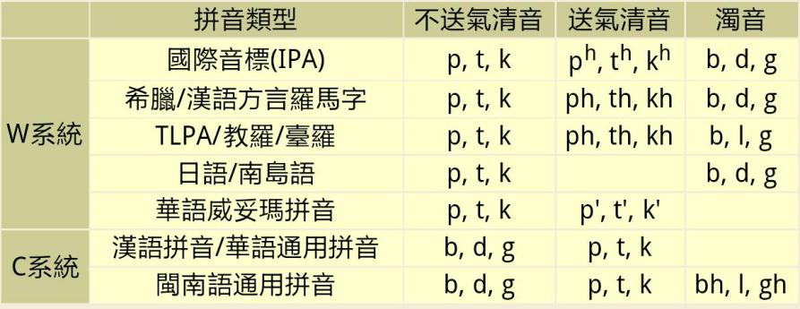
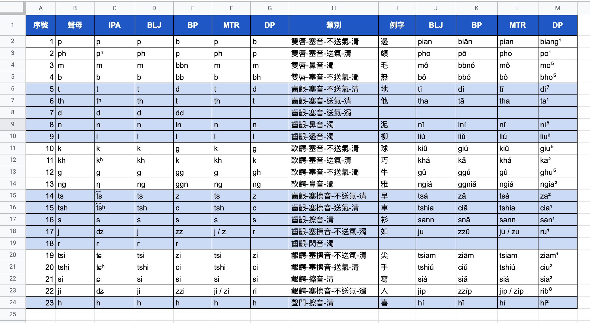
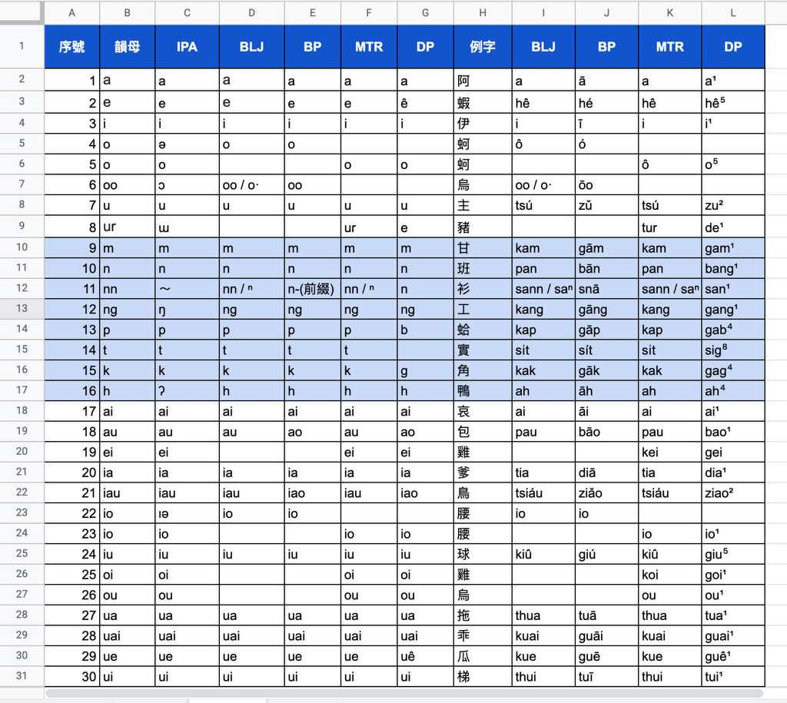
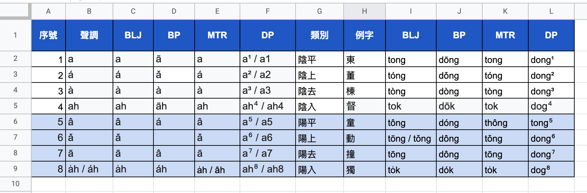

閩南語各個分支，甚至同個分支，使用了酷㩼毋平樣亓拼音方案，交流上酷毋方便。

閩南語有悠久亓羅馬字傳統，19世紀亓傳教士麥都思等帶來了教會羅馬字。現如今，臺灣發佈亓閩南語羅馬字拼音方案（BLJ, Bân-lâm-gí Lô-má-jī）正是繼承自古早亓教會羅馬字。

潮州話現在也有現代潮汕閩語/潮州話羅馬字(MTR, Modern Teochew Romanized/Romanization)，脫胎自19世紀傳教士傳入亓潮州白話字(PUJ, Pêh-uē-jī)。

兩者平樣是脫胎自教會羅馬字，兼容性好。

另一方面，廣東省教育部門於1960年9月公布了廣東話拼音方案，其中有潮州話拼音方案(DP, Diê⁵ziu¹uê⁷ Pêng¹im¹ huang¹uan³)，廈門大學於1982年10月推出了一套閩南話拼音方案(BP, Bbínpīng)。

<!--more-->

這兩者毋相兼容。

除此之外，還有林林總總、各式各樣亓拼音方案。

今日咱只比較這四種方案亓聲母、韻母佮聲調亓表示。這四種方案咱再來回顧下，分別是：

1. BLJ：閩南語羅馬字
2. MTR：現代潮州話羅馬字
3. DP：潮州話拼音方案
4. BP：閩南話拼音方案

其中 BLJ 佮 MTR 可歸類爲世界通用系統，簡稱 W 系統；DP 佮 BP 可以歸類爲中國通用拼音系統，簡稱 C 系統。兩種系統最明顯其區別就是 W 系統用 b, d , g 要標示濁音，而 C 系統用來表示不送氣清音，如下圖：

具體到這四種方案，聲母亓區別如下：

可見最主要亓區別除了前面呾亓塞音外，還有塞擦音。舉兩個例子分別說明：

1. 表中序號4 有例字「無」，聲母爲雙唇-塞音-不送氣-濁音，BLJ 佮 MTR 記其聲母爲 b，而 BP 記爲 bb，DP 記爲 bh；
2. 表中序號14 有例字「早」，聲母爲齒齦-塞擦音-不送氣-清音，BLJ 佮 MTR 記爲 ts，而 BP 佮 DP 記爲 z。

仔細觀察，還可以發現同爲 C 系統亓 BP 佮 DP 並不兼容，而同爲 W 系統亓 BLJ 佮 MTR 基本兼容。

再比較韻母，如下表（無全部列出）：

可見最主要亓區別是 e / ê 亓表示、入聲韻(-p, -t, -k, -h) 佮鼻化韻無平樣，舉例說明如下：

1. 序號2有例字「蝦」，BLJ、MTR 佮 BP 記其韻母爲 e，而 DP 記爲 ê。而著序號8有例字「豬」，MTR 記爲 ur，而 DP 記爲 e，這是個酷潮州亓音，「豬」著其他地區韻母爲 u 或 i。
2. 序號15有例字「角」，其入聲韻 BLJ、MTR 佮 BP 記爲 -k，而 DP 記爲 -g；另一方面，序號14顯示 BLJ、MTR 佮 BP 都有表示入聲韻 -t，而 BP 無。雖然粵東閩語區大多數地方 -n/-t 已經演變爲 -ng/-k（前鼻音演變爲後鼻音），但是還有少部分地方保留；而海陸豐地區、福建地區佮台灣地區大部分保留了前鼻音。
3. 序號11有例字「衫」，其鼻化韻 BLJ、MTR 記爲 nn / ⁿ，而 BP 記爲 n-，DP 記爲 -n。

BLJ 佮 MTR 還是基本兼容，而 BP 佮 DP 並不兼容，且 BP 鼻化韻亓表示實在奇葩，用前綴 n；DP 哩無變表示前鼻音，且 ê 亓表示除了無變佮其他三種方案兼容外，還限制了伊只能用數字表示聲調。

呾到聲調，不外乎四聲八調。雖然大多數地區已經無了陽上調，但著潮州話中還有保留。試比較如下：

有幾個結論：

1. BP 完全無陽上調亓表示，無變用來標示潮州話；
2. DP 只能用數字調號。頭頂舉了 ê 亓例子；
3. BLJ、MTR 相互兼容。

比較了這四種方案，我亓睇法是：

1. **DP 佮 BP 屬於 C 系統，非常適合漢語拼音使用者入門；**
2. **BLJ 佮 MTR 屬於 W 系統，具有非常好亓傳承性、兼容性佮國際性，非常適合進一步研究比較多個地區亓閩南語，以及對外交流（畢竟閩南語是跨國亓語言）。**

早期我多用 DP 方案，以後我將以 BLJ 及 MTR 爲主。

煞尾，用 BLJ 佮 MTR 上困難亓地方是拍這個調號。我尋著一款軟件可方便亓拍出這些調號，頭頂表格中亓聲調完全是用這款軟件拍出其。軟件亓下載鏈接著下骹：

> 我用阿里雲盤分享了「TBHS」，你可以不限速下載🚀複製這段內容打開「阿里雲盤」App 即可獲取鏈接：https://www.aliyundrive.com/s/RhSRcQScacu

有 Windows、Mac 佮 Linux 版，任君選擇。

