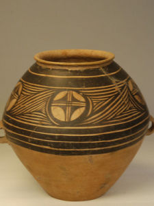

Sènn Nguáng(阮) kâi nâng tsôi`--`ik sǐ hoh`--`ǒi tsia̍h-tsiú`--`âi. Ǔ tse̍k`--`ji̍k, Nguáng-hâm(阮咸) kah i`--`âi tso̍k-nâng tsia̍h tsiú, ēng tuā àng. Tsia̍h-tiānn-nînn, ǔ tse̍k`--`kûng tu phīnn-tioh phang-bhī tshong`--`ji̍p-lâi. Suà tsôi`--`ik tsia̍h tsiú.

<!--more-->

姓阮其人齊一是酷會食酒亓。有一日，阮咸佮伊亓族人食酒，用大甕。食定然，有一群豬鼻著芳味衝入來。Suà 齊一食酒。

------

（普通话）

姓阮的人都是很会喝酒的。有一天，阮咸跟他的族人喝酒，用大瓮。正喝着，有一群猪闻到香味冲进来。于是一起喝酒。

