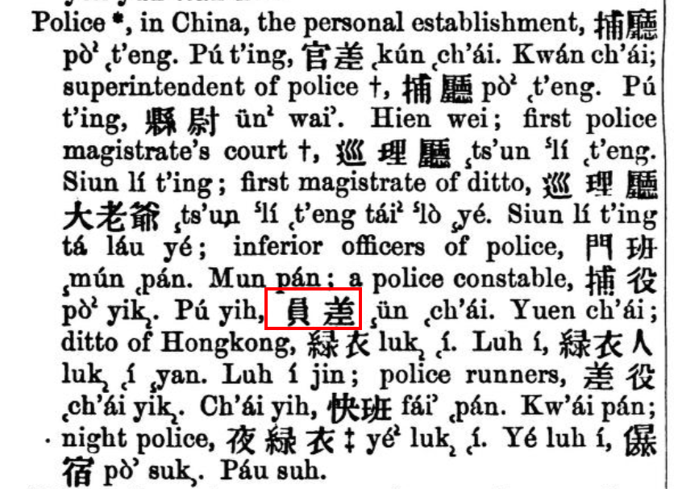

# 緣起

近期，五條人樂隊發佈了新專輯《地球戀曲》，給我帶來了新的音樂體驗。

其中有一首海豐話民謠《两人相拍跋落溪》，講述的是兩公婆因為爭論釣到的魚是吃是賣而打架，以致雙雙掉落溪水，又找了「元差」和娘家人來理論，結果賠上了幾只母雞用來款待來者的故事。歌詞如下：

> 挨呀挨
挨呀挨
挨对青鳞批
公爱食
婆爱卖
两人相拍跋落溪
挨呀挨
挨呀挨
挨对青鳞批
公爱食
婆爱卖
两人相拍跋落溪
阿公投元差
阿婆投外家
元差来
外家来
鸡母鸡母拖来刣
— 《两人相拍跋落溪》
> 

當看到歌詞中「元差」的時候，我很疑惑。我知道根據上下文是「官差」的意思，但是寫成「元差」總覺得不大對勁。於是，帶著這個問題，進行了一番求索。

<!--more-->

# 初步論斷

「元」、「員」普通話中發音一樣，閩南語中只有聲母不同，海豐話中「元」是帶有⾆根⿐⾳「ng」的，而「員」是零聲母的。再者，「員」和「人」是可互換的詞，例如：官員 ↔ 官人。粵語中警察叫「差人」，「人」換成「員」就是「差員」，再對換位置，那就是「員差」了。

因此，且認為歌詞中的「元差」即是「員差」。

# 繼續探索

顯見，前面的論斷是相當武斷的，缺乏有力證明的，因此還需要繼續探索，搜羅更為有說服力的資料。

前文論斷中留下的問題有二：

1. 是否真的有「員差」這種說法？
2. 「員」（iang5）在海豐話中是否可發「元」（ngiang5）的音？

## 其一：「員差」確有其說

對於問題一，經過多方檢索，確有其說。

一者，在1820年馬禮遜的《英華字典》第 1337 頁[「Police」詞條](https://archive.org/details/english-and-chinese-dictionary-with-the-punti-and-mandarin-pronunciation/英華字典_English)中就有「員差」一詞，並標注了粵語和國語發音，如下圖所示：

再者，在甘爲霖的《廈門音新字典》在[「員」字](https://taigi.fhl.net/dick/gm.php?fn=183.png)下，寫到：

> goân (員Oân) úi-goân, chiū-sī úi-oân; goân-gōe, goân-chhe.（按：「員」有兩個音，goân 和 Oân。後面的詞語分別是：委員，就是 委員，員外，員差）
> 

又查詢漢典[「員」字](https://www.zdic.net/hant/%E5%93%A1)發現：

> (3) 官員的定額。又指官員、官吏 [officials]。
如: 員弁(低級文武官員); 員役(從事某項工作的官員;辦事的吏員); 員僚(亦作“員寮”。泛指官吏)
> 

另外，我發現這些複詞其實就是「官」、「員」、「吏」、「人」、「僚」、「役」和「差」這幾個字的排列組合（讀起來順口就是了）：

|  | 官 | 員 | 吏 | 人 | 僚 | 役 | 差 |
| --- | --- | --- | --- | --- | --- | --- | --- |
| 官 |  |  |  |  |  |  |  |
| 員 | 官員 |  | 吏員 |  |  |  |  |
| 吏 | 官吏 |  |  |  |  |  | 差吏 |
| 人 | 官人 |  |  |  |  |  | 差人 |
| 僚 | 官僚 | 員僚 |  |  |  |  |  |
| 役 | 官役 | 員役 |  |  |  |  | 差役 |
| 差 | 官差 | 員差 |  |  |  |  |  |

綜合起來，「員差」這個詞是確實存在的，並且就是官差、差人、警察的意思。

## 其二：「員」與「元」發音相近

在閩南語中，「員」與「元」發音相近，韻母一致，聲母發音部位相近，只有是否是零聲母的差別。

根據《廈門音新字典》，「員」在廈門話中發「goân」或「Oân」音，一個是零聲母，一個帶有「g」音；而該字典中「元」只有發「goân」音。試比對閩南語各方音：

| 字 | 中古音 | 廈門音 | 海豐音 | 潮州音 |
| --- | --- | --- | --- | --- |
| 員圜焉 | 云母山攝仙韻 | goân / Oân | iang5 | ueng5 |
| 元原源 | 疑母山攝元韻 | goân | ngiang5 | ngueng5 |
| 芫 | 疑母山攝元韻 | goân | ngiang5 / **iang5** | ngueng5 / **ueng5** |

當只考慮聲母時，有：

| 字 | 上古音 | 中古音 | 廈門音 | 海豐音 | 潮州音 |
| --- | --- | --- | --- | --- | --- |
| 員 | 匣母 ɣ | 云母 ɣ / j | g | 零聲母 | 零聲母 |
| 元 | 疑母 ŋ | 疑母 ŋ | g | ŋ / 零聲母 | ŋ / 零聲母 |

上表展示了一個聲母弱化的規律：ŋ(軟顎鼻音) → g(軟顎爆發音) → 零聲母。

在王力先生的《漢語史稿》P127 論及了零聲母的來源：

> i、y、u三類零聲母有⼀個共同的情况：它們都是從雲（ɤ）、餘（j）、疑（ŋ）、影（o）變來的。
> 

對於如此演變的原因，他寫道：

> ⾆根⿐⾳在 i、y 的前⾯容易消失或發⽣變化，是由於 ŋ 的發⾳部位和 i、y 距離較遠。
> 

那麼，「員」在海豐話發「ngiang5」音似乎不符合該一般規律。

至於是否符合別種規律，尚待探索。

# 總結

五條人新曲《两人相拍跋落溪》歌詞中的「元差」應是「員差」，理由是：

1. 「員差」在《英華字典》和《廈門音新字典》等資料有提及，且含義同「官差」、「警察」與曲中的上下文相合。而「元差」未見諸出版資料。
2. 「員」和「元」在閩南語中發音相近。

但需要注意的是，「員」在海豐話中應讀為「iang5」，發「ngiang5」音不符合一般演變規律，仍須繼續探索。
