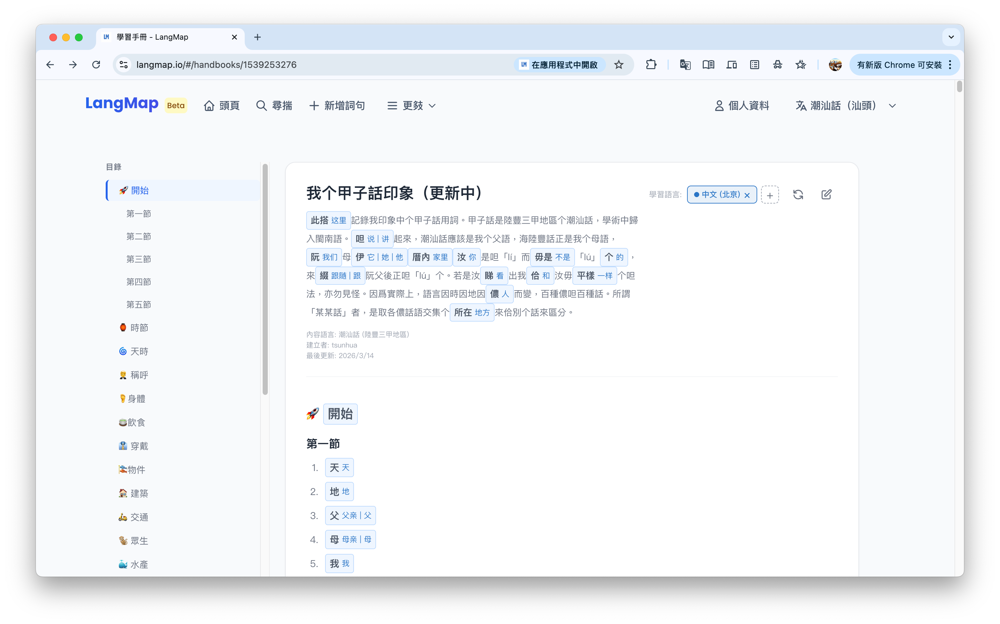

甲子話是陸豐三甲地區个潮汕話，學術中歸入閩南語。呾起來，潮汕話應該是我个父語，海陸豐話正是我个母語，阮母伊厝內汝是呾「lí」而毋是「lú」个，來綴阮父後正呾「lú」个。若是汝睇出我佮汝毋平樣个呾法，亦勿見怪。因爲實際上，語言因時因地因儂而變，百種儂呾百種話。所謂「某某話」者，是取各儂話語交集个所在來佮別个話來區分。

我想勿掠咱个話斷送在咱此一代，此馬有變做个就是先掠伊記落來。此亦是我建立 [langmap.io](https://langmap.io/) 个初衷，見前文 [介紹一個意在連結所有語言的網站——LangMap](/essay/langmap-intro/)。

<!--more-->

呾轉甲子話，遐詞基本是對我以先整理个《[甲子話分類辭表（2020.12）](/language/min/gahzi-oi-hung-lui-ci-biao/)》來，結構有所調整，用詞有所補充，並且錄入了 [我个甲子話印象（更新中） -langmap.io](https://langmap.io/#/handbooks/1539253276) 來捷捷更新。

事還未直。此馬來寫此篇短文，是爲着來乞大家儂知影 [langmap.io](https://langmap.io/#/handbooks) 已經支持手冊功能。不管汝是呾乜个話，做蜀有變寫个像我平樣、甚至更好个手冊，來乞眾儂學習。

免加句，大家儂來去此个網站頂去家己體驗吧。

